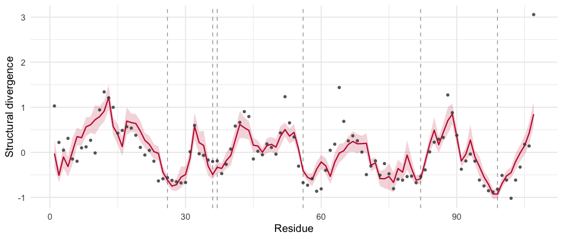
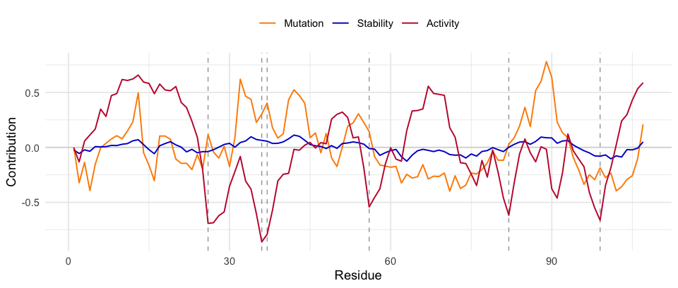

<!-- README.md is generated from README.Rmd. Please edit that file and knit. -->

# msamodel

<!-- badges: start -->

<!-- badges: end -->

Across a family of homologous enzymes, some residues change structure a
lot and others almost not at all. `msamodel` predicts this divergence
profile from a single structure and its active site, using the
Mutation-Stability-Activity model, and splits it into the contributions
of mutation, stability selection, and activity selection.

## Installation

``` r
# install.packages("remotes")
remotes::install_github("jechave/msamodel", dependencies = TRUE)
```

The elastic network model comes from
[penm](https://github.com/jechave/penm), installed alongside. Neither
package is on CRAN.

## Example

Mutate every site, fit the model to an observed profile, predict:

``` r
library(msamodel)
library(penm)

ex     <- function(f) system.file("extdata", f, package = "msamodel")
active <- read.csv(ex("1d6o_A_active_site.csv"))
obs    <- read.csv(ex("1d6o_A_lrmsd_obs_site.csv"))

wt  <- penm::set_enm(bio3d::read.pdb(ex("1d6o_A.pdb")), node = "ca",
                     model = "ming_wall", d_max = 10.5, frustrated = FALSE)
spm <- generate_spm(wt, n_mutations = 10,
                    pdb_site_active = active$pdb_site, ensemble = 1L)

fit  <- fit_lrmsd_msa_site(spm, obs$pdb_site, obs$lrmsd_obs)
pred <- predict_profiles(fit, spm, metric = "nlrmsd")$site
```



Observed divergence (points), fitted model with 95% band, active-site
residues dashed. The fit has two parameters — selection strengths on
stability (0.23) and on activity (79) — and accounts for 60% of the
variance in the observed profile.

The same fit splits the profile into its three constituent parts:

``` r
dec <- predict_decomposition(fit, spm, metric = "nlrmsd")$site
```



The three curves add up to the profile above. For this enzyme activity
selection does most of the work and stability almost none; other
families differ.

## Interface

`generate_spm()` mutates every site and records the structural response.
It is the slow step, and everything else works from its output.

`calculate_profiles()` and `calculate_decomposition()` evaluate the
model at selection strengths given as arguments — for exploring how each
constraint shapes the profile. `predict_profiles()` and
`predict_decomposition()` evaluate it at a fit obtained from data, with
error bands. Fits come from `fit_lrmsd_msa_site()` and
`fit_lrmsd_msa_mode()`.

All four return a `$site` table and a `$mode` table: divergence per
residue, and per normal mode of the structure.

Inputs are a PDB file, active-site residue numbers, and an observed
profile to fit against. Measuring that profile — superimposing homologs
over an alignment — is outside this package.

## Documentation

``` r
?msamodel                        # API, indexed by workflow step
vignette("msamodel")             # both axes, end to end
vignette("site-analysis")        # per-residue profiles in full
vignette("mode-analysis")        # per-mode profiles in full
vignette("inference-methods")    # fitting and uncertainty
```

## Reference

Echave J, Carpentier M (2026). Why structural divergence varies among
residues in enzyme evolution: contributions of mutation, stability, and
activity constraints. *Molecular Biology and Evolution* 43(7), msag162.
<https://doi.org/10.1093/molbev/msag162>

## License

MIT © Julian Echave
