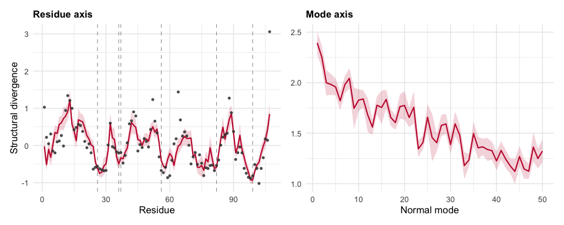
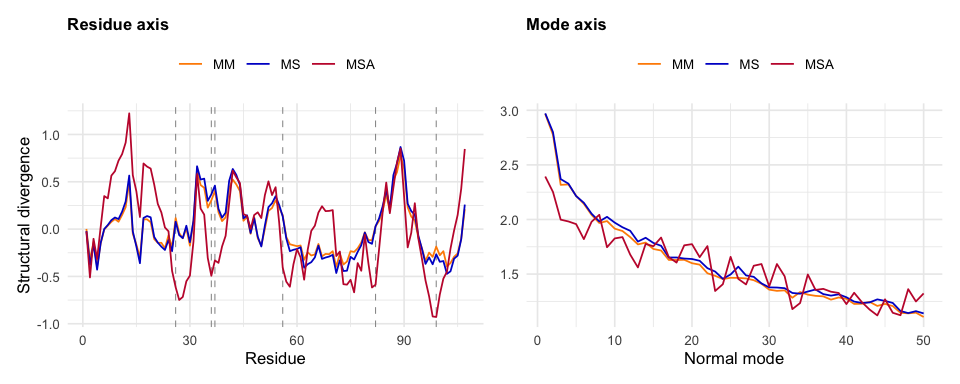

<!-- README.md is generated from README.Rmd. Please edit that file and knit. -->

# msamodel

<!-- badges: start -->

[](https://github.com/jechave/msamodel/actions/workflows/R-CMD-check.yaml)
<!-- badges: end -->

The `msamodel` package implements the Mutation-Stability-Activity (MSA)
model of protein structural evolution. In the MSA model, mutations
perturb the structure and become fixed or are lost depending on their
effects on stability and activity, weighted by stability and activity
selection strengths, respectively. Given a single structure and its
active-site residues, the model predicts the resulting structural
divergence profiles, per residue and per normal mode. The two selection
strengths can be set to chosen values, to explore how each constraint
shapes the profiles, or estimated from observed profiles by maximum
likelihood. In addition, predicted profiles can be analysed in terms of
nested “what-if” scenarios in which one or both selection constraints
are dropped, and can be decomposed as a sum of mutation, stability, and
activity contributions.

## Installation

``` r
# install.packages("remotes")
remotes::install_github("jechave/msamodel", dependencies = TRUE)
```

The elastic network model comes from
[penm](https://github.com/jechave/penm), installed alongside. Neither
package is on CRAN.

## Interface

The inputs are a PDB file and a vector of active-site residue numbers.
Fitting also takes an observed divergence profile, as two vectors: the
residue numbers, and the divergence at each. Measuring that profile, by
superimposing homologs over an alignment, is outside this package.

| Function | Does | Returns |
|----|----|----|
| `generate_spm()` | mutates every site and records the structural response | the scan every other function reads |
| `fit_lrmsd_msa_site()` | estimates the two selection strengths by fitting an observed site profile | the fit, with standard errors and `$gof` |
| `fit_lrmsd_msa_mode()` | estimates them by fitting an observed mode profile | the fit, with standard errors and `$gof` |
| `calculate_profiles()` | evaluates the model at selection strengths given as arguments | the profiles |
| `calculate_decomposition()` | decomposes the model at selection strengths given as arguments | the nested models and the three contributions |
| `predict_profiles()` | evaluates the model at a fit | the profiles, with standard errors |
| `predict_decomposition()` | decomposes the model at a fit | the nested models and the three contributions, with standard errors |

The `calculate_*` pair explores how each constraint shapes the profiles;
the `predict_*` pair evaluates the model where the data puts it.

Every profile comes in two representations, and the `calculate_*` and
`predict_*` functions return both: the same divergence written in two
bases. The `$site` tibble gives it residue by residue, the `$mode`
tibble gives it per normal mode. Their `metric` argument chooses the
quantity: `"lrmsd"` keeps the profile’s overall level, `"nlrmsd"`
centres it on its mean, which is the form a fit is made on.

## Documentation

`?msamodel` is the package page: the workflow in order, with a link to
each function.

Three vignettes, each a worked example on the shipped protein:

``` r
vignette("msamodel")             # the whole workflow, scan to decomposition
vignette("msamodel-explore")     # the model at chosen selection strengths
vignette("msamodel-fit")         # estimating those strengths from data
```

## Example

`penm::set_enm()` builds the elastic network from the structure, and
`generate_spm()` mutates every site and records how the structure
responds.

``` r
library(msamodel)
library(penm)

ex     <- function(f) system.file("extdata", f, package = "msamodel")
active <- read.csv(ex("1d6o_A_active_site.csv"))
obs    <- read.csv(ex("1d6o_A_lrmsd_obs_site.csv"))

wt  <- penm::set_enm(bio3d::read.pdb(ex("1d6o_A.pdb")), node = "ca",
                     model = "ming_wall", d_max = 10.5, frustrated = FALSE)
spm <- generate_spm(wt, n_mutations = 10,
                    pdb_site_active = active$pdb_site, ensemble = 1L)
```

`fit_lrmsd_msa_site()` estimates the two selection strengths from an
observed profile, given as two vectors: the residue numbers and the
divergence at each. The fit carries the estimates, their standard
errors, and a goodness-of-fit summary in `$gof`.

``` r
fit <- fit_lrmsd_msa_site(spm, obs$pdb_site, obs$lrmsd_obs)

c(a1 = fit$a1, a2 = fit$a2)
#>         a1         a2 
#>  0.2261728 78.7206723
fit$gof
#> # A tibble: 1 × 9
#>      D2   AIC   BIC logLik deviance null_deviance  nobs     k sigma_hat
#>   <dbl> <dbl> <dbl>  <dbl>    <dbl>         <dbl> <int> <int>     <dbl>
#> 1 0.596  115.  123.  -54.7     17.4          43.1   107     3     0.403
```

`predict_profiles()` evaluates the model at that fit. It returns a
`$site` and a `$mode` tibble, each holding the profile and its standard
error in one representation.

``` r
pred <- predict_profiles(fit, spm, metric = "nlrmsd")

pred$site
#> # A tibble: 107 × 4
#>     site pdb_site nlrmsd_msa nlrmsd_msa_se
#>    <int>    <int>      <dbl>         <dbl>
#>  1     1        1    -0.0254        0.160 
#>  2     2        2    -0.511         0.0754
#>  3     3        3    -0.103         0.130 
#>  4     4        4    -0.316         0.110 
#>  5     5        5     0.0216        0.153 
#>  6     6        6     0.349         0.101 
#>  7     7        7     0.325         0.0915
#>  8     8        8     0.565         0.107 
#>  9     9        9     0.612         0.0919
#> 10    10       10     0.723         0.164 
#> # ℹ 97 more rows
pred$mode
#> # A tibble: 315 × 3
#>     mode nlrmsd_msa nlrmsd_msa_se
#>    <int>      <dbl>         <dbl>
#>  1     1       2.39        0.0563
#>  2     2       2.25        0.0588
#>  3     3       2.00        0.0642
#>  4     4       1.98        0.0528
#>  5     5       1.96        0.0421
#>  6     6       1.82        0.0482
#>  7     7       1.98        0.0432
#>  8     8       2.04        0.0515
#>  9     9       1.75        0.105 
#> 10    10       1.83        0.0553
#> # ℹ 305 more rows
```

Plotting both: the observed profile exists only per residue, so the
points appear in the left panel alone.



`predict_decomposition()` returns more columns in the same two
representations: the profiles of the four nested models, in `nlrmsd_mm`,
`nlrmsd_ms`, `nlrmsd_ma` and `nlrmsd_msa`; the three contributions, in
`nphi_mut`, `nphi_stab` and `nphi_act`; and a standard error for each.

``` r
dec <- predict_decomposition(fit, spm, metric = "nlrmsd")

dec$site
#> # A tibble: 107 × 16
#>     site pdb_site nlrmsd_mm nlrmsd_ms nlrmsd_ma nlrmsd_msa nphi_mut nphi_stab
#>    <int>    <int>     <dbl>     <dbl>     <dbl>      <dbl>    <dbl>     <dbl>
#>  1     1        1   0.00179 -0.0219      0.0151    -0.0254  0.00179  -0.0237 
#>  2     2        2  -0.322   -0.378      -0.478     -0.511  -0.322    -0.0561 
#>  3     3        3  -0.137   -0.159      -0.0974    -0.103  -0.137    -0.0222 
#>  4     4        4  -0.393   -0.429      -0.305     -0.316  -0.393    -0.0356 
#>  5     5        5  -0.153   -0.146       0.0103     0.0216 -0.153     0.00724
#>  6     6        6  -0.00368  0.000981    0.353      0.349  -0.00368   0.00467
#>  7     7        7   0.0368   0.0432      0.297      0.325   0.0368    0.00645
#>  8     8        8   0.0767   0.0947      0.542      0.565   0.0767    0.0180 
#>  9     9        9   0.106    0.123       0.608      0.612   0.106     0.0166 
#> 10    10       10   0.0778   0.106       0.726      0.723   0.0778    0.0280 
#> # ℹ 97 more rows
#> # ℹ 8 more variables: nphi_act <dbl>, nlrmsd_mm_se <dbl>, nlrmsd_ms_se <dbl>,
#> #   nlrmsd_ma_se <dbl>, nlrmsd_msa_se <dbl>, nphi_mut_se <dbl>,
#> #   nphi_stab_se <dbl>, nphi_act_se <dbl>
dec$mode
#> # A tibble: 315 × 15
#>     mode nlrmsd_mm nlrmsd_ms nlrmsd_ma nlrmsd_msa nphi_mut nphi_stab nphi_act
#>    <int>     <dbl>     <dbl>     <dbl>      <dbl>    <dbl>     <dbl>    <dbl>
#>  1     1      2.97      2.97      2.37       2.39     2.97   0.00590  -0.578 
#>  2     2      2.78      2.80      2.23       2.25     2.78   0.0243   -0.548 
#>  3     3      2.32      2.37      1.95       2.00     2.32   0.0529   -0.372 
#>  4     4      2.32      2.33      1.95       1.98     2.32   0.00718  -0.346 
#>  5     5      2.22      2.21      1.94       1.96     2.22  -0.00243  -0.257 
#>  6     6      2.14      2.15      1.79       1.82     2.14   0.0100   -0.333 
#>  7     7      2.04      2.05      1.96       1.98     2.04   0.0111   -0.0736
#>  8     8      1.97      1.98      2.02       2.04     1.97   0.0141    0.0609
#>  9     9      1.99      2.02      1.67       1.75     1.99   0.0389   -0.278 
#> 10    10      1.92      1.97      1.78       1.83     1.92   0.0551   -0.145 
#> # ℹ 305 more rows
#> # ℹ 7 more variables: nlrmsd_mm_se <dbl>, nlrmsd_ms_se <dbl>,
#> #   nlrmsd_ma_se <dbl>, nlrmsd_msa_se <dbl>, nphi_mut_se <dbl>,
#> #   nphi_stab_se <dbl>, nphi_act_se <dbl>
```

MM, MS and MSA form a progression: MM has mutation alone, MS adds
selection on stability, and MSA adds selection on activity. Each is the
previous one with one more constraint switched on. MA, activity without
stability, lies outside this progression and is left out of the figure.



The MSA profile splits into three contributions, one per constraint,
each the increment its step adds: mutation is MM, stability is MS minus
MM, and activity is MSA minus MS.


Dashed lines mark active-site residues, and bands are 95% intervals. The
mode panels show the first 50 of 315 modes. `nlrmsd` is centred over all
315, and these are the modes carrying the largest divergence, so the
cropped panels do not appear centred on zero.

## Reference

Echave J, Carpentier M (2026). Why structural divergence varies among
residues in enzyme evolution: contributions of mutation, stability, and
activity constraints. *Molecular Biology and Evolution* 43(7), msag162.
<https://doi.org/10.1093/molbev/msag162>

## License

MIT © Julian Echave
