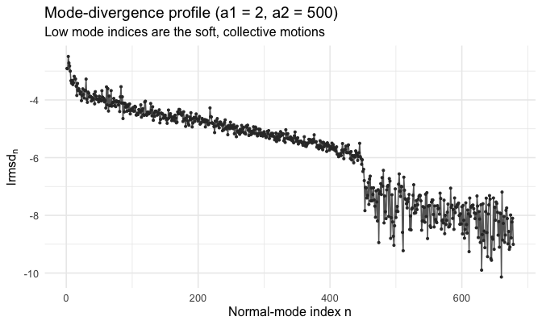
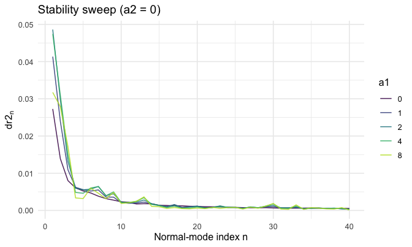
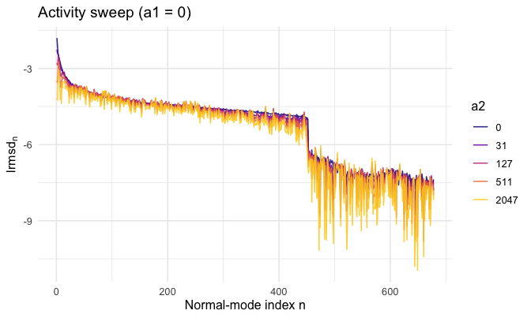

<!--
SOURCE OF TRUTH. This `.Rmd.orig` is the editable vignette; every code chunk runs
for real. The shipped `dr2n-analysis.Rmd` is PRE-RENDERED from this file.
Regenerate it after editing this file or after any change to the package code the
vignette exercises:

  Rscript -e 'knitr::knit("vignettes/dr2n-analysis.Rmd.orig", output = "vignettes/dr2n-analysis.Rmd")'

then commit both this file, the rendered `dr2n-analysis.Rmd`, and its figures.
Pattern: https://ropensci.org/technotes/2019/12/08/precompute-vignettes/
-->


## Site form vs. mode form

The [introduction vignette](msamodel-intro.html) predicts structural divergence
**per site**: `calculate_dr2_i_msa()` returns `dr2_i`, the selection-weighted mean
squared displacement of each residue. This vignette predicts the same divergence
**per normal mode**.

A single mutation displaces the structure by a vector `dr`. The site form sums
`dr` per residue (`dr2_i`); the mode form projects `dr` onto the elastic-network
normal modes and squares each contribution (`dr2_n = (mode n component of dr)^2`).
The two are the same displacement in two bases, so for any single mutant the
totals agree: `sum_i dr2_i == sum_n dr2_n`. Low-index modes are the soft,
collective motions of the protein; the mode profile shows **which motions** carry
the predicted divergence, where the site profile shows **which residues** do.

Everything here is **predict-only** — there is (yet) no observed mode profile to
fit against, so the mode arm has no likelihood/fit counterpart. (When functions to
derive `dr2_n` from structural alignments and to fit them are added, a fitting
section will be added to *this* vignette.)

## Preprocessing for the mode axis

We use the worked example `1znb_A` (zinc beta-lactamase), shipped as `znb_spm`.
`preprocess_spm_mode()` is the mode counterpart of `preprocess_spm()`: it reshapes
the per-mutant scan into the `[mutant x mode]` matrix the mode evaluator reweights.
There is no `pdb_site` map — modes are not anchored to residues.


```r
data("znb_spm")
pp_mode <- preprocess_spm_mode(znb_spm)   # list: energy_data, dr2_njm
dim(pp_mode$dr2_njm)                       # mutants x modes
#> [1] 2280  678
```

## The mode-divergence profile at given (a1, a2)

For any `(a1, a2)`, `calculate_dr2_n_msa()` returns the selection-weighted mean
`dr2_n` per mode. The reweighting is identical to the site form (the fixation
weights live only on the mutant axis); only the response axis differs.


```r
a1 <- 2; a2 <- 500
prof_mode <- calculate_dr2_n_msa(pp_mode, a1, a2)
head(prof_mode)
#> # A tibble: 6 × 2
#>       n   dr2_n
#>   <int>   <dbl>
#> 1     1 0.00297
#> 2     2 0.00291
#> 3     3 0.00684
#> 4     4 0.00435
#> 5     5 0.00353
#> 6     6 0.00247
```



The lowest-index (softest) modes dominate: most of the predicted structural
divergence is carried by a handful of collective motions.

## How the mode profile depends on a1 and a2

As in the site form, stability selection (`a1`, with `a2 = 0`) and activity
selection (`a2`, with `a1 = 0`) reshape the profile differently. We vary one
parameter at a time and overlay the resulting whole mode profiles — the same
`map_dfr` sweep pattern the intro vignette uses for the site profile.


```r
# Stability sweep: vary a1, hold a2 = 0
a1_values <- c(0, 1, 2, 4, 8)
sweep_a1 <- purrr::map_dfr(a1_values, function(a1)
  calculate_dr2_n_msa(pp_mode, a1, 0) |> mutate(a1 = a1))

# Activity sweep: vary a2, hold a1 = 0
a2_values <- c(0, 31, 127, 511, 2047)
sweep_a2 <- purrr::map_dfr(a2_values, function(a2)
  calculate_dr2_n_msa(pp_mode, 0, a2) |> mutate(a2 = a2))
```

The soft modes carry most of the signal, so we focus the plots on the lowest
modes where the dependence is visible.





Increasing `a1` suppresses divergence across the soft modes (stability selection
damps the collective motions); increasing `a2` reshapes the soft-mode divergence
according to selection on activity.

## Consistency with the site form

For a single mutant the site and mode descriptions of the displacement carry the
same total (basis invariance). This holds per mutant in the scan:


```r
r <- which(znb_spm$m > 0)[1]
c(site_total = sum(znb_spm$dr2_ijm[[r]]),
  mode_total = sum(znb_spm$dr2_njm[[r]]))
#> site_total mode_total 
#>  0.3255187  0.3255187
```

## Session info


```
#> R version 4.2.1 (2022-06-23)
#> Platform: x86_64-apple-darwin17.0 (64-bit)
#> Running under: macOS Big Sur ... 10.16
#> 
#> Matrix products: default
#> BLAS:   /Library/Frameworks/R.framework/Versions/4.2/Resources/lib/libRblas.0.dylib
#> LAPACK: /Library/Frameworks/R.framework/Versions/4.2/Resources/lib/libRlapack.dylib
#> 
#> locale:
#> [1] en_US.UTF-8/en_US.UTF-8/en_US.UTF-8/C/en_US.UTF-8/en_US.UTF-8
#> 
#> attached base packages:
#> [1] stats     graphics  grDevices utils     datasets  methods   base     
#> 
#> other attached packages:
#> [1] ggplot2_4.0.1       dplyr_1.1.4         msamodel_0.2.0.9000
#> 
#> loaded via a namespace (and not attached):
#>  [1] Rcpp_1.1.0         knitr_1.43         magrittr_2.0.4     tidyselect_1.2.1  
#>  [5] viridisLite_0.4.2  lattice_0.22-5     R6_2.6.1           rlang_1.1.6       
#>  [9] highr_0.11         jefuns_0.1.0       tools_4.2.1        parallel_4.2.1    
#> [13] grid_4.2.1         gtable_0.3.6       xfun_0.41          cli_3.6.5         
#> [17] withr_3.0.2        bio3d_2.4-5        tibble_3.3.0       lifecycle_1.0.4   
#> [21] S7_0.2.1           Matrix_1.5-4.1     tidyr_1.3.1        purrr_1.2.0       
#> [25] RColorBrewer_1.1-3 farver_2.1.2       vctrs_0.6.5        glue_1.8.0        
#> [29] evaluate_0.24.0    labeling_0.4.3     compiler_4.2.1     pillar_1.11.1     
#> [33] generics_0.1.4     scales_1.4.0       penm_0.2.0.9000    pkgconfig_2.0.3
```
