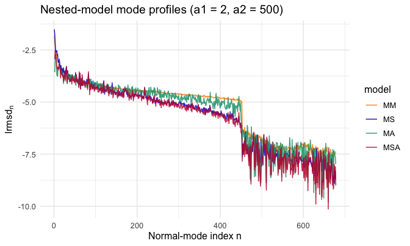
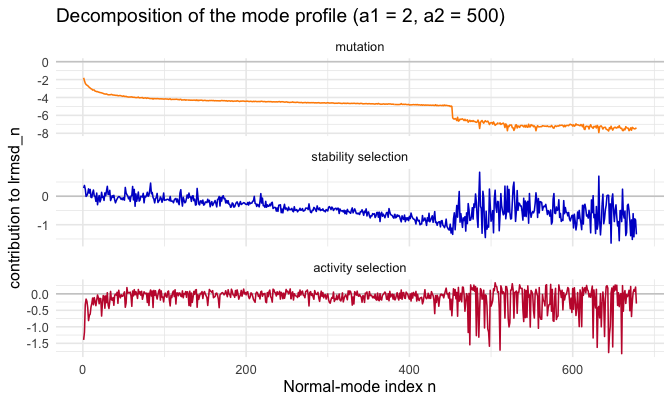
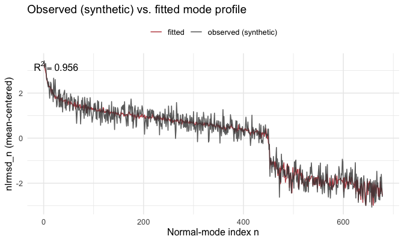
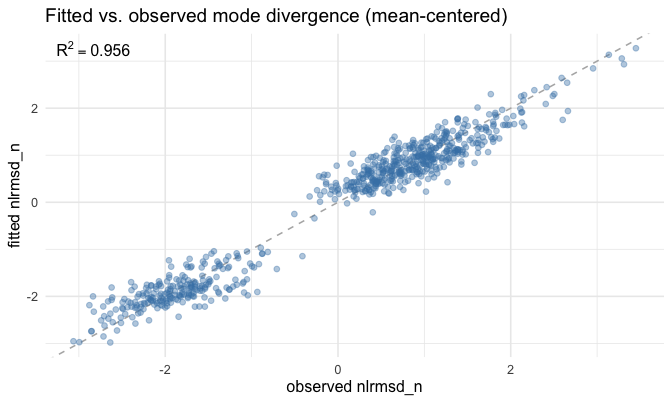

<!--
SOURCE OF TRUTH. This `.Rmd.orig` is the editable vignette; every code chunk runs
for real. The shipped `dr2n-analysis.Rmd` is PRE-RENDERED from this file.
Regenerate it after editing this file or after any change to the package code the
vignette exercises:

  Rscript -e 'knitr::knit("vignettes/dr2n-analysis.Rmd.orig", output = "vignettes/dr2n-analysis.Rmd")'

then commit both this file, the rendered `dr2n-analysis.Rmd`, and its figures.
Pattern: https://ropensci.org/technotes/2019/12/08/precompute-vignettes/
-->


## Site form vs. mode form

The [introduction vignette](msamodel-intro.html) predicts structural divergence
**per site**: `calculate_dr2_i_msa()` returns `dr2_i`, the selection-weighted mean
squared displacement of each residue. This vignette predicts the same divergence
**per normal mode**.

A single mutation displaces the structure by a vector `dr`. The site form sums
`dr` per residue (`dr2_i`); the mode form projects `dr` onto the elastic-network
normal modes and squares each contribution (`dr2_n = (mode n component of dr)^2`).
The two are the same displacement in two bases, so for any single mutant the
totals agree: `sum_i dr2_i == sum_n dr2_n`. Low-index modes are the soft,
collective motions of the protein; the mode profile shows **which motions** carry
the predicted divergence, where the site profile shows **which residues** do.

Everything here is **predict-only** — there is (yet) no observed mode profile to
fit against, so the mode arm has no likelihood/fit counterpart. (When functions to
derive `dr2_n` from structural alignments and to fit them are added, a fitting
section will be added to *this* vignette.)

## Preprocessing for the mode axis

We use the worked example `1znb_A` (zinc beta-lactamase), shipped as `znb_spm`.
`preprocess_spm_mode()` is the mode counterpart of `preprocess_spm()`: it reshapes
the per-mutant scan into the `[mutant x mode]` matrix the mode evaluator reweights.
There is no `pdb_site` map — modes are not anchored to residues.


```r
data("znb_spm")
pp_mode <- preprocess_spm_mode(znb_spm)   # list: energy_data, dr2_njm
dim(pp_mode$dr2_njm)                       # mutants x modes
#> [1] 2280  678
```

## The mode-divergence profile at given (a1, a2)

For any `(a1, a2)`, `calculate_dr2_n_msa()` returns the selection-weighted mean
`dr2_n` per mode. The per-mode divergence is `lrmsd_n = log(sqrt(dr2_n))`, the
mode analogue of the site form's `lrmsd`.


```r
a1 <- 2; a2 <- 500
prof_mode <- calculate_dr2_n_msa(pp_mode, a1, a2) |>
  mutate(lrmsd_n = log(sqrt(dr2_n)))
head(prof_mode)
#> # A tibble: 6 × 3
#>       n   dr2_n lrmsd_n
#>   <int>   <dbl>   <dbl>
#> 1     1 0.00297   -2.91
#> 2     2 0.00291   -2.92
#> 3     3 0.00684   -2.49
#> 4     4 0.00435   -2.72
#> 5     5 0.00353   -2.82
#> 6     6 0.00247   -3.00
```


The lowest-index (softest) modes carry the most divergence: a handful of
collective motions account for most of the predicted structural change.

## Nested models and decomposition

As in the site form, the mode profile at a chosen `(a1, a2)` splits into additive
mutation, stability-selection, and activity-selection contributions, built from
four **nested model variants** (each `calculate_dr2_n_msa()` at a particular
parameter point):

| Variant | a1 (stability) | a2 (activity) | meaning |
|:--|:--|:--|:--|
| **MM** | 0 | 0 | mutation only — no selection |
| **MS** | a1 | 0 | mutation + stability selection |
| **MA** | 0 | a2 | mutation + activity selection |
| **MSA** | a1 | a2 | full model — both selections |

`calculate_lrmsd_n_nested_models()` returns all four `lrmsd_n` profiles at once —
the mode counterpart of `calculate_lrmsd_i_nested_models()`:


```r
nested <- calculate_lrmsd_n_nested_models(pp_mode, a1, a2)   # a1 = 2, a2 = 500
```



The **sequential** decomposition adds one selection pressure at a time along
M0 → MM → MS → MSA; each $\phi$ term is the incremental divergence contributed by
the next pressure:

$$
\phi_{\text{mut}}  = \text{lrmsd}_{\text{mm}}, \qquad
\phi_{\text{stab}} = \text{lrmsd}_{\text{ms}} - \text{lrmsd}_{\text{mm}}, \qquad
\phi_{\text{act}}  = \text{lrmsd}_{\text{msa}} - \text{lrmsd}_{\text{ms}}
$$

By construction these sum to the full prediction. `calculate_msa_decomposition()`
is axis-agnostic — the same pure function used for the site form — so we apply it
to the four `lrmsd_n` vectors:


```r
phi <- dplyr::bind_cols(
  nested,
  calculate_msa_decomposition(nested$lrmsd_n_mm, nested$lrmsd_n_ms,
                              nested$lrmsd_n_ma, nested$lrmsd_n_msa)
)
```



## How the mode profile depends on a1 and a2

As in the site form, stability selection (`a1`, with `a2 = 0`) and activity
selection (`a2`, with `a1 = 0`) reshape the profile differently. We vary one
parameter at a time and overlay the resulting whole mode profiles — the same
`map_dfr` sweep pattern the intro vignette uses for the site profile.


```r
# Stability sweep: vary a1, hold a2 = 0
a1_values <- c(0, 1, 2, 4, 8)
sweep_a1 <- purrr::map_dfr(a1_values, function(a1)
  calculate_dr2_n_msa(pp_mode, a1, 0) |> mutate(lrmsd_n = log(sqrt(dr2_n)), a1 = a1))

# Activity sweep: vary a2, hold a1 = 0
a2_values <- c(0, 31, 127, 511, 2047)
sweep_a2 <- purrr::map_dfr(a2_values, function(a2)
  calculate_dr2_n_msa(pp_mode, 0, a2) |> mutate(lrmsd_n = log(sqrt(dr2_n)), a2 = a2))
```


Increasing `a1` suppresses divergence across the soft modes (stability selection
damps the collective motions); increasing `a2` reshapes the soft-mode divergence
according to selection on activity.

## Fitting the mode profile (on synthetic data)

> **The observed mode profile here is SYNTHETIC, not empirical.** No measured
> per-mode divergence profile exists yet — computing observed `dr2_n` from
> homologous structures and an alignment is out of scope for `msamodel` (it belongs
> to a future protein-evolution-patterns package). The fixture `znb_profile_n` is a
> stand-in: the site model is fit to the *real* `znb_profile` to get a realistic
> `(a1, a2)`, the mode forward map is evaluated there, and seeded Gaussian noise is
> added (see `?znb_profile_n`). This section exercises the mode fit end-to-end; it
> is **not** an empirical result.

The mode fit mirrors the site fit exactly. `fit_lrmsd_n_msa_ml()` maximises the
mode-form profiled Gaussian log-likelihood ([`calculate_loglik_lrmsd_n_msa()`]) over
the same `(a1, log2(a2 + 1))` coordinates, returning a point estimate plus an
asymptotic covariance. The target is `znb_profile_n` (columns `n`, `lrmsd_n_obs`),
keyed by the mode index `n` (modes are not structure-anchored, so there is no
`pdb_site`).


```r
ml_n <- fit_lrmsd_n_msa_ml(pp_mode, znb_profile_n)
c(a1 = ml_n$a1, a2 = ml_n$a2)
#>         a1         a2 
#>  0.4492209 40.8195734
```

Because the synthetic profile was built at a known `(a1, a2)` — the site fit to the
real `znb_profile` — we can check the mode fit recovers it. (This recovery is only
meaningful for synthetic data, where the truth is known.)


```r
truth <- fit_lrmsd_i_msa_ml(preprocess_spm(znb_spm), znb_profile)
recovery <- tibble::tibble(
  parameter = c("a1", "a2"),
  truth     = c(truth$a1, truth$a2),
  fitted    = c(ml_n$a1, ml_n$a2),
  se        = c(ml_n$se_a1, ml_n$se_a2)
)
```


Table: Mode fit recovers the (synthetic) truth (a1, a2); se is the ML asymptotic standard error

|parameter |  truth| fitted|    se|
|:---------|------:|------:|-----:|
|a1        |  0.458|  0.449| 0.058|
|a2        | 42.302| 40.820| 6.314|


Observed (synthetic) vs. fitted mode profile, mean-centered as the likelihood
compares them:


```r
fitted_n <- calculate_dr2_n_msa(pp_mode, ml_n$a1, ml_n$a2) |>
  transmute(n, lrmsd_n_fit = log(sqrt(dr2_n)))

cmp_n <- znb_profile_n |>
  inner_join(fitted_n, by = "n") |>
  mutate(
    nlrmsd_n_obs = lrmsd_n_obs - mean(lrmsd_n_obs),
    nlrmsd_n_fit = lrmsd_n_fit - mean(lrmsd_n_fit)
  )

r2_n <- 1 - sum((cmp_n$nlrmsd_n_obs - cmp_n$nlrmsd_n_fit)^2) /
            sum((cmp_n$nlrmsd_n_obs - mean(cmp_n$nlrmsd_n_obs))^2)
```





## Session info


```
#> R version 4.2.1 (2022-06-23)
#> Platform: x86_64-apple-darwin17.0 (64-bit)
#> Running under: macOS Big Sur ... 10.16
#> 
#> Matrix products: default
#> BLAS:   /Library/Frameworks/R.framework/Versions/4.2/Resources/lib/libRblas.0.dylib
#> LAPACK: /Library/Frameworks/R.framework/Versions/4.2/Resources/lib/libRlapack.dylib
#> 
#> locale:
#> [1] en_US.UTF-8/en_US.UTF-8/en_US.UTF-8/C/en_US.UTF-8/en_US.UTF-8
#> 
#> attached base packages:
#> [1] stats     graphics  grDevices utils     datasets  methods   base     
#> 
#> other attached packages:
#> [1] ggplot2_4.0.1       dplyr_1.1.4         msamodel_0.3.0.9000
#> 
#> loaded via a namespace (and not attached):
#>  [1] Rcpp_1.1.0         pillar_1.11.1      compiler_4.2.1     RColorBrewer_1.1-3
#>  [5] highr_0.11         tools_4.2.1        jefuns_0.1.0       evaluate_0.24.0   
#>  [9] lifecycle_1.0.4    tibble_3.3.0       gtable_0.3.6       lattice_0.22-5    
#> [13] viridisLite_0.4.2  pkgconfig_2.0.3    rlang_1.1.6        Matrix_1.5-4.1    
#> [17] cli_3.6.5          rstudioapi_0.16.0  parallel_4.2.1     xfun_0.41         
#> [21] withr_3.0.2        knitr_1.43         generics_0.1.4     vctrs_0.6.5       
#> [25] grid_4.2.1         tidyselect_1.2.1   glue_1.8.0         R6_2.6.1          
#> [29] farver_2.1.2       purrr_1.2.0        tidyr_1.3.1        magrittr_2.0.4    
#> [33] scales_1.4.0       bio3d_2.4-5        labeling_0.4.3     S7_0.2.1          
#> [37] penm_0.2.0.9000
```
