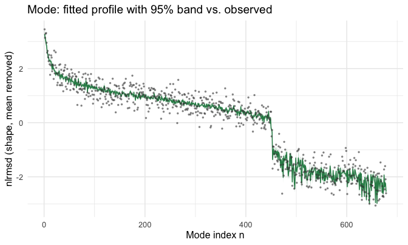
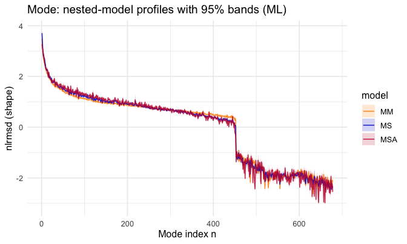
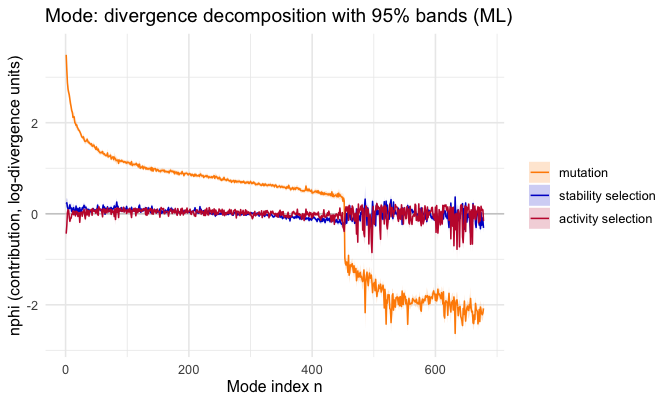

<!--
SOURCE OF TRUTH. This `.Rmd.orig` is the editable vignette; every code chunk runs
for real. The shipped `inference-methods.Rmd` is PRE-RENDERED from this file.
Regenerate it after editing this file or after any change to the package code the
vignette exercises (run from INSIDE vignettes/ so fig.path resolves correctly):

  cd vignettes && Rscript -e 'knitr::knit("inference-methods.Rmd.orig", output = "inference-methods.Rmd")'

then commit this file, the rendered `inference-methods.Rmd`, and its figures.
The working tree must be installed first if a chunk calls package functions not
yet in the installed package (`library(msamodel)` loads the *installed* package).
Pattern: https://ropensci.org/technotes/2019/12/08/precompute-vignettes/
-->


## What this vignette does

When a protein evolves, different residues drift in structure at different rates: some
positions barely move across a family of homologues, others swing widely. `msamodel`
predicts that **per-residue divergence profile** from a single structure and a model of
how mutations perturb it, governed by two selection-strength parameters, `a1`
(stability) and `a2` (activity). If you also have a *measured* divergence profile — how
much each residue actually moved across real homologues — you can **fit** those two
parameters to your data and ask how well the model explains it.

This vignette teaches that fitting workflow end to end, and — because a point estimate
without an uncertainty is not worth much — it puts a **confidence band** on every
prediction. The idea behind the band is simple: the fit does not know `(a1, a2)`
exactly, only to within a standard error, and a small wobble in `(a1, a2)` produces a
small wobble in every predicted value. The band is the size of that downstream wobble —
the fit's own uncertainty carried forward to each prediction, giving a `mean` with a
`lower`/`upper` interval at every residue. ("Delta method" is just the standard name for
this carry-forward; you don't need its formula to use the result.) The fit is
deterministic (a numerical optimisation, no chain or burn-in), so the same data always
gives the same answer.

One scope note: this band reflects the uncertainty in the fitted `(a1, a2)` only. The
mutation scan it is built on is itself finite (a limited number of mutations per site),
which is a second, separate source of uncertainty the band does not cover. So read the
bands here as *parameter* uncertainty, not the last word on total uncertainty.

The workflow has five steps, each a function:

1. **fit** `(a1, a2)` to your data — `fit_lrmsd_i_msa_ml()`;
2. **score** how well the fit does — `gof_lrmsd_i_msa_ml()`;
3. **predict** the divergence profile with a band — `predict_lrmsd_i_msa_ml()`;
4. band the four **nested-model variants** (the profile under each what-if selection
   scenario) — `predict_lrmsd_i_nested_models_ml()` and its centred form
   `predict_nlrmsd_i_nested_models_ml()`;
5. band the **decomposition** (splitting one profile into its mutation, stability, and
   activity parts) — `predict_nlrmsd_i_msa_decomposition_ml()`.

The model runs on **two axes**, and every function comes in both. The **site** axis
(function suffix `_i`) gives one value per residue; the **mode** axis (suffix `_n`)
gives one value per normal mode of the structure — a coarser, motion-based coordinate.
**Part A** below runs the whole workflow on the site axis; **Part B** repeats it on the
mode axis. (The [site analysis](site-analysis.html) and [mode analysis](mode-analysis.html)
vignettes develop the model itself; here the model is fixed and the subject is fitting
and uncertainty.)

## One idea to grasp first: `lrmsd` vs. `nlrmsd`

Every predictor below returns its answer in two forms, and knowing which to reach for
is the one thing worth understanding before you start.

- **`lrmsd`** is the profile the model predicts directly: the log of each residue's
  structural divergence. Think of it as the raw predicted curve.
- **`nlrmsd`** is that same curve with its average subtracted off:
  `nlrmsd = lrmsd - mean(lrmsd)`. It describes the *shape* of the profile — which
  residues are above or below average — with the overall level removed. (The leading
  `n` marks this centred form; it appears in the function names too, e.g.
  `predict_nlrmsd_...`. Do not confuse it with the axis suffix `_n`, which means the
  *mode* axis of Part B — a different letter in a different slot.)

Why keep both? Because they answer different questions, and each carries its **own**
confidence band. It is tempting to assume `nlrmsd`'s band is just `lrmsd`'s band shifted
down by the mean — but it is genuinely narrower. The reason: the mean you subtract is
itself computed from the model, so it moves with `(a1, a2)` too. When `(a1, a2)` wobble,
the whole curve and its mean wobble *together*, and part of the wobble cancels in
`lrmsd - mean(lrmsd)`. The shape is thus more tightly pinned down than the raw curve, and
its band is correspondingly tighter. So these are two real predictions with two real
uncertainties, not one prediction drawn twice.

**Which to use:** compare against measured data with **`nlrmsd`**. Real divergence
profiles can only be compared up to an overall level (the data does not pin down the
absolute scale), so the meaningful comparison is of shape — exactly what `nlrmsd` holds.
Reach for **`lrmsd`** when you want the model's raw predicted curve on its own. The
decomposition (step 5) exists only in the centred form, because there is no meaningful
way to split up an overall level the data cannot see.

Keep that distinction in mind; each step below shows both forms and says which it is
using and why.

# Part A — Site axis (`_i`)

## A1. Setup: from your structure to a fittable object

The workflow needs two things from you: a **structure** (a PDB file) and its
**active-site residues** (a vector of residue numbers). Everything else the package
builds. We use the worked example `1znb_A` (zinc beta-lactamase) that ships with the
package; replace the two marked lines with your own protein.

First, attach the packages. `msamodel` is the package itself; the other three are used
by the data-wrangling and plotting code shown throughout (ggplot2 is optional — skip it
if you only want the numeric tables).


```r
library(msamodel)
library(dplyr)      # data-wrangling verbs (mutate, inner_join, ...) used below
#> 
#> Attaching package: 'dplyr'
#> The following objects are masked from 'package:stats':
#> 
#>     filter, lag
#> The following objects are masked from 'package:base':
#> 
#>     intersect, setdiff, setequal, union
library(tidyr)      # pivot_longer, for reshaping the nested/decomposition bands
library(ggplot2)    # the figures below; optional -- skip if you only want the tables
```


```r
pdb_file        <- system.file("extdata", "1znb_A.pdb", package = "msamodel")  # <- your PDB path
pdb_site_active <- c(99, 101, 103, 162, 181, 184, 193, 223)                    # <- your active-site residues
```

From those inputs the package reads the structure, builds an elastic network model of it
(`wt`), and runs a **single-point-mutation scan** (`spm`) — mutating every site in turn
and recording how the structure responds. This scan is the raw material the model turns
into a divergence profile. The `setup_enm()` and `generate_spm_data()` arguments below
configure the network model and the scan; leave them at these values to follow along
(the [site analysis](site-analysis.html) vignette covers what they do and how to tune
them). Only the two lines above are yours to change.


```r
pdb <- bio3d::read.pdb(pdb_file)
wt  <- setup_enm(pdb, node = "ca", model = "ming_wall", d_max = 10.5, frustrated = FALSE)
spm <- generate_spm_data(wt, n_mutations = 10, model = "lfenm", sigma = 0.3,
                         min_sd = 2, pdb_site_active = pdb_site_active, seed = 1024)
```

The scan takes a minute or two; for this example the result also ships as `znb_spm`, so
`data("znb_spm")` loads it if you would rather skip the wait. `spm` is what every later
function reads from: for each mutant it records the energy changes and the structural
divergence it causes, per residue (`dr2_ijm`) and per normal mode (`dr2_njm`), plus the
`site_map` from the site index `i` to `pdb_site`.

The last input is your **data**: the observed divergence profile you want to fit,
supplied as a table with columns `pdb_site` and `lrmsd_i_obs` (the log-divergence
actually measured at each residue). Producing it — comparing homologous structures over
an alignment — is outside `msamodel`; you bring it in this shape. The package ships one
for the worked example, `znb_profile`:


```r
data("znb_profile")   # the example observed data; supply your own in this shape
head(znb_profile)
#> # A tibble: 6 × 2
#>   pdb_site lrmsd_i_obs
#>      <int>       <dbl>
#> 1       20        1.65
#> 2       21        1.68
#> 3       22        1.23
#> 4       23        1.30
#> 5       24        1.95
#> 6       25        1.69
```

## A2. Fit `(a1, a2)` to the data

`fit_lrmsd_i_msa_ml()` is the fit. It searches for the `(a1, a2)` that make the model's
predicted profile best match your observed one (by maximum likelihood), and returns the
estimate together with the information needed to put uncertainties on it. It matches on
**shape**, not level: internally it mean-centres both the predicted and the observed
profile before comparing them, so the fit responds only to the *relative* pattern of
divergence along the chain — which is all an observed profile pins down — and the overall
level, which the data does not constrain, drops out. Give it the scan and your data:


```r
ml <- fit_lrmsd_i_msa_ml(spm, znb_profile)   # spm from A1; znb_profile is your data
c(a1 = ml$a1, a2 = ml$a2)
#>         a1         a2 
#>  0.4580022 42.3021911
```

Those two numbers are the fitted stability and activity selection strengths. The fit
object also carries their standard errors, so you know how well-pinned-down each is:


```r
c(se_a1 = ml$se_a1, se_a2 = ml$se_a2)
#>     se_a1     se_a2 
#>  0.122275 10.186796
```

Every band in the rest of Part A is built from `ml` — specifically from the uncertainty
in these two estimates.

## A3. Score the fit

Before trusting a fit, ask how much of the data it actually explains.
`gof_lrmsd_i_msa_ml()` answers that with a one-row summary in the style of
`broom::glance()`:


```r
gof <- gof_lrmsd_i_msa_ml(ml)
gof
#> # A tibble: 1 × 8
#>      D2   AIC   BIC logLik deviance null_deviance  nobs     k
#>   <dbl> <dbl> <dbl>  <dbl>    <dbl>         <dbl> <int> <int>
#> 1 0.605  283.  293.  -139.     45.1          114.   225     3
```

The headline number is `D2`, the fraction of the profile's variance the model captures
(1 = perfect, 0 = no better than predicting the flat average; it can go negative for a
fit worse than that). `AIC` and `BIC` are here for comparing this fit against another
fit of the same data — they are not meaningful in isolation. The remaining columns
(`logLik`, `deviance`, `null_deviance`, `nobs`, `k`) are the raw quantities `D2`, `AIC`,
and `BIC` are built from, exposed in case you want them; for a quick read, `D2` is the
one to look at.

## A4. Predict the divergence profile, with a band

Now the payoff: the predicted profile. There are two predictors, one per quantity from
the section above — `predict_lrmsd_i_msa_ml()` for the raw `lrmsd` curve and
`predict_nlrmsd_i_msa_ml()` for the centred `nlrmsd` shape. Each takes the fit and the
scan, and returns one row per residue with a `mean` and a `lower`/`upper` band, computed
by propagating the fit's `(a1, a2)` uncertainty through the model.

### The raw curve (`lrmsd`)


```r
band <- predict_lrmsd_i_msa_ml(ml, spm)   # raw lrmsd; *_mean / *_lower / *_upper per residue
head(band)
#> # A tibble: 6 × 5
#>       i pdb_site lrmsd_i_msa_mean lrmsd_i_msa_lower lrmsd_i_msa_upper
#>   <int>    <int>            <dbl>             <dbl>             <dbl>
#> 1     1       20            -2.30             -2.50             -2.10
#> 2     2       21            -3.26             -3.46             -3.07
#> 3     3       22            -3.19             -3.36             -3.02
#> 4     4       23            -3.52             -3.73             -3.31
#> 5     5       24            -3.62             -3.80             -3.43
#> 6     6       25            -3.51             -3.68             -3.35
```

### The centred shape (`nlrmsd`)

The centred predictor returns the same profile with its mean removed, and its own —
narrower — band:


```r
nband <- predict_nlrmsd_i_msa_ml(ml, spm)  # centred nlrmsd; its own delta band
head(nband)
#> # A tibble: 6 × 5
#>       i pdb_site nlrmsd_i_msa_mean nlrmsd_i_msa_lower nlrmsd_i_msa_upper
#>   <int>    <int>             <dbl>              <dbl>              <dbl>
#> 1     1       20             1.82               1.60               2.03 
#> 2     2       21             0.852              0.648              1.06 
#> 3     3       22             0.927              0.743              1.11 
#> 4     4       23             0.599              0.371              0.827
#> 5     5       24             0.501              0.303              0.700
#> 6     6       25             0.605              0.426              0.784
```

### Comparing the fit to your data

To see how well the fitted model matches the measured profile, plot them together. Use
`nlrmsd`, since (as explained above) measured profiles compare on shape, not absolute
level. First centre your observed profile the same way — subtract its mean:


```r
obs_centred <- znb_profile |>
  mutate(nlrmsd_i_obs = lrmsd_i_obs - mean(lrmsd_i_obs)) |>
  select(pdb_site, nlrmsd_i_obs)
```

There is one wrinkle to get right, and it is worth understanding because it will apply
to your own data too. "Centred" only means anything relative to *which residues you
averaged over*. The predictor centres over **all** residues the model covers, because it
knows nothing about your particular dataset. But your measured profile centres over only
the residues *it* observes — and an alignment rarely observes every modelled residue
(here the model spans a few more than the data measures). Two curves centred over two
different residue sets sit at two slightly different zero-levels, so laid on top of each
other they would appear vertically offset for no real reason.

The fix is to put the prediction on the data's footing: re-centre it over exactly the
residues the data observes. Concretely, subtract the prediction's mean *taken over just
the matched residues*. This is one number subtracted from `mean`, `lower`, and `upper`
together, so it slides the band up or down without changing its **width** — it only lines
the two curves up on a common zero:


```r
band_obs <- nband |>
  inner_join(obs_centred, by = "pdb_site")            # keep only residues the data observes

shift <- mean(band_obs$nlrmsd_i_msa_mean)             # prediction's mean over those residues

band_obs <- band_obs |>
  mutate(nlrmsd_i_msa_mean  = nlrmsd_i_msa_mean  - shift,
         nlrmsd_i_msa_lower = nlrmsd_i_msa_lower - shift,
         nlrmsd_i_msa_upper = nlrmsd_i_msa_upper - shift)
```


```r
ggplot(band_obs, aes(pdb_site)) +
  geom_ribbon(aes(ymin = nlrmsd_i_msa_lower, ymax = nlrmsd_i_msa_upper),
              fill = "steelblue", alpha = 0.25) +
  geom_line(aes(y = nlrmsd_i_msa_mean), colour = "steelblue") +
  geom_point(aes(y = nlrmsd_i_obs), colour = "grey25", size = 0.7, alpha = 0.7) +
  labs(title = "Site: fitted profile with 95% band vs. observed",
       x = "Residue (PDB numbering)", y = "nlrmsd (shape, mean removed)")
```


The blue band is the model's 95% prediction; the grey points are your data. Where points
sit inside the band, the fit accounts for them. Widen the band to any level with the
`level` argument (e.g. `level = 0.99`).

## A5. Nested models: what-if selection scenarios

The full model (call it **MSA**) turns on both kinds of selection at once. To see what
each kind would do on its own, the package also evaluates three **what-if** versions of
the *same* profile under different selection regimes: **MM**, no selection (mutation
only); **MS**, stability selection alone; **MA**, activity selection alone. These are
four separate predicted profiles, not pieces of one — comparing them shows how the
profile changes as each kind of selection is switched on.

As with the profile, there is a raw and a centred predictor.
`predict_lrmsd_i_nested_models_ml()` returns the four variants as raw curves:


```r
nested_band <- predict_lrmsd_i_nested_models_ml(ml, spm)  # lrmsd_i_{mm,ms,ma,msa}_{mean,lower,upper}
head(nested_band[, 1:8])   # i, pdb_site, then the MM and MS bands
#> # A tibble: 6 × 8
#>       i pdb_site lrmsd_i_mm_mean lrmsd_i_mm_lower lrmsd_i_mm_upper
#>   <int>    <int>           <dbl>            <dbl>            <dbl>
#> 1     1       20           -2.42            -2.62            -2.22
#> 2     2       21           -3.35            -3.50            -3.20
#> 3     3       22           -3.27            -3.41            -3.13
#> 4     4       23           -3.62            -3.74            -3.51
#> 5     5       24           -3.67            -3.79            -3.55
#> 6     6       25           -3.60            -3.73            -3.47
#> # ℹ 3 more variables: lrmsd_i_ms_mean <dbl>, lrmsd_i_ms_lower <dbl>,
#> #   lrmsd_i_ms_upper <dbl>
```

`predict_nlrmsd_i_nested_models_ml()` returns them centred (each on its own mean), which
is what we plot so all four sit on the same shape scale:


```r
nested_nband <- predict_nlrmsd_i_nested_models_ml(ml, spm)  # nlrmsd_i_{mm,ms,ma,msa}_*
head(nested_nband[, 1:8])
#> # A tibble: 6 × 8
#>       i pdb_site nlrmsd_i_mm_mean nlrmsd_i_mm_lower nlrmsd_i_mm_upper
#>   <int>    <int>            <dbl>             <dbl>             <dbl>
#> 1     1       20            1.43             1.23               1.63 
#> 2     2       21            0.501            0.351              0.652
#> 3     3       22            0.577            0.439              0.716
#> 4     4       23            0.226            0.110              0.341
#> 5     5       24            0.180            0.0605             0.300
#> 6     6       25            0.249            0.122              0.376
#> # ℹ 3 more variables: nlrmsd_i_ms_mean <dbl>, nlrmsd_i_ms_lower <dbl>,
#> #   nlrmsd_i_ms_upper <dbl>
```


```r
# One colour per model variant; MA omitted to keep the panel readable.
model_cols <- c(MM = "#FF8C00", MS = "#0000CD", MSA = "#C41E3A")
nested_long <- nested_nband |>
  pivot_longer(
    c(starts_with("nlrmsd_i_mm_"), starts_with("nlrmsd_i_ms_"), starts_with("nlrmsd_i_msa_")),
    names_to = c("model", ".value"),
    names_pattern = "nlrmsd_i_(mm|ms|msa)_(mean|lower|upper)"
  ) |>
  mutate(model = factor(toupper(model), levels = c("MM", "MS", "MSA")))

ggplot(nested_long, aes(pdb_site, colour = model, fill = model)) +
  geom_vline(xintercept = pdb_site_active, colour = "firebrick",
             alpha = 0.4, linewidth = 0.3) +     # active-site residues
  geom_ribbon(aes(ymin = lower, ymax = upper), colour = NA, alpha = 0.18) +
  geom_line(aes(y = mean), alpha = 0.85) +
  scale_colour_manual(values = model_cols) +
  scale_fill_manual(values = model_cols) +
  labs(title = "Site: nested-model profiles with 95% bands (ML)",
       x = "Residue (PDB numbering)", y = "nlrmsd (shape)", colour = "model", fill = "model")
```


MM's curve varies residue to residue like any profile (mutations perturb different sites
by different amounts), but it carries **no band** — with both selection strengths off it
does not depend on `(a1, a2)` at all, so the fit's uncertainty cannot move it. Bands
appear and widen on the other variants as selection is switched on, and the gap between
MM and the others is the divergence that selection accounts for.

## A6. Decompose each residue's divergence

The nested models (A5) were four separate what-if profiles. The **decomposition** is the
different task: it takes the single full profile and splits each residue's divergence
into three additive parts — how much comes from **mutation** alone, from **stability**
selection, and from **activity** selection — so you can read, residue by residue, what is
driving the divergence there.

`predict_nlrmsd_i_msa_decomposition_ml()` returns those three parts (`nphi_mut`,
`nphi_stab`, `nphi_act`), each with its own band. It exists only in the centred form —
there is no way to split up an overall level the data cannot see — so, unlike the
profile and the nested models, there is a single predictor here:


```r
phi_band <- predict_nlrmsd_i_msa_decomposition_ml(ml, spm)  # nphi_{mut,stab,act}_{mean,lower,upper}
head(phi_band)
#> # A tibble: 6 × 11
#>       i pdb_site nphi_mut_mean nphi_mut_lower nphi_mut_upper nphi_stab_mean
#>   <int>    <int>         <dbl>          <dbl>          <dbl>          <dbl>
#> 1     1       20         1.43          1.23            1.63          0.129 
#> 2     2       21         0.501         0.351           0.652         0.110 
#> 3     3       22         0.577         0.439           0.716         0.107 
#> 4     4       23         0.226         0.110           0.341         0.132 
#> 5     5       24         0.180         0.0605          0.300         0.0933
#> 6     6       25         0.249         0.122           0.376         0.123 
#> # ℹ 5 more variables: nphi_stab_lower <dbl>, nphi_stab_upper <dbl>,
#> #   nphi_act_mean <dbl>, nphi_act_lower <dbl>, nphi_act_upper <dbl>
```


```r
comp_labs <- c(mut = "mutation", stab = "stability selection", act = "activity selection")
comp_cols <- c("mutation" = "#FF8C00", "stability selection" = "#0000CD",
               "activity selection" = "#C41E3A")
phi_long <- phi_band |>
  pivot_longer(
    -c(i, pdb_site),
    names_to = c("component", ".value"),
    names_pattern = "nphi_(mut|stab|act)_(mean|lower|upper)"
  ) |>
  mutate(component = factor(comp_labs[component], levels = comp_labs))

ggplot(phi_long, aes(pdb_site, colour = component, fill = component)) +
  geom_vline(xintercept = pdb_site_active, colour = "firebrick",
             alpha = 0.4, linewidth = 0.3) +     # active-site residues
  geom_hline(yintercept = 0, colour = "grey80") +
  geom_ribbon(aes(ymin = lower, ymax = upper), colour = NA, alpha = 0.2) +
  geom_line(aes(y = mean)) +
  scale_colour_manual(values = comp_cols) +
  scale_fill_manual(values = comp_cols) +
  labs(title = "Site: divergence decomposition with 95% bands (ML)",
       x = "Residue (PDB numbering)", y = "nphi (contribution, log-divergence units)",
       colour = NULL, fill = NULL)
```


The three parts add up, residue by residue, to the full centred profile `nlrmsd_i_msa`
(the split is exact). Their bands do **not** add — each is the uncertainty of that one
part. The mutation part has no band, for the same reason MM had none: it does not depend
on `(a1, a2)`.

# Part B — Mode axis (`_n`)

Everything in Part A was on the **site** axis — one value per residue. The **mode** axis
runs the identical five-step workflow with the `_n` functions, but on the structure's
normal modes: coordinates that describe how the whole protein flexes, ordered from
softest motion upward. Where the site axis answers "which *residues* diverge most," the
mode axis answers "which *collective motions* diverge most" — use it when you care about
the protein's large-scale flexibility rather than individual positions. (What a normal
mode is, and why it is a natural coordinate for divergence, is developed in the
[mode analysis](mode-analysis.html) vignette.)

Each step below is the mode counterpart of the same-numbered site step, so the
*reasoning* from Part A carries over unchanged — here we show the mode functions and
point out only what genuinely differs on this axis.

## B1. Setup (mode)

You work from the same `spm` object built in A1; the mode functions read its per-mode
divergence matrix `dr2_njm`. Your data on this axis is a mode-indexed profile, columns
`n` and `lrmsd_n_obs`; the package ships `znb_profile_n`:


```r
data("znb_profile_n")             # example observed mode profile; supply your own in this shape
head(znb_profile_n)
#> # A tibble: 6 × 2
#>       n lrmsd_n_obs
#>   <int>       <dbl>
#> 1     1       -2.00
#> 2     2       -2.32
#> 3     3       -2.17
#> 4     4       -2.14
#> 5     5       -2.50
#> 6     6       -2.86
```

## B2. Fit (mode)

Same fit, mode data:


```r
mln <- fit_lrmsd_n_msa_ml(spm, znb_profile_n)
c(a1 = mln$a1, a2 = mln$a2, se_a1 = mln$se_a1, se_a2 = mln$se_a2)
#>          a1          a2       se_a1       se_a2 
#>  0.44922086 40.81957340  0.05775644  6.31377052
```

## B3. Score (mode)


```r
gof_lrmsd_n_msa_ml(mln)
#> # A tibble: 1 × 8
#>      D2   AIC   BIC logLik deviance null_deviance  nobs     k
#>   <dbl> <dbl> <dbl>  <dbl>    <dbl>         <dbl> <int> <int>
#> 1 0.956  317.  331.  -156.     62.8         1418.   678     3
```

## B4. Predict the profile (mode)

The two profile predictors, raw and centred, exactly as in A4:


```r
mband  <- predict_lrmsd_n_msa_ml(mln, spm)    # raw lrmsd_n
mnband <- predict_nlrmsd_n_msa_ml(mln, spm)   # centred nlrmsd_n
head(mnband)
#> # A tibble: 6 × 4
#>       n nlrmsd_n_msa_mean nlrmsd_n_msa_lower nlrmsd_n_msa_upper
#>   <int>             <dbl>              <dbl>              <dbl>
#> 1     1              3.27               3.11               3.44
#> 2     2              3.14               2.97               3.30
#> 3     3              3.06               2.88               3.23
#> 4     4              2.93               2.80               3.07
#> 5     5              2.85               2.71               2.98
#> 6     6              2.64               2.55               2.73
```

Two differences from the site axis, both because modes are not residues. There is no
`pdb_site` column — modes are indexed by `n`, so the observed overlay joins on `n`. And
here **every mode is observed** (the data covers all of the model's modes), so the
re-levelling wrinkle from A4 does not arise: the prediction and the data are already
centred over the same set, and we join directly with no shift.


```r
mobs_centred <- znb_profile_n |>
  mutate(nlrmsd_n_obs = lrmsd_n_obs - mean(lrmsd_n_obs)) |>
  select(n, nlrmsd_n_obs)

mband_obs <- mnband |>
  inner_join(mobs_centred, by = "n")
```


```r
ggplot(mband_obs, aes(n)) +
  geom_ribbon(aes(ymin = nlrmsd_n_msa_lower, ymax = nlrmsd_n_msa_upper),
              fill = "seagreen", alpha = 0.25) +
  geom_line(aes(y = nlrmsd_n_msa_mean), colour = "seagreen") +
  geom_point(aes(y = nlrmsd_n_obs), colour = "grey25", size = 0.5, alpha = 0.5) +
  labs(title = "Mode: fitted profile with 95% band vs. observed",
       x = "Mode index n", y = "nlrmsd (shape, mean removed)")
```



## B5. Nested models (mode)

The centred nested predictor, as in A5 (its raw counterpart
`predict_lrmsd_n_nested_models_ml()` behaves exactly like the site version):


```r
mnested_nband <- predict_nlrmsd_n_nested_models_ml(mln, spm)  # nlrmsd_n_{mm,ms,ma,msa}_*
head(mnested_nband[, 1:8])
#> # A tibble: 6 × 8
#>       n nlrmsd_n_mm_mean nlrmsd_n_mm_lower nlrmsd_n_mm_upper nlrmsd_n_ms_mean
#>   <int>            <dbl>             <dbl>             <dbl>            <dbl>
#> 1     1             3.49              3.35              3.64             3.71
#> 2     2             3.16              3.01              3.30             3.40
#> 3     3             2.88              2.70              3.06             3.03
#> 4     4             2.74              2.63              2.85             2.84
#> 5     5             2.67              2.56              2.78             2.78
#> 6     6             2.61              2.54              2.69             2.72
#> # ℹ 3 more variables: nlrmsd_n_ms_lower <dbl>, nlrmsd_n_ms_upper <dbl>,
#> #   nlrmsd_n_ma_mean <dbl>
```


```r
model_cols <- c(MM = "#FF8C00", MS = "#0000CD", MSA = "#C41E3A")
mnested_long <- mnested_nband |>
  pivot_longer(
    c(starts_with("nlrmsd_n_mm_"), starts_with("nlrmsd_n_ms_"), starts_with("nlrmsd_n_msa_")),
    names_to = c("model", ".value"),
    names_pattern = "nlrmsd_n_(mm|ms|msa)_(mean|lower|upper)"
  ) |>
  mutate(model = factor(toupper(model), levels = c("MM", "MS", "MSA")))

ggplot(mnested_long, aes(n, colour = model, fill = model)) +
  geom_ribbon(aes(ymin = lower, ymax = upper), colour = NA, alpha = 0.18) +
  geom_line(aes(y = mean), alpha = 0.85) +
  scale_colour_manual(values = model_cols) +
  scale_fill_manual(values = model_cols) +
  labs(title = "Mode: nested-model profiles with 95% bands (ML)",
       x = "Mode index n", y = "nlrmsd (shape)", colour = "model", fill = "model")
```



As on the site axis, MM has no band (it does not depend on `(a1, a2)`).

## B6. Decompose (mode)

The mode decomposition, as in A6:


```r
mphi_band <- predict_nlrmsd_n_msa_decomposition_ml(mln, spm)  # nphi_{mut,stab,act}_*
head(mphi_band)
#> # A tibble: 6 × 10
#>       n nphi_mut_mean nphi_mut_lower nphi_mut_upper nphi_stab_mean
#>   <int>         <dbl>          <dbl>          <dbl>          <dbl>
#> 1     1          3.49           3.35           3.64          0.219
#> 2     2          3.16           3.01           3.30          0.240
#> 3     3          2.88           2.70           3.06          0.153
#> 4     4          2.74           2.63           2.85          0.105
#> 5     5          2.67           2.56           2.78          0.114
#> 6     6          2.61           2.54           2.69          0.112
#> # ℹ 5 more variables: nphi_stab_lower <dbl>, nphi_stab_upper <dbl>,
#> #   nphi_act_mean <dbl>, nphi_act_lower <dbl>, nphi_act_upper <dbl>
```


```r
comp_labs <- c(mut = "mutation", stab = "stability selection", act = "activity selection")
comp_cols <- c("mutation" = "#FF8C00", "stability selection" = "#0000CD",
               "activity selection" = "#C41E3A")
mphi_long <- mphi_band |>
  pivot_longer(
    -n,
    names_to = c("component", ".value"),
    names_pattern = "nphi_(mut|stab|act)_(mean|lower|upper)"
  ) |>
  mutate(component = factor(comp_labs[component], levels = comp_labs))

ggplot(mphi_long, aes(n, colour = component, fill = component)) +
  geom_hline(yintercept = 0, colour = "grey80") +
  geom_ribbon(aes(ymin = lower, ymax = upper), colour = NA, alpha = 0.2) +
  geom_line(aes(y = mean)) +
  scale_colour_manual(values = comp_cols) +
  scale_fill_manual(values = comp_cols) +
  labs(title = "Mode: divergence decomposition with 95% bands (ML)",
       x = "Mode index n", y = "nphi (contribution, log-divergence units)",
       colour = NULL, fill = NULL)
```



As on the site axis, the three parts sum to `nlrmsd_n_msa` and the mutation part has no
band.

## Where to next

- **[Site analysis](site-analysis.html)** — the per-residue model in full: predict the
  profile, decompose it, sweep `a1`/`a2`, and fit.
- **[Mode analysis](mode-analysis.html)** — the same arc per normal mode.
- **[Package overview](msamodel.html)** — a short end-to-end tour of both axes.

## Session info


```
#> R version 4.2.1 (2022-06-23)
#> Platform: x86_64-apple-darwin17.0 (64-bit)
#> Running under: macOS Big Sur ... 10.16
#> 
#> Matrix products: default
#> BLAS:   /Library/Frameworks/R.framework/Versions/4.2/Resources/lib/libRblas.0.dylib
#> LAPACK: /Library/Frameworks/R.framework/Versions/4.2/Resources/lib/libRlapack.dylib
#> 
#> locale:
#> [1] en_US.UTF-8/en_US.UTF-8/en_US.UTF-8/C/en_US.UTF-8/en_US.UTF-8
#> 
#> attached base packages:
#> [1] stats     graphics  grDevices utils     datasets  methods   base     
#> 
#> other attached packages:
#> [1] ggplot2_4.0.1       tidyr_1.3.1         dplyr_1.1.4        
#> [4] msamodel_0.3.0.9000
#> 
#> loaded via a namespace (and not attached):
#>  [1] Rcpp_1.1.0         knitr_1.43         magrittr_2.0.4     tidyselect_1.2.1  
#>  [5] lattice_0.22-5     R6_2.6.1           rlang_1.1.6        highr_0.11        
#>  [9] jefuns_0.1.0       tools_4.2.1        parallel_4.2.1     grid_4.2.1        
#> [13] gtable_0.3.6       xfun_0.41          cli_3.6.5          withr_3.0.2       
#> [17] bio3d_2.4-5        tibble_3.3.0       lifecycle_1.0.4    S7_0.2.1          
#> [21] Matrix_1.5-4.1     purrr_1.2.0        RColorBrewer_1.1-3 farver_2.1.2      
#> [25] vctrs_0.6.5        glue_1.8.0         evaluate_0.24.0    labeling_0.4.3    
#> [29] compiler_4.2.1     pillar_1.11.1      generics_0.1.4     scales_1.4.0      
#> [33] penm_0.2.0.9000    pkgconfig_2.0.3
```
