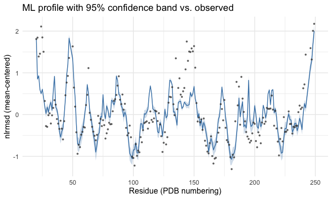
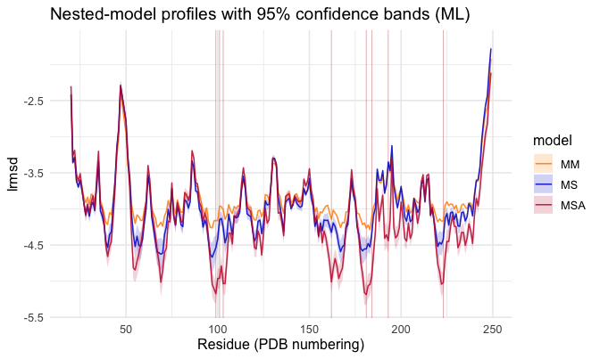
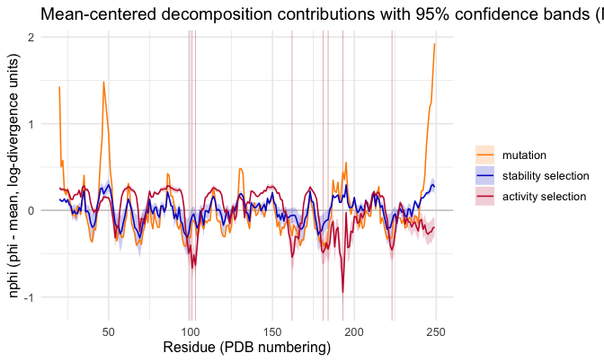

<!--
SOURCE OF TRUTH. This `.Rmd.orig` is the editable vignette; every code chunk runs
for real. The shipped `inference-methods.Rmd` is PRE-RENDERED from this file.
Regenerate it after editing this file or after any change to the package code the
vignette exercises (run from INSIDE vignettes/ so fig.path resolves correctly):

  cd vignettes && Rscript -e 'knitr::knit("inference-methods.Rmd.orig", output = "inference-methods.Rmd")'

then commit this file, the rendered `inference-methods.Rmd`, and its figures.
The working tree must be installed first if a chunk calls package functions not
yet in the installed package (`library(msamodel)` loads the *installed* package).
Pattern: https://ropensci.org/technotes/2019/12/08/precompute-vignettes/
-->


`msamodel` fits the per-residue `lrmsd_i` MSA model to an observed divergence
profile by **maximum likelihood**, and propagates the fit's uncertainty to every
predicted quantity as a **delta-method error band**. This vignette walks through
that fit end to end: estimate the selection parameters, score the fit against the
data, and put a confidence band on the predicted profile and its decomposition.
Its siblings, the [site analysis](site-analysis.html) and
[mode analysis](mode-analysis.html) vignettes, develop the model itself; here we
hold the model fixed and focus on **fitting it to data and quantifying uncertainty**.

The fit is fully deterministic — a numerical optimisation of the likelihood, with
no chain, seed, or burn-in — so the same data always gives the same estimate and
the same bands.

## 1. Setup

Everything starts from your two inputs: a structure file and a vector of
active-site residue numbers. We use the worked example `1znb_A` (zinc
beta-lactamase) that ships with the package; swap in your own at the two marked
lines.


```r
library(msamodel)
library(dplyr)    # data-wrangling verbs (mutate, inner_join, ...) used below
```


```r
pdb_file        <- system.file("extdata", "1znb_A.pdb", package = "msamodel")  # <- your PDB path
pdb_site_active <- c(99, 101, 103, 162, 181, 184, 193, 223)                    # <- your active-site residues
```

`msamodel` reads the structure, builds an elastic network model (`wt`), and runs a
single-point-mutation scan (`spm`):


```r
pdb <- bio3d::read.pdb(pdb_file)
wt  <- setup_enm(pdb, node = "ca", model = "ming_wall", d_max = 10.5, frustrated = FALSE)
spm <- generate_spm_data(wt, n_mutations = 10, model = "lfenm", sigma = 0.3,
                         min_sd = 2, pdb_site_active = pdb_site_active, seed = 1024)
#> Processing site 10 of 228 
#> Processing site 20 of 228 
#> Processing site 30 of 228 
#> Processing site 40 of 228 
#> Processing site 50 of 228 
#> Processing site 60 of 228 
#> Processing site 70 of 228 
#> Processing site 80 of 228 
#> Processing site 90 of 228 
#> Processing site 100 of 228 
#> Processing site 110 of 228 
#> Processing site 120 of 228 
#> Processing site 130 of 228 
#> Processing site 140 of 228 
#> Processing site 150 of 228 
#> Processing site 160 of 228 
#> Processing site 170 of 228 
#> Processing site 180 of 228 
#> Processing site 190 of 228 
#> Processing site 200 of 228 
#> Processing site 210 of 228 
#> Processing site 220 of 228
```

(`spm` is identical to the shipped `znb_spm`; to skim without running the scan,
`data("znb_spm")` loads the prebuilt object instead.) From the scan we precompute
the energy/displacement matrices once; the fit reuses them:


```r
pp <- preprocess_spm(spm)   # list: energy_data, dr2_ijm, site_map
```

The fit target is an **observed** per-residue divergence profile — your data, a
table with columns `pdb_site` and `lrmsd_i_obs`. The observed divergence comes
from comparing homologous structures over an alignment, which is out of scope for
`msamodel`; you bring it in this shape. The package ships one for the worked
example, `znb_profile`:


```r
data("znb_profile")   # the example observed data; supply your own in this shape
head(znb_profile)
#> # A tibble: 6 × 2
#>   pdb_site lrmsd_i_obs
#>      <int>       <dbl>
#> 1       20        1.65
#> 2       21        1.68
#> 3       22        1.23
#> 4       23        1.30
#> 5       24        1.95
#> 6       25        1.69
```

## 2. The fit

`fit_lrmsd_i_msa_ml()` maximises the profiled Gaussian log-likelihood
(`calculate_loglik_lrmsd_i_msa()`) over the selection parameters `(a1, a2)` and
returns the point estimate plus an asymptotic covariance from the Hessian at the
optimum. It is fast and deterministic:


```r
ml <- fit_lrmsd_i_msa_ml(pp, znb_profile)   # pp from section 1; znb_profile is the target
c(a1 = ml$a1, a2 = ml$a2)
#>         a1         a2 
#>  0.4580022 42.3021911
```

The fit object also carries the asymptotic standard errors of the two parameters —
the square roots of the covariance diagonal, `se_a2` mapped to the natural `a2`
scale by the delta method:


```r
c(se_a1 = ml$se_a1, se_a2 = ml$se_a2)
#>     se_a1     se_a2 
#>  0.122275 10.186796
```

## 3. How well does it fit?

`gof_lrmsd_i_msa_ml()` reports an absolute goodness-of-fit summary in the style of
`broom::glance()` for a `glm`: the deviance-explained `D2` against a flat / mean-only
null, together with `AIC`, `BIC`, and the primitives they derive from. Because the
fit mean-centres the profile, `D2 = 1 - deviance/null_deviance` is exactly the
fraction of profile variance the model explains:


```r
gof <- gof_lrmsd_i_msa_ml(ml)
gof
#> # A tibble: 1 × 8
#>      D2   AIC   BIC logLik deviance null_deviance  nobs     k
#>   <dbl> <dbl> <dbl>  <dbl>    <dbl>         <dbl> <int> <int>
#> 1 0.605  283.  293.  -139.     45.1          114.   225     3
```

`D2` is at most `1` but has no lower bound — a negative value would signal a fit
worse than the flat null. The `AIC`/`BIC` here are per-fit numbers, meaningful only
*compared* against another model fit at its own maximum (comparing nested variants
requires fitting them independently, which the package does not yet do).

## 4. The predicted profile, with an error band

`predict_lrmsd_i_msa_ml()` propagates the fit's covariance through the forward map
to a **delta-method confidence band**: it linearises the model prediction about the
fit's `(a1, a2)` and sandwiches the gradient with the fit's covariance, giving a
symmetric band around the predicted profile at every residue. The point estimate
gives a single line; this gives that line plus a band around it:


```r
band <- predict_lrmsd_i_msa_ml(ml, pp)   # one row per residue; *_mean / *_lower / *_upper
head(band)
#> # A tibble: 6 × 8
#>       i pdb_site lrmsd_i_msa_mean lrmsd_i_msa_lower lrmsd_i_msa_upper
#>   <int>    <int>            <dbl>             <dbl>             <dbl>
#> 1     1       20            -2.30             -2.32             -2.28
#> 2     2       21            -3.26             -3.29             -3.24
#> 3     3       22            -3.19             -3.22             -3.15
#> 4     4       23            -3.52             -3.54             -3.49
#> 5     5       24            -3.62             -3.65             -3.58
#> 6     6       25            -3.51             -3.55             -3.47
#> # ℹ 3 more variables: nlrmsd_i_msa_mean <dbl>, nlrmsd_i_msa_lower <dbl>,
#> #   nlrmsd_i_msa_upper <dbl>
```

Plotted against the observed profile (the band and observed both mean-centered, via
the `nlrmsd_*` columns the predictor returns):




The band width is the delta-method standard error scaled to the 95% level; widen it
(e.g. `level = 0.99`) with the `level` argument.

The same propagation applies to any per-residue quantity the model produces, not
just the full profile. Two companions band the analysis outputs.

First, `predict_lrmsd_i_nested_models_ml()` bands each of the four nested variants
— from no selection (MM) through stability-only (MS) and activity-only (MA) to the
full model (MSA) — returning a mean and confidence interval for every one:


```r
nested_band <- predict_lrmsd_i_nested_models_ml(ml, pp)  # lrmsd_i_{mm,ms,ma,msa}_{mean,lower,upper}
head(nested_band[, 1:8])   # i, pdb_site, then the MM and MS bands
#> # A tibble: 6 × 8
#>       i pdb_site lrmsd_i_mm_mean lrmsd_i_mm_lower lrmsd_i_mm_upper
#>   <int>    <int>           <dbl>            <dbl>            <dbl>
#> 1     1       20           -2.42            -2.42            -2.42
#> 2     2       21           -3.35            -3.35            -3.35
#> 3     3       22           -3.27            -3.27            -3.27
#> 4     4       23           -3.62            -3.62            -3.62
#> 5     5       24           -3.67            -3.67            -3.67
#> 6     6       25           -3.60            -3.60            -3.60
#> # ℹ 3 more variables: lrmsd_i_ms_mean <dbl>, lrmsd_i_ms_lower <dbl>,
#> #   lrmsd_i_ms_upper <dbl>
```



The MM band is a flat line with no width: with both selection strengths off it does
not depend on `(a1, a2)`, so the fit's uncertainty leaves it unchanged. The bands
widen as selection is switched on.

Second, `predict_decomposition_i_msa_ml()` bands the mutation / stability / activity
decomposition — each contribution gets a mean and a confidence interval:


```r
phi_band <- predict_decomposition_i_msa_ml(ml, pp)  # phi_{mut,stab,act}_{mean,lower,upper}
head(phi_band)
#> # A tibble: 6 × 11
#>       i pdb_site phi_mut_mean phi_mut_lower phi_mut_upper phi_stab_mean
#>   <int>    <int>        <dbl>         <dbl>         <dbl>         <dbl>
#> 1     1       20        -2.42         -2.42         -2.42     0.00615  
#> 2     2       21        -3.35         -3.35         -3.35    -0.0133   
#> 3     3       22        -3.27         -3.27         -3.27    -0.0164   
#> 4     4       23        -3.62         -3.62         -3.62     0.00931  
#> 5     5       24        -3.67         -3.67         -3.67    -0.0298   
#> 6     6       25        -3.60         -3.60         -3.60     0.0000500
#> # ℹ 5 more variables: phi_stab_lower <dbl>, phi_stab_upper <dbl>,
#> #   phi_act_mean <dbl>, phi_act_lower <dbl>, phi_act_upper <dbl>
```



The three contributions' *means* add up to the full-model profile (the
decomposition is exact at the fit's `(a1, a2)`); the per-contribution bands are the
delta method applied to each contribution in turn. The `phi_mut` (MM) band is
zero-width — that term does not depend on the parameters. (The figure above centres
each contribution on its residue mean, `nphi = phi - mean(phi)`, so the site-to-site
*shape* of the three contributions can be compared on one panel; this shift does not
change the band widths.)

## Where to next

- **[Site analysis](site-analysis.html)** — the per-residue model in full: predict
  the profile, decompose it into mutation / stability / activity contributions,
  sweep `a1`/`a2`, and fit.
- **[Mode analysis](mode-analysis.html)** — the same arc per normal mode.
- **[Package overview](msamodel.html)** — a short end-to-end tour of both axes.

## Session info


```
#> R version 4.2.1 (2022-06-23)
#> Platform: x86_64-apple-darwin17.0 (64-bit)
#> Running under: macOS Big Sur ... 10.16
#> 
#> Matrix products: default
#> BLAS:   /Library/Frameworks/R.framework/Versions/4.2/Resources/lib/libRblas.0.dylib
#> LAPACK: /Library/Frameworks/R.framework/Versions/4.2/Resources/lib/libRlapack.dylib
#> 
#> locale:
#> [1] en_US.UTF-8/en_US.UTF-8/en_US.UTF-8/C/en_US.UTF-8/en_US.UTF-8
#> 
#> attached base packages:
#> [1] stats     graphics  grDevices utils     datasets  methods   base     
#> 
#> other attached packages:
#> [1] ggplot2_4.0.1       tidyr_1.3.1         dplyr_1.1.4        
#> [4] msamodel_0.3.0.9000
#> 
#> loaded via a namespace (and not attached):
#>  [1] Rcpp_1.1.0         rstudioapi_0.16.0  knitr_1.43         magrittr_2.0.4    
#>  [5] tidyselect_1.2.1   lattice_0.22-5     R6_2.6.1           rlang_1.1.6       
#>  [9] highr_0.11         jefuns_0.1.0       tools_4.2.1        parallel_4.2.1    
#> [13] grid_4.2.1         gtable_0.3.6       xfun_0.41          cli_3.6.5         
#> [17] withr_3.0.2        bio3d_2.4-5        tibble_3.3.0       lifecycle_1.0.4   
#> [21] S7_0.2.1           Matrix_1.5-4.1     purrr_1.2.0        RColorBrewer_1.1-3
#> [25] farver_2.1.2       vctrs_0.6.5        glue_1.8.0         evaluate_0.24.0   
#> [29] labeling_0.4.3     compiler_4.2.1     pillar_1.11.1      generics_0.1.4    
#> [33] scales_1.4.0       penm_0.2.0.9000    pkgconfig_2.0.3
```
