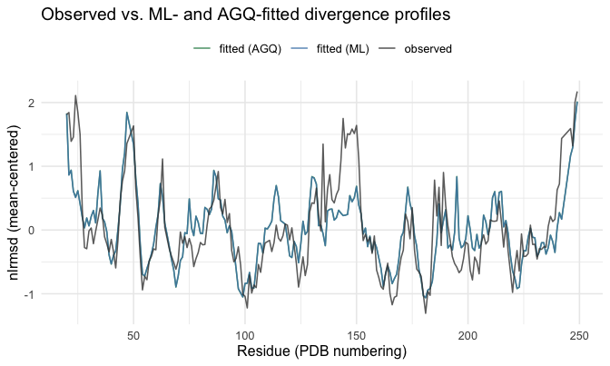
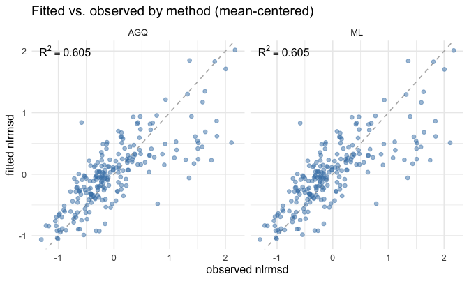
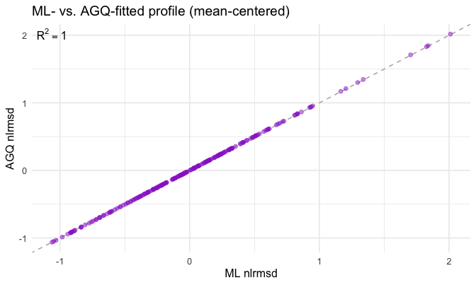
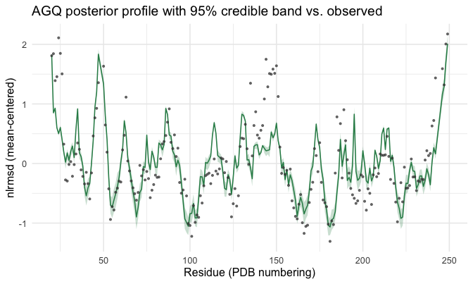
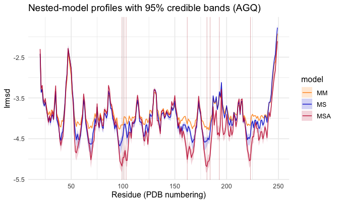
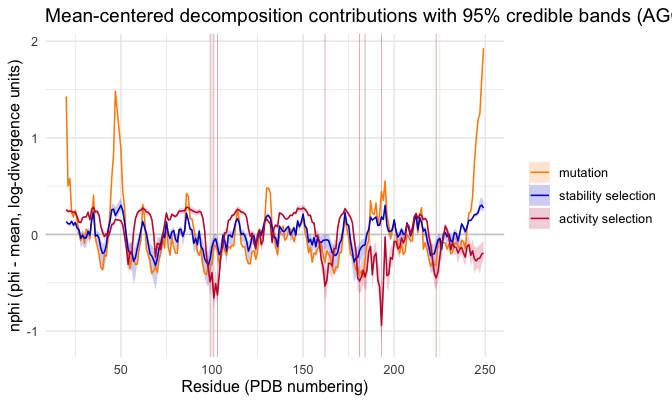

<!--
SOURCE OF TRUTH. This `.Rmd.orig` is the editable vignette; every code chunk runs
for real. The shipped `inference-methods.Rmd` is PRE-RENDERED from this file.
Regenerate it after editing this file or after any change to the package code the
vignette exercises (run from INSIDE vignettes/ so fig.path resolves correctly):

  cd vignettes && Rscript -e 'knitr::knit("inference-methods.Rmd.orig", output = "inference-methods.Rmd")'

then commit this file, the rendered `inference-methods.Rmd`, and its figures.
The working tree must be installed first if a chunk calls package functions not
yet in the installed package (`library(msamodel)` loads the *installed* package).
Pattern: https://ropensci.org/technotes/2019/12/08/precompute-vignettes/
-->


`msamodel` ships two **deterministic** ways to fit the per-residue `lrmsd_i` MSA
model to an observed divergence profile. This vignette runs both on the same data
and compares them. Its siblings, the [site analysis](site-analysis.html) and
[mode analysis](mode-analysis.html) vignettes, develop the model itself; here we
hold the model fixed and vary the *fitting method*.

- **Maximum likelihood** (`fit_lrmsd_i_msa_ml()`) returns a **point estimate** of
  the selection parameters `(a1, a2)` plus an asymptotic standard error from the
  Hessian at the optimum — a fast Gaussian (Laplace) summary.
- **Adaptive Gauss–Hermite quadrature** (`fit_lrmsd_i_msa_agq()`) returns a
  **deterministic posterior**: posterior means, standard deviations and credible
  intervals, computed by placing a handful of quadrature nodes at the locations
  the ML Laplace approximation suggests. No chain, no seed, no burn-in.

The question this vignette answers: do the two agree, and what does the posterior
buy you over the point estimate?

## 1. Setup

Everything starts from your two inputs: a structure file and a vector of
active-site residue numbers. We use the worked example `1znb_A` (zinc
beta-lactamase) that ships with the package; swap in your own at the two marked
lines.


```r
library(msamodel)
library(dplyr)    # data-wrangling verbs (mutate, inner_join, ...) used below
```


```r
pdb_file        <- system.file("extdata", "1znb_A.pdb", package = "msamodel")  # <- your PDB path
pdb_site_active <- c(99, 101, 103, 162, 181, 184, 193, 223)                    # <- your active-site residues
```

`msamodel` reads the structure, builds an elastic network model (`wt`), and runs a
single-point-mutation scan (`spm`):


```r
pdb <- bio3d::read.pdb(pdb_file)
wt  <- setup_enm(pdb, node = "ca", model = "ming_wall", d_max = 10.5, frustrated = FALSE)
spm <- generate_spm_data(wt, n_mutations = 10, model = "lfenm", sigma = 0.3,
                         min_sd = 2, pdb_site_active = pdb_site_active, seed = 1024)
#> Processing site 10 of 228 
#> Processing site 20 of 228 
#> Processing site 30 of 228 
#> Processing site 40 of 228 
#> Processing site 50 of 228 
#> Processing site 60 of 228 
#> Processing site 70 of 228 
#> Processing site 80 of 228 
#> Processing site 90 of 228 
#> Processing site 100 of 228 
#> Processing site 110 of 228 
#> Processing site 120 of 228 
#> Processing site 130 of 228 
#> Processing site 140 of 228 
#> Processing site 150 of 228 
#> Processing site 160 of 228 
#> Processing site 170 of 228 
#> Processing site 180 of 228 
#> Processing site 190 of 228 
#> Processing site 200 of 228 
#> Processing site 210 of 228 
#> Processing site 220 of 228
```

(`spm` is identical to the shipped `znb_spm`; to skim without running the scan,
`data("znb_spm")` loads the prebuilt object instead.) From the scan we precompute
the energy/displacement matrices once; both fits below reuse them:


```r
pp <- preprocess_spm(spm)   # list: energy_data, dr2_ijm, site_map
```

The fit target is an **observed** per-residue divergence profile — your data, a
table with columns `pdb_site` and `lrmsd_i_obs`. The observed divergence comes
from comparing homologous structures over an alignment, which is out of scope for
`msamodel`; you bring it in this shape. The package ships one for the worked
example, `znb_profile`:


```r
data("znb_profile")   # the example observed data; supply your own in this shape
head(znb_profile)
#> # A tibble: 6 × 2
#>   pdb_site lrmsd_i_obs
#>      <int>       <dbl>
#> 1       20        1.65
#> 2       21        1.68
#> 3       22        1.23
#> 4       23        1.30
#> 5       24        1.95
#> 6       25        1.69
```

## 2. The two fits

`fit_lrmsd_i_msa_ml()` maximises the profiled Gaussian log-likelihood
(`calculate_loglik_lrmsd_i_msa()`) over `(a1, a2)` and returns the estimate plus an
asymptotic covariance from the Hessian at the optimum. It is fast and deterministic:


```r
ml <- fit_lrmsd_i_msa_ml(pp, znb_profile)   # pp from section 1; znb_profile is the target
c(a1 = ml$a1, a2 = ml$a2)
#>         a1         a2 
#>  0.4580022 42.3021911
```

`fit_lrmsd_i_msa_agq()` approximates the **posterior** of `(a1, a2)` under the same
likelihood, *deterministically*, by adaptive Gauss–Hermite quadrature — placing
nodes at the locations the ML Laplace (Gaussian) approximation suggests. For this
protein the posterior is near-Gaussian in `(a1, log2(a2 + 1))`, so the default 7×7
grid (49 likelihood evaluations) reproduces it essentially exactly. It reports
posterior means, standard deviations and credible intervals on the natural
`(a1, a2)` scale:


```r
agq <- fit_lrmsd_i_msa_agq(pp, znb_profile)   # default n_nodes = 7
c(a1 = agq$a1, a2 = agq$a2)
#>         a1         a2 
#>  0.4706557 42.6931072
```

## 3. Do they agree on the parameters?

To score each fit against the data, we predict the MSA profile at a single
`(a1, a2)` — the ML point estimate and the AGQ posterior mean — using the same
forward map (`calculate_lrmsd_i_nested_models()`), then mean-center it
(`nlrmsd = lrmsd - mean(lrmsd)`). Predicting at a single point keeps the only
difference between the two arms the *estimate* of `(a1, a2)`, not how the profile is
summarised:


```r
# Goodness-of-fit helper. msamodel does not export an R^2 (the fit-assessment
# layer is deferred to a later version), so we define it here for the comparison.
r2 <- function(obs, pred) 1 - sum((obs - pred)^2) / sum((obs - mean(obs))^2)

ml_msa <- calculate_lrmsd_i_nested_models(pp, ml$a1, ml$a2) |>
  transmute(pdb_site, lrmsd_ml = lrmsd_i_msa)

agq_msa <- calculate_lrmsd_i_nested_models(pp, agq$a1, agq$a2) |>
  transmute(pdb_site, lrmsd_agq = lrmsd_i_msa)

cmp <- znb_profile |>
  inner_join(ml_msa,  by = "pdb_site") |>
  inner_join(agq_msa, by = "pdb_site") |>
  mutate(
    nlrmsd_i_obs = lrmsd_i_obs - mean(lrmsd_i_obs),
    nlrmsd_ml    = lrmsd_ml    - mean(lrmsd_ml),
    nlrmsd_agq   = lrmsd_agq   - mean(lrmsd_agq)
  )

r2_ml  <- r2(cmp$nlrmsd_i_obs, cmp$nlrmsd_ml)
r2_agq <- r2(cmp$nlrmsd_i_obs, cmp$nlrmsd_agq)
```

The two arms land on essentially the same `(a1, a2)`, with comparable uncertainty
(the ML asymptotic standard error vs the AGQ posterior sd), and explain the observed
profile equally well:


Table: ML and AGQ estimates of the selection parameters (uncertainty is the ML asymptotic standard error or the AGQ posterior sd)

|method               |    a1| a1 (se/sd)|     a2| a2 (se/sd)|    R²|
|:--------------------|-----:|----------:|------:|----------:|-----:|
|ML (point estimate)  | 0.458|      0.122| 42.302|     10.187| 0.605|
|AGQ (posterior mean) | 0.471|      0.125| 42.693|     10.558| 0.605|


## 4. Do they agree on the predicted profile?

The parameters agree; so do the profiles they predict. Observed, ML-fitted and
AGQ-fitted profiles along the chain (all mean-centered):




Fitted vs observed, one panel per method (the goodness-of-fit view); points on the
dashed 1:1 line fit perfectly, and the R² scores the fit to data:



Finally, the ML point estimate directly against the AGQ posterior mean. Points on
the dashed 1:1 line mean the two methods predict the **same** profile site-for-site;
the R² here measures **method-vs-method** agreement, not fit to data:


```r
r2_methods <- r2(cmp$nlrmsd_ml, cmp$nlrmsd_agq)
r2_methods
#> [1] 0.9999644
```



The deterministic quadrature recovers the same profile as the point estimate, at
49 likelihood evaluations.

## 5. What AGQ gives you that ML doesn't

Because AGQ carries the whole `(a1, a2)` posterior, it propagates that uncertainty
to the **predicted profile**: `predict_lrmsd_i_msa_agq()` returns, per residue, the
posterior mean and a credible band — the model prediction integrated over the
posterior — making no Gaussian assumption. The ML fit gives a single line; AGQ
gives that line plus a band around it:


```r
band <- predict_lrmsd_i_msa_agq(agq, pp)   # one row per residue; *_mean / *_lower / *_upper
head(band)
#> # A tibble: 6 × 8
#>       i pdb_site lrmsd_i_msa_mean lrmsd_i_msa_lower lrmsd_i_msa_upper
#>   <int>    <int>            <dbl>             <dbl>             <dbl>
#> 1     1       20            -2.30             -2.33             -2.28
#> 2     2       21            -3.27             -3.30             -3.24
#> 3     3       22            -3.19             -3.23             -3.16
#> 4     4       23            -3.52             -3.54             -3.50
#> 5     5       24            -3.62             -3.65             -3.59
#> 6     6       25            -3.52             -3.55             -3.48
#> # ℹ 3 more variables: nlrmsd_i_msa_mean <dbl>, nlrmsd_i_msa_lower <dbl>,
#> #   nlrmsd_i_msa_upper <dbl>
```

Plotted against the observed profile (the band and observed both mean-centered):



The band is read off the node masses as weighted quantiles, so its tails are only
as fine as the node grid; on this protein it is already stable at the default
`n_nodes`. To sharpen it (e.g. at `level = 0.99`), refit with a larger `n_nodes`.

The same posterior propagation applies to any per-residue quantity the model
produces, not just the full profile. Two companions band the analysis outputs.

First, `predict_lrmsd_i_nested_models_agq()` bands each of the four nested variants
— from no selection (MM) through stability-only (MS) and activity-only (MA) to the
full model (MSA) — returning a posterior mean and credible interval for every one:


```r
nested_band <- predict_lrmsd_i_nested_models_agq(agq, pp)  # lrmsd_i_{mm,ms,ma,msa}_{mean,lower,upper}
head(nested_band[, 1:8])   # i, pdb_site, then the MM and MS bands
#> # A tibble: 6 × 8
#>       i pdb_site lrmsd_i_mm_mean lrmsd_i_mm_lower lrmsd_i_mm_upper
#>   <int>    <int>           <dbl>            <dbl>            <dbl>
#> 1     1       20           -2.42            -2.42            -2.42
#> 2     2       21           -3.35            -3.35            -3.35
#> 3     3       22           -3.27            -3.27            -3.27
#> 4     4       23           -3.62            -3.62            -3.62
#> 5     5       24           -3.67            -3.67            -3.67
#> 6     6       25           -3.60            -3.60            -3.60
#> # ℹ 3 more variables: lrmsd_i_ms_mean <dbl>, lrmsd_i_ms_lower <dbl>,
#> #   lrmsd_i_ms_upper <dbl>
```



The MM band is a flat line with no width: with both selection strengths off it does
not depend on `(a1, a2)`, so the posterior leaves it unchanged. The bands widen as
selection is switched on.

Second, `predict_decomposition_i_msa_agq()` bands the mutation / stability / activity
decomposition — each contribution gets a posterior mean and a credible interval:


```r
phi_band <- predict_decomposition_i_msa_agq(agq, pp)  # phi_{mut,stab,act}_{mean,lower,upper}
head(phi_band)
#> # A tibble: 6 × 11
#>       i pdb_site phi_mut_mean phi_mut_lower phi_mut_upper phi_stab_mean
#>   <int>    <int>        <dbl>         <dbl>         <dbl>         <dbl>
#> 1     1       20        -2.42         -2.42         -2.42       0.00665
#> 2     2       21        -3.35         -3.35         -3.35      -0.0146 
#> 3     3       22        -3.27         -3.27         -3.27      -0.0189 
#> 4     4       23        -3.62         -3.62         -3.62       0.00921
#> 5     5       24        -3.67         -3.67         -3.67      -0.0310 
#> 6     6       25        -3.60         -3.60         -3.60      -0.00283
#> # ℹ 5 more variables: phi_stab_lower <dbl>, phi_stab_upper <dbl>,
#> #   phi_act_mean <dbl>, phi_act_lower <dbl>, phi_act_upper <dbl>
```



The three contributions' posterior *means* still add up to the full-model profile
(the decomposition is exact at every node, so it holds in the posterior mean); the
per-contribution bands are read off the same quadrature. This is the deterministic
replacement for the credible bands the Markov chain used to provide. (The figure
above centres each contribution on its residue mean, `nphi = phi - mean(phi)`, so the
site-to-site *shape* of the three contributions can be compared on one panel; this
shift does not change the band widths.)

## Where to next

- **[Site analysis](site-analysis.html)** — the per-residue model in full: predict
  the profile, decompose it into mutation / stability / activity contributions,
  sweep `a1`/`a2`, and fit.
- **[Mode analysis](mode-analysis.html)** — the same arc per normal mode.
- **[Package overview](msamodel.html)** — a short end-to-end tour of both axes.

## Session info


```
#> R version 4.2.1 (2022-06-23)
#> Platform: x86_64-apple-darwin17.0 (64-bit)
#> Running under: macOS Big Sur ... 10.16
#> 
#> Matrix products: default
#> BLAS:   /Library/Frameworks/R.framework/Versions/4.2/Resources/lib/libRblas.0.dylib
#> LAPACK: /Library/Frameworks/R.framework/Versions/4.2/Resources/lib/libRlapack.dylib
#> 
#> locale:
#> [1] en_US.UTF-8/en_US.UTF-8/en_US.UTF-8/C/en_US.UTF-8/en_US.UTF-8
#> 
#> attached base packages:
#> [1] stats     graphics  grDevices utils     datasets  methods   base     
#> 
#> other attached packages:
#> [1] ggplot2_4.0.1       tidyr_1.3.1         dplyr_1.1.4        
#> [4] msamodel_0.3.0.9000
#> 
#> loaded via a namespace (and not attached):
#>  [1] Rcpp_1.1.0         rstudioapi_0.16.0  knitr_1.43         magrittr_2.0.4    
#>  [5] tidyselect_1.2.1   lattice_0.22-5     R6_2.6.1           rlang_1.1.6       
#>  [9] highr_0.11         jefuns_0.1.0       tools_4.2.1        parallel_4.2.1    
#> [13] grid_4.2.1         gtable_0.3.6       xfun_0.41          cli_3.6.5         
#> [17] withr_3.0.2        bio3d_2.4-5        tibble_3.3.0       lifecycle_1.0.4   
#> [21] S7_0.2.1           Matrix_1.5-4.1     purrr_1.2.0        RColorBrewer_1.1-3
#> [25] farver_2.1.2       vctrs_0.6.5        glue_1.8.0         evaluate_0.24.0   
#> [29] labeling_0.4.3     compiler_4.2.1     pillar_1.11.1      generics_0.1.4    
#> [33] scales_1.4.0       penm_0.2.0.9000    pkgconfig_2.0.3
```
