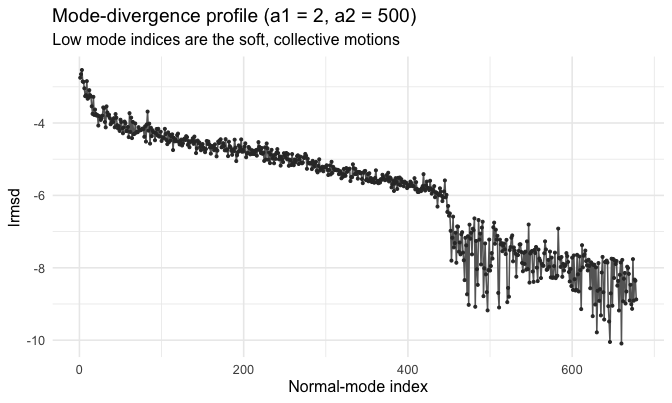
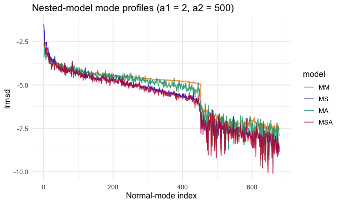
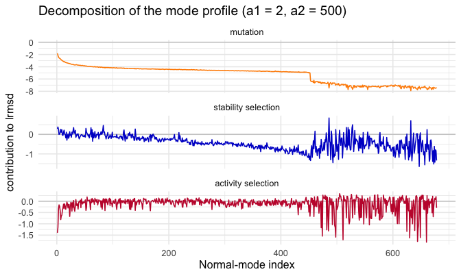
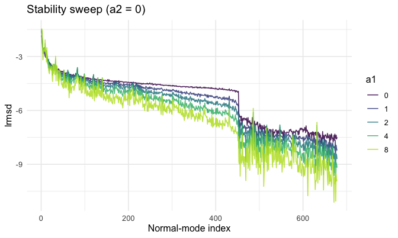
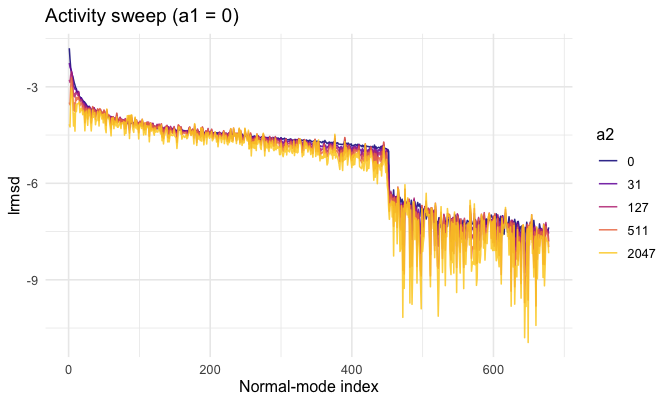
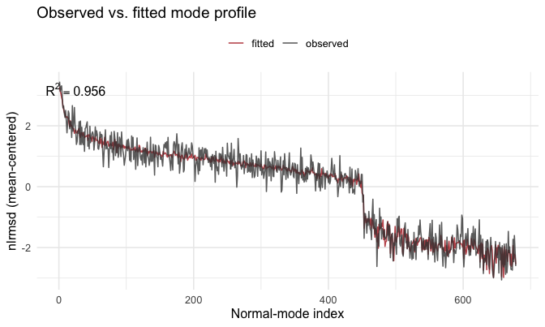
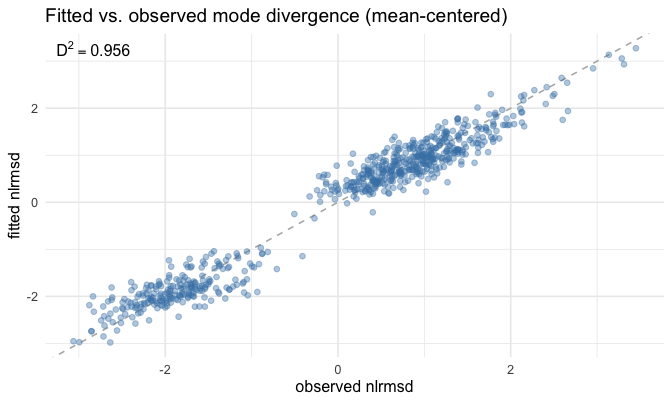
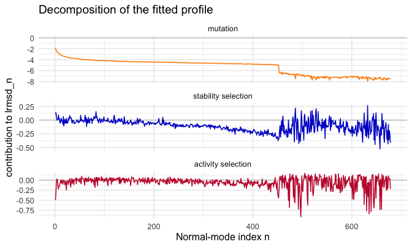

<!--
SOURCE OF TRUTH. This `.Rmd.orig` is the editable vignette; every code chunk runs
for real. The shipped `mode-analysis.Rmd` is PRE-RENDERED from this file.
Regenerate it after editing this file or after any change to the package code the
vignette exercises:

  Rscript -e 'knitr::knit("vignettes/mode-analysis.Rmd.orig", output = "vignettes/mode-analysis.Rmd")'

then commit both this file, the rendered `mode-analysis.Rmd`, and its figures.
Pattern: https://ropensci.org/technotes/2019/12/08/precompute-vignettes/
-->


This vignette predicts structural divergence **per normal mode** and fits it to
data. Its sibling, the [site analysis vignette](site-analysis.html), runs the same
arc **per residue**; the two are companion views of one model. For a short
end-to-end tour of both axes, see the [package overview](msamodel.html).

A single mutation displaces the structure by a vector `dr`. The site form sums `dr`
per residue (`dr2_i`); the mode form projects `dr` onto the elastic-network normal
modes and squares each contribution (`dr2_n = (mode n component of dr)^2`). The two
are the same displacement in two bases, so for any single mutant the totals agree:
`sum_i dr2_i == sum_n dr2_n`. Low-index modes are the soft, collective motions of
the protein; the mode profile shows **which motions** carry the predicted
divergence, where the site profile shows **which residues** do. We use the worked
example `1znb_A` (zinc beta-lactamase), whose data ship as the `znb_*` datasets.

## 1. Setup

Everything starts from your two inputs: a structure file and a vector of
active-site residue numbers. We use the worked example `1znb_A` (zinc
beta-lactamase) that ships with the package; swap in your own at the two marked
lines.


```r
library(msamodel)
library(dplyr)    # data-wrangling verbs (mutate, left_join, ...) used below
```


```r
pdb_file        <- system.file("extdata", "1znb_A.pdb", package = "msamodel")  # <- your PDB path
pdb_site_active <- c(99, 101, 103, 162, 181, 184, 193, 223)                    # <- your active-site residues
```

`msamodel` reads the structure, builds an elastic network model (`wt`), and runs a
single-point-mutation scan (`spm`) — the **same** scan the site axis uses; only the
reshaping differs:


```r
pdb <- bio3d::read.pdb(pdb_file)
wt  <- setup_enm(pdb, node = "ca", model = "ming_wall", d_max = 10.5, frustrated = FALSE)
spm <- generate_spm_data(wt, n_mutations = 10, model = "lfenm", sigma = 0.3,
                         min_sd = 2, pdb_site_active = pdb_site_active, seed = 1024)
#> Processing site 10 of 228 
#> Processing site 20 of 228 
#> Processing site 30 of 228 
#> Processing site 40 of 228 
#> Processing site 50 of 228 
#> Processing site 60 of 228 
#> Processing site 70 of 228 
#> Processing site 80 of 228 
#> Processing site 90 of 228 
#> Processing site 100 of 228 
#> Processing site 110 of 228 
#> Processing site 120 of 228 
#> Processing site 130 of 228 
#> Processing site 140 of 228 
#> Processing site 150 of 228 
#> Processing site 160 of 228 
#> Processing site 170 of 228 
#> Processing site 180 of 228 
#> Processing site 190 of 228 
#> Processing site 200 of 228 
#> Processing site 210 of 228 
#> Processing site 220 of 228
```

(`spm` is identical to the shipped `znb_spm`; to skim, `data("znb_spm")` loads it.)
`preprocess_spm_mode()` is the mode counterpart of `preprocess_spm()`: it reshapes
the per-mutant scan into the `[mutant x mode]` matrix the mode evaluator reweights.


```r
pp_mode <- preprocess_spm_mode(spm)   # list: energy_data, dr2_njm
dim(pp_mode$dr2_njm)                   # mutants x modes
#> [1] 2280  678
```

> **For your own protein you can run the mode prediction (sections 1–4); the mode
> fit (section 5) cannot yet be reproduced on real data** — it needs an observed
> per-mode divergence profile, which `msamodel` does not compute. The example uses a
> **synthetic** stand-in, loaded where the fit begins (section 5).

## 2. Divergence profile at given (a1, a2)

For any `(a1, a2)`, `calculate_dr2_n_msa()` returns the selection-weighted mean
`dr2_n` per mode. The per-mode divergence is `lrmsd_n = log(sqrt(dr2_n))`, the
mode analogue of the site form's `lrmsd`.


```r
a1 <- 2; a2 <- 500
prof_mode <- calculate_dr2_n_msa(pp_mode, a1, a2) |>
  mutate(lrmsd_n = log(sqrt(dr2_n)))
head(prof_mode)
#> # A tibble: 6 × 3
#>       n   dr2_n lrmsd_n
#>   <int>   <dbl>   <dbl>
#> 1     1 0.00297   -2.91
#> 2     2 0.00291   -2.92
#> 3     3 0.00684   -2.49
#> 4     4 0.00435   -2.72
#> 5     5 0.00353   -2.82
#> 6     6 0.00247   -3.00
```



The lowest-index (softest) modes carry the most divergence: a handful of
collective motions account for most of the predicted structural change.

## 3. Decomposing the profile at given (a1, a2)

As in the site form, the mode profile at a chosen `(a1, a2)` splits into additive
mutation, stability-selection, and activity-selection contributions, built from
four **nested model variants** (each `calculate_dr2_n_msa()` at a particular
parameter point):

| Variant | a1 (stability) | a2 (activity) | meaning |
|:--|:--|:--|:--|
| **MM** | 0 | 0 | mutation only — no selection |
| **MS** | a1 | 0 | mutation + stability selection |
| **MA** | 0 | a2 | mutation + activity selection |
| **MSA** | a1 | a2 | full model — both selections |

`calculate_lrmsd_n_nested_models()` returns all four `lrmsd_n` profiles at once —
the mode counterpart of `calculate_lrmsd_i_nested_models()`:


```r
nested <- calculate_lrmsd_n_nested_models(pp_mode, a1, a2)   # a1 = 2, a2 = 500
```



The **sequential** decomposition adds one selection pressure at a time along
MM → MS → MSA (MA is the alternative single-selection variant, not on this
additive path); each $\phi$ term is the incremental divergence contributed by the
next pressure:

$$
\phi_{\text{mut}}  = \text{lrmsd}_{\text{mm}}, \qquad
\phi_{\text{stab}} = \text{lrmsd}_{\text{ms}} - \text{lrmsd}_{\text{mm}}, \qquad
\phi_{\text{act}}  = \text{lrmsd}_{\text{msa}} - \text{lrmsd}_{\text{ms}}
$$

By construction these sum to the full prediction.
`calculate_decomposition_n_msa()` packages the split for the mode axis — the exact
mirror of `calculate_decomposition_i_msa()` for sites — returning one row per mode
with the three $\phi$ contributions:


```r
phi <- calculate_decomposition_n_msa(pp_mode, a1, a2)   # a1 = 2, a2 = 500
```



## 4. How the profile depends on a1 and a2

As in the site form, stability selection (`a1`, with `a2 = 0`) and activity
selection (`a2`, with `a1 = 0`) reshape the profile differently. We vary one
parameter at a time and overlay the resulting whole mode profiles.


```r
# Stability sweep: vary a1, hold a2 = 0
a1_values <- c(0, 1, 2, 4, 8)
sweep_a1 <- purrr::map_dfr(a1_values, function(a1)
  calculate_dr2_n_msa(pp_mode, a1, 0) |> mutate(lrmsd_n = log(sqrt(dr2_n)), a1 = a1))

# Activity sweep: vary a2, hold a1 = 0
a2_values <- c(0, 31, 127, 511, 2047)
sweep_a2 <- purrr::map_dfr(a2_values, function(a2)
  calculate_dr2_n_msa(pp_mode, 0, a2) |> mutate(lrmsd_n = log(sqrt(dr2_n)), a2 = a2))
```





Increasing `a1` suppresses divergence across the soft modes (stability selection
damps the collective motions); increasing `a2` reshapes the soft-mode divergence
according to selection on activity.

## 5. Fitting a1 and a2 to observed divergence

To fit, you supply an **observed** per-mode divergence profile — your data, not
something `msamodel` computes. It is a table with columns `n` and `lrmsd_n_obs`
(the observed log-RMSD per mode), keyed by the mode index `n`. The observed mode
divergence comes from comparing homologous structures over an alignment, which is
out of scope for `msamodel`. The example fixture `znb_profile_n` is a synthetic
stand-in (no measured per-mode profile exists yet; see `?znb_profile_n`):


```r
data("znb_profile_n")   # observed mode profile (here a synthetic example); supply your own in this shape
```

Mirroring the site fit, `fit_lrmsd_n_msa_ml()` estimates `a1, a2` from it by maximum
likelihood, returning a point estimate plus an asymptotic covariance from the
Hessian:


```r
ml_n <- fit_lrmsd_n_msa_ml(pp_mode, znb_profile_n)
c(a1 = ml_n$a1, a2 = ml_n$a2)
#>         a1         a2 
#>  0.4492209 40.8195734
```


Table: ML estimate of the selection parameters (se from the Hessian)

|parameter | estimate|    se|
|:---------|--------:|-----:|
|a1        |    0.449| 0.058|
|a2        |   40.820| 6.314|


### Fitted vs. observed

Observed vs. fitted mode profile, mean-centered as the likelihood compares them:


```r
# Coefficient of determination, R^2 = 1 - SSE/SST, used to score the fit.
r2 <- function(obs, pred) 1 - sum((obs - pred)^2) / sum((obs - mean(obs))^2)

fitted_n <- calculate_dr2_n_msa(pp_mode, ml_n$a1, ml_n$a2) |>
  transmute(n, lrmsd_n_fit = log(sqrt(dr2_n)))

cmp_n <- znb_profile_n |>
  inner_join(fitted_n, by = "n") |>
  mutate(
    nlrmsd_n_obs = lrmsd_n_obs - mean(lrmsd_n_obs),
    nlrmsd_n_fit = lrmsd_n_fit - mean(lrmsd_n_fit)
  )

r2_n <- r2(cmp_n$nlrmsd_n_obs, cmp_n$nlrmsd_n_fit)
```





## 6. Decomposing the fitted profile

Section 3 decomposed the profile at a *chosen* `(a1, a2)`. The same
$\phi_{\text{mut}}/\phi_{\text{stab}}/\phi_{\text{act}}$ decomposition applies to
the **fitted** profile — call `calculate_decomposition_n_msa()` at the ML estimate
`(ml_n$a1, ml_n$a2)` instead of the chosen strengths. (The fit is to synthetic data,
so this decomposes a synthetic-fitted profile.)


```r
phi_fit <- calculate_decomposition_n_msa(pp_mode, ml_n$a1, ml_n$a2)
```

The mutation term is the divergence under no selection; a negative selection term
means that pressure *reduces* divergence at that mode relative to the
mutation-only model.



## Session info


```
#> R version 4.2.1 (2022-06-23)
#> Platform: x86_64-apple-darwin17.0 (64-bit)
#> Running under: macOS Big Sur ... 10.16
#> 
#> Matrix products: default
#> BLAS:   /Library/Frameworks/R.framework/Versions/4.2/Resources/lib/libRblas.0.dylib
#> LAPACK: /Library/Frameworks/R.framework/Versions/4.2/Resources/lib/libRlapack.dylib
#> 
#> locale:
#> [1] en_US.UTF-8/en_US.UTF-8/en_US.UTF-8/C/en_US.UTF-8/en_US.UTF-8
#> 
#> attached base packages:
#> [1] stats     graphics  grDevices utils     datasets  methods   base     
#> 
#> other attached packages:
#> [1] ggplot2_4.0.1       dplyr_1.1.4         msamodel_0.3.0.9000
#> 
#> loaded via a namespace (and not attached):
#>  [1] Rcpp_1.1.0         pillar_1.11.1      compiler_4.2.1     RColorBrewer_1.1-3
#>  [5] highr_0.11         tools_4.2.1        jefuns_0.1.0       evaluate_0.24.0   
#>  [9] lifecycle_1.0.4    tibble_3.3.0       gtable_0.3.6       lattice_0.22-5    
#> [13] viridisLite_0.4.2  pkgconfig_2.0.3    rlang_1.1.6        Matrix_1.5-4.1    
#> [17] cli_3.6.5          rstudioapi_0.16.0  parallel_4.2.1     xfun_0.41         
#> [21] withr_3.0.2        knitr_1.43         generics_0.1.4     vctrs_0.6.5       
#> [25] grid_4.2.1         tidyselect_1.2.1   glue_1.8.0         R6_2.6.1          
#> [29] farver_2.1.2       purrr_1.2.0        tidyr_1.3.1        magrittr_2.0.4    
#> [33] scales_1.4.0       bio3d_2.4-5        labeling_0.4.3     S7_0.2.1          
#> [37] penm_0.2.0.9000
```
