<!--
SOURCE OF TRUTH. This `.Rmd.orig` is the editable vignette; every code chunk runs
for real. The shipped `msamodel-intro.Rmd` is PRE-RENDERED from this file so that
`R CMD check` does not re-run the MCMC. Regenerate it after editing this file or
after any change to the package code the vignette exercises:

  Rscript -e 'knitr::knit("vignettes/msamodel-intro.Rmd.orig", output = "vignettes/msamodel-intro.Rmd")'

then commit both this file, the rendered `msamodel-intro.Rmd`, and its figures.
Pattern: https://ropensci.org/technotes/2019/12/08/precompute-vignettes/
-->


## What this package does

`msamodel` implements the Mutation-Stability-Activity (MSA) model of neutral
structural evolution. Given a protein structure and its active-site residues, it
predicts the **site-specific structural divergence** expected under neutral
evolution, from a single-point-mutation scan (SPM) of the structure.

The per-site quantity is the log root-mean-square structural displacement,
`lrmsd = log(sqrt(dr2_i))`, where `dr2_i` is a selection-weighted average over
the mutation scan. Two selection parameters control the weighting:

- `a1` — strength of selection on **stability**,
- `a2` — strength of selection on **activity** (proximity to the active site).

This vignette walks through everything v0.1 can do with the worked example
`1znb_A` (zinc beta-lactamase), whose data ship with the package as the `znb_*`
datasets:


```r
data("znb_wt")       # elastic network model (wild type)
data("znb_spm")      # single-point-mutation scan
data("znb_profile")  # observed divergence profile (the fit target)
```


```
#> Example protein: 1znb_A 
#> Active-site residues (PDB numbering): 99, 101, 103, 162, 181, 184, 193, 223 
#> Observed sites: 225
```

## 1. Setup: from a PDB structure to an SPM

The shipped `znb_wt` and `znb_spm` are the result of the setup pipeline below.
Starting from a structure and the active-site residues, you build an elastic
network model and run a single-point-mutation scan. `setup_enm()` takes a bio3d
structure object directly, so you read the file yourself — with
`bio3d::read.pdb()` for legacy `.pdb` or `bio3d::read.cif()` for mmCIF — and the
active site is just a vector of PDB residue numbers.

This is the exact recipe that produced the shipped `znb_spm` dataset, so we show
it but do not re-run it here (the package's `test-spm-generate.R` checks that this
code still reproduces `znb_spm`):


```r
# Read the structure (any source that yields a bio3d pdb object works)
pdb     <- bio3d::read.pdb(system.file("extdata", "1znb_A.pdb", package = "msamodel"))

# Active-site residues (PDB numbering)
pdb_site_active <- c(99, 101, 103, 162, 181, 184, 193, 223)

# Build the elastic network model (wild type)
wt      <- setup_enm(pdb, node = "ca", model = "ming_wall", d_max = 10.5, frustrated = FALSE)

# Single-point-mutation scan: 10 mutations per site
spm     <- generate_spm_data(wt, n_mutations = 10, model = "lfenm",
                             sigma = 0.3, min_sd = 2,
                             pdb_site_active = pdb_site_active, seed = 1024)
# `spm` is identical to the embedded `znb_spm`.
```

From the SPM we precompute the energy/displacement matrices once; every profile
below reuses them:


```r
pp <- preprocess_spm(znb_spm)   # list: energy_data, dr2_ijm, site_map
```

Per-site structural properties (distance to the active site, flexibility) used by
the plots below, keyed by the internal site index `i`:


```r
site_ids   <- as.integer(colnames(pp$dr2_ijm))
site_props <- add_site_properties(tibble(i = site_ids), znb_wt, pdb_site_active) |>
  mutate(lrmsf = log(sqrt(msf))) |>
  left_join(pp$site_map, by = "i") |>
  select(i, pdb_site, dactive, lrmsf)
```

## 2. Divergence profiles at given (a1, a2)

For any choice of `(a1, a2)`, `calculate_dr2_i_msa()` returns the per-site
weighted mean squared displacement; `lrmsd = log(sqrt(dr2_i))` is the divergence
profile. We attach the two structural descriptors from `site_props` — the log
RMSF (flexibility) and the distance to the active site — for context:


```r
a1 <- 2; a2 <- 500
profile_demo <- calculate_dr2_i_msa(pp, a1, a2) |>
  mutate(lrmsd = log(sqrt(dr2_i))) |>
  left_join(site_props, by = "i")
```

The divergence profile along the chain (active sites marked in red):

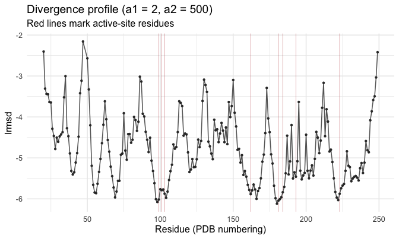

Divergence is lower (more conserved) at rigid sites and near the active site.
Plotting `lrmsd` against flexibility and against distance to the active site,
with a smooth, makes those trends explicit:

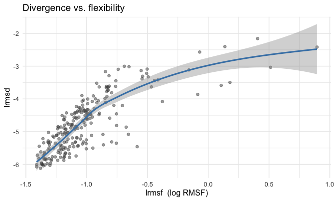

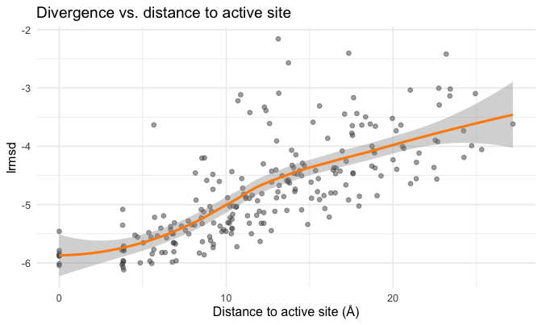

## 3. Decomposing the profile at given (a1, a2)

The profile at a chosen `(a1, a2)` can be split into additive contributions from
mutation, stability selection, and activity selection. The split uses four
**nested model variants**, each just `calculate_dr2_i_msa()` evaluated at a
particular parameter point:

| Variant | a1 (stability) | a2 (activity) | meaning |
|:--|:--|:--|:--|
| **MM** | 0 | 0 | mutation only — no selection |
| **MS** | a1 | 0 | mutation + stability selection |
| **MA** | 0 | a2 | mutation + activity selection |
| **MSA** | a1 | a2 | full model — both selections |

`calculate_lrmsd_i_nested_models()` returns all four lrmsd profiles at once
(`lrmsd_i_mm`, `lrmsd_i_ms`, `lrmsd_i_ma`, `lrmsd_i_msa`):


```r
nested <- calculate_lrmsd_i_nested_models(pp, a1, a2)   # a1 = 2, a2 = 500 from section 2
```

The four profiles along the chain — each model adds one more selection pressure,
suppressing divergence further (active sites marked in red):

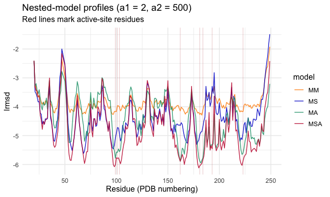

The **sequential** decomposition starts from the mutation-only model and adds one
selection pressure at a time along M0 → MM → MS → MSA. Each term is the
incremental divergence contributed by the next pressure. Writing $\phi$ for the
contributions,

$$
\phi_{\text{mut}}  = \text{lrmsd}_{\text{mm}}
$$
$$
\phi_{\text{stab}} = \text{lrmsd}_{\text{ms}} - \text{lrmsd}_{\text{mm}}
$$
$$
\phi_{\text{act}}  = \text{lrmsd}_{\text{msa}} - \text{lrmsd}_{\text{ms}}
$$

By construction these sum to the full prediction,
$\phi_{\text{mut}} + \phi_{\text{stab}} + \phi_{\text{act}} = \text{lrmsd}_{\text{msa}}$.
`calculate_msa_decomposition()` is pure: it takes the four nested-model lrmsd
vectors and returns the three $\phi$ vectors, so we attach them to `nested`:


```r
phi <- dplyr::bind_cols(
  nested,
  calculate_msa_decomposition(nested$lrmsd_i_mm, nested$lrmsd_i_ms,
                              nested$lrmsd_i_ma, nested$lrmsd_i_msa)
)
```

The three contributions along the chain (active sites marked in red):


This decomposes the profile at the **chosen** `(a1, a2)`. Section 6 applies the
same decomposition to the **fitted** (posterior-mean) profile after `a1, a2` are
estimated from data.

## 4. How the profile depends on a1 and a2

Stability selection (`a1`, with `a2 = 0`) and activity selection (`a2`, with
`a1 = 0`) reshape the profile in different ways. Here we vary one parameter at a
time and overlay the resulting whole (un-centered) profiles:


```r
# Stability sweep: vary a1, hold a2 = 0
a1_values <- c(0, 1, 2, 4, 8)
sweep_a1 <- purrr::map_dfr(a1_values, function(a1)
  calculate_dr2_i_msa(pp, a1, 0) |>
    mutate(lrmsd = log(sqrt(dr2_i)), a1 = a1) |>
    left_join(site_props, by = "i"))

# Activity sweep: vary a2, hold a1 = 0
a2_values <- c(0, 31, 127, 511, 2047)
sweep_a2 <- purrr::map_dfr(a2_values, function(a2)
  calculate_dr2_i_msa(pp, 0, a2) |>
    mutate(lrmsd = log(sqrt(dr2_i)), a2 = a2) |>
    left_join(site_props, by = "i"))
```

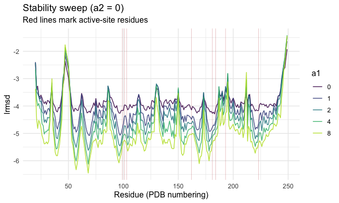


Increasing `a1` suppresses divergence broadly (stronger stability selection
conserves the whole structure); increasing `a2` suppresses divergence
selectively around the active site.

## 5. Fitting a1 and a2 to observed divergence

The fit reuses the same four nested model variants of section 3 (MM / MS / MA /
MSA), but now `a1, a2` are **estimated from data** rather than chosen. The fitted
profiles are `lrmsd_i_mm`, `lrmsd_i_ms`, `lrmsd_i_ma`, `lrmsd_i_msa`; MSA is the
full model, and the other three feed the decomposition of section 6.

Given an observed divergence profile (`observed_data` with columns `pdb_site`
and `lrmsd_i_obs` — here `znb_profile`), `run_msa_bayesian_analysis()` estimates
`a1, a2` by MCMC and returns posterior summaries, per-site predictions for the
four model variants, and the site-level decomposition of section 6. We use
a short chain here so the vignette renders quickly; use more iterations in
practice:


```r
fit <- run_msa_bayesian_analysis(
  spm           = znb_spm,
  observed_data = znb_profile,
  n_mcmc_iter   = 500,    # short, for a fast vignette render; use more in practice
  n_burnin      = 100
)
#> Preprocessing data...
#> Running MCMC...
#> Iteration 100/500 - Acceptance rate: 0.515
#> Iteration 200/500 - Acceptance rate: 0.437
#> Iteration 300/500 - Acceptance rate: 0.398
#> Iteration 400/500 - Acceptance rate: 0.391
#> Iteration 500/500 - Acceptance rate: 0.391
#> Calculating parameter summary...
#> Calculating prediction samples...
#> Processing sample 100/400
#> Processing sample 200/400
#> Processing sample 300/400
#> Processing sample 400/400
#> Calculating prediction summary...
#> Calculating decomposition samples...
#> Calculating decomposition summary...
#> Analysis complete.
```


Table: Posterior summary of the selection parameters

|parameter |   mean|    sd| median|  lower|  upper|
|:---------|------:|-----:|------:|------:|------:|
|a1        |  0.455| 0.123|  0.447|  0.216|  0.669|
|a2        | 44.378| 8.711| 44.141| 27.546| 59.555|


### Fitted vs. observed

The likelihood compares **mean-centered** profiles (`nlrmsd = lrmsd - mean(lrmsd)`),
so the comparison plots use the same centering. We build the comparison table
from the posterior-mean MSA prediction per site, joined to the observed profile,
then center both on the compared subset and annotate with R²:


```r
fit_msa <- fit$prediction_summary |>
  filter(variable == "lrmsd_i_msa") |>
  select(pdb_site, lrmsd_fit = mean)

cmp <- znb_profile |>
  inner_join(fit_msa, by = "pdb_site") |>
  left_join(select(site_props, pdb_site, dactive, lrmsf), by = "pdb_site") |>
  mutate(
    nlrmsd_i_obs = lrmsd_i_obs - mean(lrmsd_i_obs),
    nlrmsd_fit = lrmsd_fit - mean(lrmsd_fit)
  )

r2_fit <- r2(cmp$nlrmsd_i_obs, cmp$nlrmsd_fit)
```


Profile along the chain — observed vs fitted:

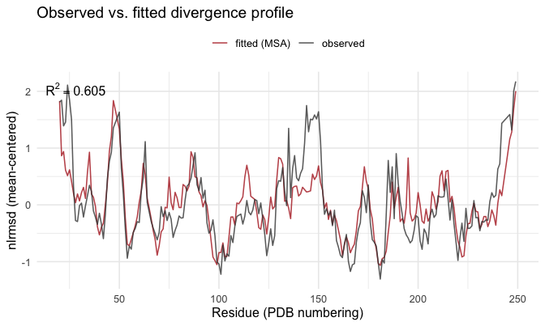

Fitted vs observed as a scatter (the gof view):

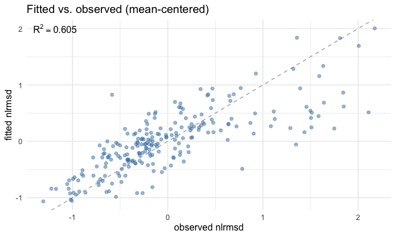

And the fitted/observed divergence against flexibility and distance to the
active site:

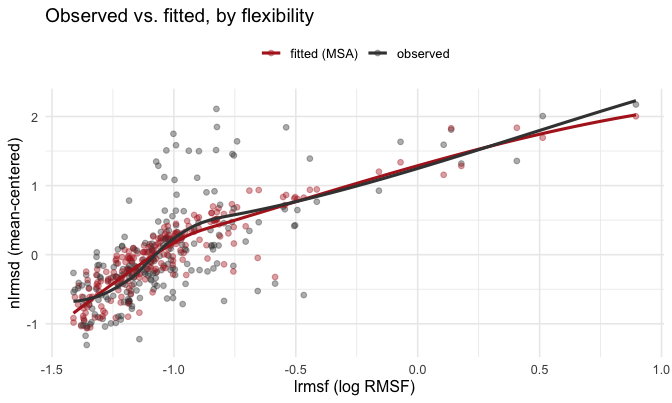

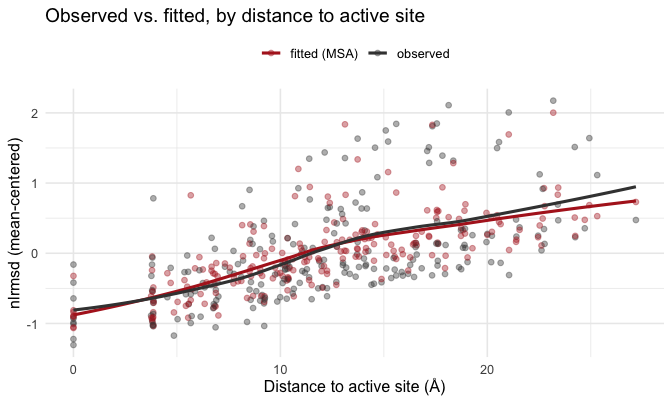

### Maximum-likelihood fit, and a comparison of methods

The MCMC above samples the posterior of `(a1, a2)`. For a fast **point** estimate,
`fit_lrmsd_i_msa_ml()` maximises the *same* likelihood
([`calculate_loglik_lrmsd_i_msa()`]) over the same coordinates (`a1` and
`log2(a2 + 1)`), returning the estimate plus an asymptotic covariance from the
Hessian at the optimum. It is much faster than MCMC — useful for large proteins or
path simulations — but gives no posterior sample. Here we check the two arms agree.


```r
ml <- fit_lrmsd_i_msa_ml(pp, znb_profile)   # pp from section 1; znb_profile is the target
```

To compare the two arms on equal footing, we build **both** profiles the same way:
the MSA prediction from the single-source-of-truth forward map, evaluated at a single
`(a1, a2)` — the **posterior mean** for the MCMC arm and the **point estimate** for
ML — then mean-centered. (This differs from the §5.1 profile above, which is the
posterior *predictive* mean: the per-site prediction averaged over the whole
posterior. Predicting at the posterior-mean parameters instead keeps the only
difference between the two arms the estimate of `(a1, a2)`, not how the profile is
summarised.)


```r
mcmc_par <- fit$parameter_summary
get <- function(p, col) mcmc_par[[col]][mcmc_par$parameter == p]
mcmc_a1 <- get("a1", "mean"); mcmc_a2 <- get("a2", "mean")

# MCMC profile at the posterior-mean (a1, a2) -- same recipe as ML below.
mcmc_msa <- calculate_lrmsd_i_nested_models(pp, mcmc_a1, mcmc_a2) |>
  transmute(pdb_site, lrmsd_mcmc = lrmsd_i_msa)

# ML profile at the point estimate.
ml_msa <- calculate_lrmsd_i_nested_models(pp, ml$a1, ml$a2) |>
  transmute(pdb_site, lrmsd_ml = lrmsd_i_msa)

cmp_ml <- cmp |>
  inner_join(mcmc_msa, by = "pdb_site") |>
  inner_join(ml_msa,   by = "pdb_site") |>
  mutate(
    nlrmsd_mcmc = lrmsd_mcmc - mean(lrmsd_mcmc),
    nlrmsd_ml   = lrmsd_ml   - mean(lrmsd_ml)
  )

r2_mcmc <- r2(cmp_ml$nlrmsd_i_obs, cmp_ml$nlrmsd_mcmc)
r2_ml   <- r2(cmp_ml$nlrmsd_i_obs, cmp_ml$nlrmsd_ml)
```

The two arms land on essentially the same `(a1, a2)`, with comparable uncertainty
(MCMC posterior sd vs ML asymptotic standard error), and explain the observed
profile equally well:


Table: MCMC vs ML estimates of the selection parameters (both profiles predicted at a single (a1, a2); uncertainty is the MCMC posterior sd / the ML asymptotic standard error)

|method                |    a1| a1 (sd/se)|     a2| a2 (sd/se)|    R²|
|:---------------------|-----:|----------:|------:|----------:|-----:|
|MCMC (posterior mean) | 0.455|      0.123| 44.378|      8.711| 0.605|
|ML (point estimate)   | 0.458|      0.122| 42.302|     10.187| 0.605|


Observed, MCMC-fitted and ML-fitted profiles along the chain (all mean-centered):


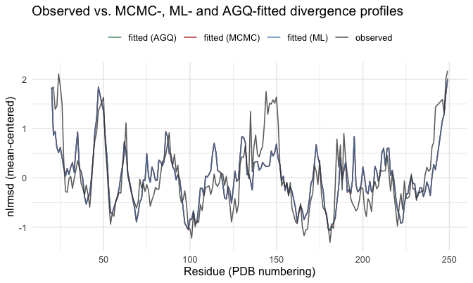

Fitted vs observed, one panel per fit method:

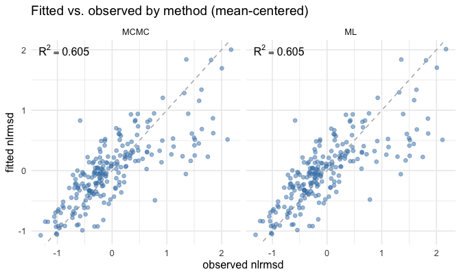

Finally, the two fitted profiles directly against each other. Points on the dashed
1:1 line mean the methods agree site-for-site; the R² here measures
**method-vs-method** agreement, not fit to data:


```r
r2_methods <- r2(cmp_ml$nlrmsd_mcmc, cmp_ml$nlrmsd_ml)
r2_methods
#> [1] 0.9998732
```

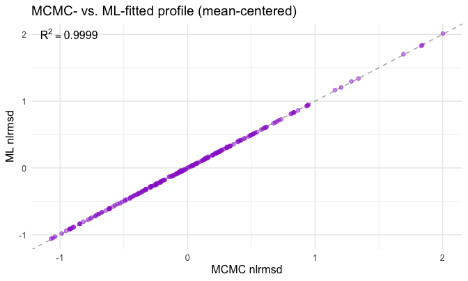

## 6. Site-level decomposition of the fitted profile

Section 3 decomposed the profile at a *chosen* `(a1, a2)`. The fit applies the
**same** sequential decomposition (same $\phi_{\text{mut}}/\phi_{\text{stab}}/\phi_{\text{act}}$
formula) to the **fitted** profile, propagating the MCMC posterior so each
contribution comes with an uncertainty band. `run_msa_bayesian_analysis()` returns
the result as `phi_mut`, `phi_stab`, `phi_act` in `decomposition_summary` (one
posterior summary per site and term).

The mutation term is the divergence under no selection (it still varies among
sites — mutations perturb sites unequally); a negative selection term means that
pressure *reduces* divergence at that site relative to the mutation-only model.

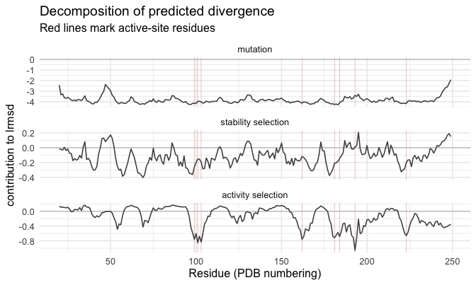

## Session info


```
#> R version 4.2.1 (2022-06-23)
#> Platform: x86_64-apple-darwin17.0 (64-bit)
#> Running under: macOS Big Sur ... 10.16
#> 
#> Matrix products: default
#> BLAS:   /Library/Frameworks/R.framework/Versions/4.2/Resources/lib/libRblas.0.dylib
#> LAPACK: /Library/Frameworks/R.framework/Versions/4.2/Resources/lib/libRlapack.dylib
#> 
#> locale:
#> [1] en_US.UTF-8/en_US.UTF-8/en_US.UTF-8/C/en_US.UTF-8/en_US.UTF-8
#> 
#> attached base packages:
#> [1] stats     graphics  grDevices utils     datasets  methods   base     
#> 
#> other attached packages:
#> [1] ggplot2_4.0.1       tidyr_1.3.1         dplyr_1.1.4        
#> [4] msamodel_0.3.0.9000
#> 
#> loaded via a namespace (and not attached):
#>  [1] Rcpp_1.1.0         pillar_1.11.1      compiler_4.2.1     RColorBrewer_1.1-3
#>  [5] highr_0.11         tools_4.2.1        jefuns_0.1.0       viridisLite_0.4.2 
#>  [9] nlme_3.1-164       evaluate_0.24.0    lifecycle_1.0.4    tibble_3.3.0      
#> [13] gtable_0.3.6       lattice_0.22-5     mgcv_1.9-1         pkgconfig_2.0.3   
#> [17] rlang_1.1.6        Matrix_1.5-4.1     cli_3.6.5          rstudioapi_0.16.0 
#> [21] parallel_4.2.1     xfun_0.41          withr_3.0.2        knitr_1.43        
#> [25] generics_0.1.4     vctrs_0.6.5        grid_4.2.1         tidyselect_1.2.1  
#> [29] glue_1.8.0         R6_2.6.1           farver_2.1.2       purrr_1.2.0       
#> [33] magrittr_2.0.4     splines_4.2.1      scales_1.4.0       bio3d_2.4-5       
#> [37] labeling_0.4.3     S7_0.2.1           penm_0.2.0.9000
```
