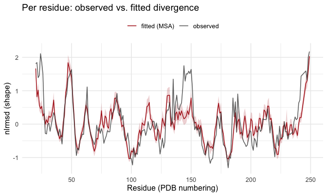
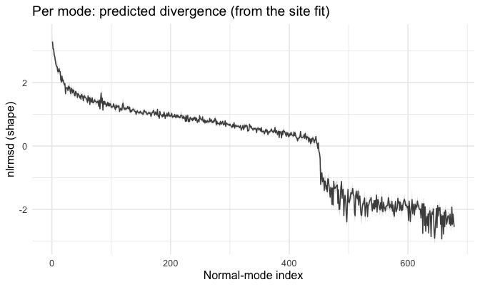

<!--
SOURCE OF TRUTH. This `.Rmd.orig` is the editable vignette; every code chunk runs
for real. The shipped `msamodel.Rmd` is PRE-RENDERED from this file. Regenerate it
after editing this file or after any change to the package code the vignette
exercises (run from INSIDE vignettes/ so fig.path resolves correctly):

  cd vignettes && Rscript -e 'knitr::knit("msamodel.Rmd.orig", output = "msamodel.Rmd")'

then commit both this file, the rendered `msamodel.Rmd`, and its figures.
Pattern: https://ropensci.org/technotes/2019/12/08/precompute-vignettes/
-->


## What does this package do for me?

You have a protein structure and a list of its active-site residues. `msamodel`
implements the Mutation-Stability-Activity (MSA) model of neutral structural
evolution: it predicts how much each part of the structure **diverges** under
neutral evolution, fits that prediction to an observed divergence profile, and
tells you how stability and activity selection shape the result.

The model has two selection parameters: `a1` (strength of selection on **stability**)
and `a2` (strength of selection on **activity**, i.e. proximity to the active site).
Both are non-negative; `0` means that pressure is off, and larger values mean stronger
selection. You do not have to guess them — the usual workflow **estimates them from
your data** by fitting, which is what this overview does. The predicted divergence can
then be read along **two axes** — per residue and per normal mode — and this overview
shows both, end to end.

|                              | what it is                                              |
|------------------------------|--------------------------------------------------------|
| **You provide**              | a PDB file; a vector of active-site residue numbers; (to fit) observed divergence as two vectors — the residue numbers, and the value at each |
| **`penm` computes**          | the elastic network model of your structure (`penm::set_enm`) |
| **`msamodel` computes**      | the mutation scan (`generate_spm`), the fit of `(a1, a2)` to your data (`fit_*`), and the predicted divergence profiles (`predict_profiles`) |

## From your structure to a mutation scan

Everything starts from your two inputs. We use the worked example `1znb_A` (zinc
beta-lactamase) that ships with the package; swap in your own file and residues at
the two marked lines:


```r
library(msamodel)
library(penm)       # penm::set_enm(), the elastic network model msamodel builds on
library(dplyr)      # data-wrangling verbs (mutate, left_join, ...) used below
library(readr)      # read_csv, for the example data files
library(ggplot2)    # the two figures; optional
```

Both inputs are **files**. The example ones ship with the package; point these two
lines at your own to run the whole vignette on your protein.


```r
pdb_file    <- system.file("extdata", "1znb_A.pdb", package = "msamodel")        # <- your PDB
active_file <- system.file("extdata", "znb_active_site.csv", package = "msamodel") # <- your active sites

active_site <- read_csv(active_file, show_col_types = FALSE)
active_site
#> # A tibble: 8 × 3
#>   pdb   chain pdb_site
#>   <chr> <chr>    <dbl>
#> 1 1znb  A           99
#> 2 1znb  A          101
#> 3 1znb  A          103
#> 4 1znb  A          162
#> 5 1znb  A          181
#> 6 1znb  A          184
#> 7 1znb  A          193
#> 8 1znb  A          223
```

The active-site table lists one residue per row, keyed by `pdb` and `chain`, so one
file can hold the annotations for many proteins. Pick out the chain you are modelling;
what the model needs is a plain vector of PDB residue numbers.


```r
pdb_site_active <- active_site |>
  filter(pdb == "1znb", chain == "A") |>
  pull(pdb_site)

pdb_site_active
#> [1]  99 101 103 162 181 184 193 223
```

`msamodel` reads the structure, builds an elastic network model (`wt`), and runs a
single-point-mutation scan (`spm`):


```r
wt_pdb <- bio3d::read.pdb(pdb_file)
wt     <- penm::set_enm(wt_pdb, node = "ca", model = "ming_wall", d_max = 10.5, frustrated = FALSE)
spm    <- generate_spm(wt, n_mutations = 10, model = "lfenm", sigma = 0.3,
                            min_sd = 2, pdb_site_active = pdb_site_active, ensemble = 1L)
```

Those are the settings we use throughout; keep them for a first run and revisit them
later (the [site analysis](site-analysis.html) vignette explains what each controls).
Note that `penm::set_enm()` requires all five arguments — it has no defaults. The scan
takes a minute or two — it is the one slow step, and everything after it is fast.

`spm` is what the model works from: for every mutant it records the energy change and
the structural divergence it causes, measured two ways — per residue and per normal
mode. The functions below read whichever they need from it.

## Fit the model, then read divergence two ways

To fit, you supply an **observed** per-residue divergence profile — this is **your**
data, not something `msamodel` computes. You obtain it upstream by superimposing a set
of homologous structures onto your protein over a sequence alignment and measuring, at
each residue, how much its position varies across the family; the observed value is the
log of that per-residue variation. `msamodel` does not do this step — you bring the
result as **two vectors**: the PDB residue numbers, and the observed value at each. They
can live in a table of any shape, with columns named whatever you already call them. The
package ships one for the worked example:


```r
observed_file <- system.file("extdata", "znb_lrmsd_obs_site.csv", package = "msamodel")
observed      <- read_csv(observed_file, show_col_types = FALSE)   # <- your observed data
head(observed)
#> # A tibble: 6 × 2
#>   pdb_site lrmsd_obs
#>      <dbl>     <dbl>
#> 1       20      1.65
#> 2       21      1.68
#> 3       22      1.23
#> 4       23      1.30
#> 5       24      1.95
#> 6       25      1.69
```

Note it covers 225 residues while the model has 228: an observed profile need not cover
every residue, and the fitter uses the overlap.

We fit the two selection parameters to that observed profile by maximum likelihood,
passing the two columns as the key and the values:


```r
fit <- fit_lrmsd_msa_site(spm, observed$pdb_site, observed$lrmsd_obs)
c(a1 = fit$a1, a2 = fit$a2)
#>         a1         a2 
#>  0.4236682 38.4171558
```

The fit returns a point estimate of `(a1, a2)`. To turn that estimate into a divergence
profile you can plot, pass the fit to `predict_profiles()`. It evaluates the model at
the fitted parameters and returns a list with a `$site` tibble (the profile per residue)
and a `$mode` tibble (the profile per normal mode):


```r
predicted <- predict_profiles(fit, spm, metric = "nlrmsd")
head(predicted$site)
#> # A tibble: 6 × 4
#>    site pdb_site nlrmsd_msa nlrmsd_msa_se
#>   <int>    <int>      <dbl>         <dbl>
#> 1     1       20      1.67         0.109 
#> 2     2       21      0.819        0.102 
#> 3     3       22      1.02         0.0981
#> 4     4       23      0.573        0.0853
#> 5     5       24      0.461        0.0787
#> 6     6       25      0.535        0.0932
```

The `metric` argument picks the quantity: `"nlrmsd"` (used here) is the profile with its
average subtracted off (`nlrmsd = lrmsd - mean`), i.e. its *shape*, while `"lrmsd"` is
the absolute profile with its overall level kept. An observed divergence profile pins
down shape but not overall level, so `"nlrmsd"` is what you compare against data.

Both tibbles use the same column names — `nlrmsd_msa` for the profile value and
`nlrmsd_msa_se` for its standard error, which propagates the fit's `(a1, a2)` uncertainty
to every point. Only the key column differs: `$site` is keyed by residue (`site` and
`pdb_site`), `$mode` by mode number (`mode`). To draw
a confidence band, turn the standard error into lower/upper bounds — a 95% band is the
value plus or minus `z_975` standard errors, with `z_975 = qnorm(0.975) ≈ 1.96`:


```r
z_975 <- qnorm(0.975)   # 1.96; the multiplier for a 95% band
```

We build the band from the standard error, join the per-residue profile to the observed
data to compare shapes, and read the mode axis from the same prediction:


```r
# Per-residue profile from the fit, with a 95% band, joined to the observed data
profile_site <- predicted$site |>
  mutate(lower = nlrmsd_msa - z_975 * nlrmsd_msa_se,
         upper = nlrmsd_msa + z_975 * nlrmsd_msa_se) |>
  inner_join(observed, by = "pdb_site") |>
  mutate(nlrmsd_obs = lrmsd_obs - mean(lrmsd_obs))

# Per-mode profile: the same fitted (a1, a2) read on the normal-mode axis
profile_mode <- predicted$mode |>
  mutate(lower = nlrmsd_msa - z_975 * nlrmsd_msa_se,
         upper = nlrmsd_msa + z_975 * nlrmsd_msa_se)
```

**Per residue** — the fitted profile (red, with its band) tracked against the observed
shape (grey). This is the model compared to real data along the chain.


```r
ggplot(profile_site, aes(pdb_site)) +
  geom_ribbon(aes(ymin = lower, ymax = upper), fill = "firebrick", alpha = 0.2) +
  geom_line(aes(y = nlrmsd_msa, colour = "fitted (MSA)")) +
  geom_line(aes(y = nlrmsd_obs, colour = "observed"), alpha = 0.8) +
  scale_colour_manual(values = c("observed" = "grey25", "fitted (MSA)" = "firebrick")) +
  labs(title = "Per residue: observed vs. fitted divergence",
       x = "Residue (PDB numbering)", y = "nlrmsd (shape)", colour = NULL) +
  theme(legend.position = "top")
```



**Per normal mode** — the fitted `(a1, a2)` read on the normal-mode axis instead of per
residue. Divergence is largest for the softest (lowest-index) modes, so a handful of
collective motions carry most of it. There is no observed profile to compare against
here — this panel is a prediction from the fit we already have. (The mode axis can also
be fit to its own data; see the [mode analysis](mode-analysis.html) vignette.)


```r
ggplot(profile_mode, aes(mode)) +
  geom_ribbon(aes(ymin = lower, ymax = upper), fill = "grey70", alpha = 0.4) +
  geom_line(aes(y = nlrmsd_msa), colour = "grey30") +
  labs(title = "Per mode: predicted divergence (from the site fit)",
       x = "Normal-mode index", y = "nlrmsd (shape)")
```



The same evolutionary divergence, read per residue and per mode.

## Where to next

- **[Site analysis](site-analysis.html)** — the per-residue arc in full: predict,
  decompose into mutation / stability / activity contributions, sweep `a1`/`a2`,
  fit, and decompose the fitted profile.
- **[Mode analysis](mode-analysis.html)** — the same arc per normal mode.
- **[Inference methods](inference-methods.html)** — the maximum-likelihood fit end
  to end, with delta-method confidence bands on the predicted profile and its
  decomposition.

## Session info


```
#> R version 4.2.1 (2022-06-23)
#> Platform: x86_64-apple-darwin17.0 (64-bit)
#> Running under: macOS Big Sur ... 10.16
#> 
#> Matrix products: default
#> BLAS:   /Library/Frameworks/R.framework/Versions/4.2/Resources/lib/libRblas.0.dylib
#> LAPACK: /Library/Frameworks/R.framework/Versions/4.2/Resources/lib/libRlapack.dylib
#> 
#> locale:
#> [1] en_US.UTF-8/en_US.UTF-8/en_US.UTF-8/C/en_US.UTF-8/en_US.UTF-8
#> 
#> attached base packages:
#> [1] stats     graphics  grDevices utils     datasets  methods   base     
#> 
#> other attached packages:
#> [1] purrr_1.2.0    ggplot2_4.0.1  readr_2.1.4    tidyr_1.3.1    dplyr_1.1.4   
#> [6] penm_0.2.0     msamodel_0.5.0
#> 
#> loaded via a namespace (and not attached):
#>  [1] bio3d_2.4-5        Rcpp_1.1.0         lattice_0.22-5     ps_1.7.5          
#>  [5] utf8_1.2.6         digest_0.6.33      mime_0.12          R6_2.6.1          
#>  [9] evaluate_0.24.0    highr_0.11         pillar_1.11.1      rlang_1.1.6       
#> [13] miniUI_0.1.1.1     callr_3.7.6        urlchecker_1.0.1   Matrix_1.5-4.1    
#> [17] labeling_0.4.3     desc_1.4.3         devtools_2.4.5     stringr_1.6.0     
#> [21] htmlwidgets_1.6.4  S7_0.2.1           bit_4.0.5          shiny_1.8.1.1     
#> [25] compiler_4.2.1     httpuv_1.6.13      xfun_0.41          pkgconfig_2.0.3   
#> [29] pkgbuild_1.4.4     htmltools_0.5.8.1  tidyselect_1.2.1   tibble_3.3.0      
#> [33] viridisLite_0.4.2  crayon_1.5.3       tzdb_0.4.0         withr_3.0.2       
#> [37] later_1.3.2        grid_4.2.1         xtable_1.8-4       gtable_0.3.6      
#> [41] lifecycle_1.0.4    magrittr_2.0.4     scales_1.4.0       cli_3.6.5         
#> [45] stringi_1.8.3      vroom_1.6.5        cachem_1.0.8       farver_2.1.2      
#> [49] fs_1.6.4           promises_1.2.1     remotes_2.5.0      ellipsis_0.3.2    
#> [53] generics_0.1.4     vctrs_0.6.5        RColorBrewer_1.1-3 tools_4.2.1       
#> [57] bit64_4.0.5        glue_1.8.0         hms_1.1.3          processx_3.8.3    
#> [61] pkgload_1.5.2      parallel_4.2.1     fastmap_1.1.1      sessioninfo_1.2.2 
#> [65] memoise_2.0.1      knitr_1.43         profvis_0.3.8      usethis_2.2.3
```
