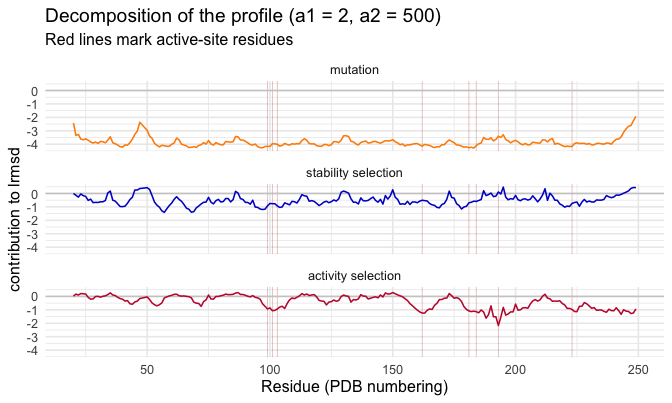
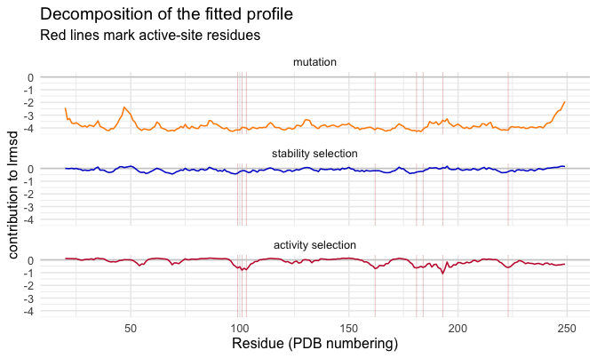

<!--
SOURCE OF TRUTH. This `.Rmd.orig` is the editable vignette; every code chunk runs
for real. The shipped `site-analysis.Rmd` is PRE-RENDERED from this file.
Regenerate it after editing this file or after any change to the package code the
vignette exercises:

  Rscript -e 'knitr::knit("vignettes/site-analysis.Rmd.orig", output = "vignettes/site-analysis.Rmd")'

then commit both this file, the rendered `site-analysis.Rmd`, and its figures.
Pattern: https://ropensci.org/technotes/2019/12/08/precompute-vignettes/
-->


This vignette predicts structural divergence **per residue** and fits it to data.
Its sibling, the [mode analysis vignette](mode-analysis.html), runs the same arc
**per normal mode**; the two are companion views of one model. For a short
end-to-end tour of both axes, see the [package overview](msamodel.html).

The per-residue quantity is the log root-mean-square structural displacement,
`lrmsd = log(sqrt(dr2_i))`, where `dr2_i` is a selection-weighted average over a
single-point-mutation scan (SPM). Two selection parameters control the weighting:
`a1` (selection on **stability**) and `a2` (selection on **activity**, proximity
to the active site). We use the worked example `1znb_A` (zinc beta-lactamase),
whose data ship as the `znb_*` datasets.

## 1. Setup

Everything starts from your two inputs: a structure file and a vector of
active-site residue numbers. We use the worked example `1znb_A` (zinc
beta-lactamase) that ships with the package; swap in your own at the two marked
lines. `setup_enm()` takes a bio3d structure object directly, so you read the file
yourself — `bio3d::read.pdb()` for legacy `.pdb`, `bio3d::read.cif()` for mmCIF.


```r
library(msamodel)
library(dplyr)    # data-wrangling verbs (mutate, left_join, ...) used below
```


```r
pdb_file        <- system.file("extdata", "1znb_A.pdb", package = "msamodel")  # <- your PDB path
pdb_site_active <- c(99, 101, 103, 162, 181, 184, 193, 223)                    # <- your active-site residues
```

`msamodel` reads the structure, builds an elastic network model (`wt`), and runs a
single-point-mutation scan (`spm`):


```r
pdb <- bio3d::read.pdb(pdb_file)
wt  <- setup_enm(pdb, node = "ca", model = "ming_wall", d_max = 10.5, frustrated = FALSE)
spm <- generate_spm_data(wt, n_mutations = 10, model = "lfenm", sigma = 0.3,
                         min_sd = 2, pdb_site_active = pdb_site_active, seed = 1024)
#> Processing site 10 of 228 
#> Processing site 20 of 228 
#> Processing site 30 of 228 
#> Processing site 40 of 228 
#> Processing site 50 of 228 
#> Processing site 60 of 228 
#> Processing site 70 of 228 
#> Processing site 80 of 228 
#> Processing site 90 of 228 
#> Processing site 100 of 228 
#> Processing site 110 of 228 
#> Processing site 120 of 228 
#> Processing site 130 of 228 
#> Processing site 140 of 228 
#> Processing site 150 of 228 
#> Processing site 160 of 228 
#> Processing site 170 of 228 
#> Processing site 180 of 228 
#> Processing site 190 of 228 
#> Processing site 200 of 228 
#> Processing site 210 of 228 
#> Processing site 220 of 228
```

(`wt` and `spm` are identical to the shipped `znb_wt` / `znb_spm`; to skim without
running the scan, `data("znb_spm")` loads the prebuilt object instead.) The
observed divergence profile we will fit to is loaded later, in section 5.

From the scan we precompute the energy/displacement matrices once; every profile
below reuses them:


```r
pp <- preprocess_spm(spm)   # list: energy_data, dr2_ijm, site_map
```

Two per-site structural descriptors are used as plot axes below. We get them from
`add_site_properties()`, which reads the wild-type ENM (`wt`) and returns, per
site:

- `dactive` — distance (Å) from the residue to the nearest active-site residue,
- `msf` — mean square fluctuation, a flexibility measure from the ENM normal modes;
  we report `lrmsf = log(sqrt(msf))`, the log RMSF.

The site index `i` is msamodel's internal 1..N residue index; `pp$site_map` (built
by `preprocess_spm()` above) is the key from `i` to `pdb_site`, the PDB residue
number used on the chain-plot x-axis.


```r
site_ids   <- as.integer(colnames(pp$dr2_ijm))   # the internal site indices i
site_props <- add_site_properties(tibble(i = site_ids), wt, pdb_site_active) |>
  mutate(lrmsf = log(sqrt(msf))) |>               # log RMSF (flexibility)
  left_join(pp$site_map, by = "i") |>             # attach pdb_site (i -> PDB number)
  select(i, pdb_site, dactive, lrmsf)
```

## 2. Divergence profile at given (a1, a2)

For any choice of `(a1, a2)`, `calculate_dr2_i_msa()` returns the per-site
weighted mean squared displacement; `lrmsd = log(sqrt(dr2_i))` is the divergence
profile. We attach the two structural descriptors from `site_props` — the log
RMSF (flexibility) and the distance to the active site — for context:


```r
a1 <- 2; a2 <- 500
profile_demo <- calculate_dr2_i_msa(pp, a1, a2) |>
  mutate(lrmsd = log(sqrt(dr2_i))) |>
  left_join(site_props, by = "i")
```

The divergence profile along the chain (active sites marked in red):


Divergence is lower (more conserved) at rigid sites and near the active site.
Plotting `lrmsd` against flexibility and against distance to the active site,
with a smooth, makes those trends explicit:


## 3. Decomposing the profile at given (a1, a2)

The profile at a chosen `(a1, a2)` can be split into additive contributions from
mutation, stability selection, and activity selection. The split uses four
**nested model variants**, each just `calculate_dr2_i_msa()` evaluated at a
particular parameter point:

| Variant | a1 (stability) | a2 (activity) | meaning |
|:--|:--|:--|:--|
| **MM** | 0 | 0 | mutation only — no selection |
| **MS** | a1 | 0 | mutation + stability selection |
| **MA** | 0 | a2 | mutation + activity selection |
| **MSA** | a1 | a2 | full model — both selections |

`calculate_lrmsd_i_nested_models()` returns all four lrmsd profiles at once
(`lrmsd_i_mm`, `lrmsd_i_ms`, `lrmsd_i_ma`, `lrmsd_i_msa`):


```r
nested <- calculate_lrmsd_i_nested_models(pp, a1, a2)   # a1 = 2, a2 = 500 from section 2
```

The four profiles along the chain — each model adds one more selection pressure,
suppressing divergence further (active sites marked in red):


The **sequential** decomposition starts from the mutation-only model and adds one
selection pressure at a time along MM → MS → MSA (MA is the alternative
single-selection variant, not on this additive path). Each term is the incremental
divergence contributed by the next pressure. Writing $\phi$ for the contributions,

$$
\phi_{\text{mut}}  = \text{lrmsd}_{\text{mm}}
$$
$$
\phi_{\text{stab}} = \text{lrmsd}_{\text{ms}} - \text{lrmsd}_{\text{mm}}
$$
$$
\phi_{\text{act}}  = \text{lrmsd}_{\text{msa}} - \text{lrmsd}_{\text{ms}}
$$

By construction these sum to the full prediction,
$\phi_{\text{mut}} + \phi_{\text{stab}} + \phi_{\text{act}} = \text{lrmsd}_{\text{msa}}$.
`calculate_decomposition_i_msa()` packages this split: give it the preprocessed
data and a selection strength `(a1, a2)` and it returns one row per site with the
three $\phi$ contributions.


```r
phi <- calculate_decomposition_i_msa(pp, a1, a2)   # a1 = 2, a2 = 500 from section 2
```

The three contributions along the chain (active sites marked in red):



This decomposes the profile at the **chosen** `(a1, a2)`. Section 6 applies the
same decomposition to the **fitted** profile, after `a1, a2` are estimated from
data in section 5.

## 4. How the profile depends on a1 and a2

Stability selection (`a1`, with `a2 = 0`) and activity selection (`a2`, with
`a1 = 0`) reshape the profile in different ways. Here we vary one parameter at a
time and overlay the resulting whole (un-centered) profiles:


```r
# Stability sweep: vary a1, hold a2 = 0
a1_values <- c(0, 1, 2, 4, 8)
sweep_a1 <- purrr::map_dfr(a1_values, function(a1)
  calculate_dr2_i_msa(pp, a1, 0) |>
    mutate(lrmsd = log(sqrt(dr2_i)), a1 = a1) |>
    left_join(site_props, by = "i"))

# Activity sweep: vary a2, hold a1 = 0
a2_values <- c(0, 31, 127, 511, 2047)
sweep_a2 <- purrr::map_dfr(a2_values, function(a2)
  calculate_dr2_i_msa(pp, 0, a2) |>
    mutate(lrmsd = log(sqrt(dr2_i)), a2 = a2) |>
    left_join(site_props, by = "i"))
```


Increasing `a1` suppresses divergence broadly (stronger stability selection
conserves the whole structure); increasing `a2` suppresses divergence
selectively around the active site.

## 5. Fitting a1 and a2 to observed divergence

The fit reuses the same four nested model variants of section 3 (MM / MS / MA /
MSA), but now `a1, a2` are **estimated from data** rather than chosen. The fitted
profiles are `lrmsd_i_mm`, `lrmsd_i_ms`, `lrmsd_i_ma`, `lrmsd_i_msa`; MSA is the
full model.

To fit, you supply an **observed** divergence profile — **your** data, not something
`msamodel` computes. The observed per-residue divergence (`lrmsd_i_obs`) comes from
comparing homologous structures over an alignment — out of scope for `msamodel` (it
belongs to a future protein-evolution-patterns package); you bring it as a table
with columns `pdb_site` and `lrmsd_i_obs`. The package ships one for the worked
example, `znb_profile`:


```r
data("znb_profile")   # the example observed data; supply your own in this shape
head(znb_profile)
#> # A tibble: 6 × 2
#>   pdb_site lrmsd_i_obs
#>      <int>       <dbl>
#> 1       20        1.65
#> 2       21        1.68
#> 3       22        1.23
#> 4       23        1.30
#> 5       24        1.95
#> 6       25        1.69
```

`fit_lrmsd_i_msa_ml()` estimates `a1, a2` from it by maximum likelihood, returning a
point estimate plus an asymptotic covariance from the Hessian at the optimum. It is
fast and deterministic:


```r
ml <- fit_lrmsd_i_msa_ml(pp, znb_profile)   # pp from section 1; znb_profile is the target
c(a1 = ml$a1, a2 = ml$a2)
#>         a1         a2 
#>  0.4580022 42.3021911
```


Table: ML estimate of the selection parameters (se from the Hessian)

|parameter | estimate|     se|
|:---------|--------:|------:|
|a1        |    0.458|  0.122|
|a2        |   42.302| 10.187|


The [inference methods vignette](inference-methods.html) walks through this fit end
to end and puts delta-method confidence bands on the predicted profile and its
decomposition.

### Fitted vs. observed

The likelihood compares **mean-centered** profiles (`nlrmsd = lrmsd - mean(lrmsd)`),
so the comparison plots use the same centering. We build the comparison table
from the MSA prediction at the ML estimate (via `calculate_lrmsd_i_nested_models()`),
joined to the observed profile, then center both on the compared subset and
annotate with R²:


```r
# Coefficient of determination, R^2 = 1 - SSE/SST, used to score the fit.
r2 <- function(obs, pred) 1 - sum((obs - pred)^2) / sum((obs - mean(obs))^2)

fit_msa <- calculate_lrmsd_i_nested_models(pp, ml$a1, ml$a2) |>
  select(pdb_site, lrmsd_fit = lrmsd_i_msa)

cmp <- znb_profile |>
  inner_join(fit_msa, by = "pdb_site") |>
  left_join(select(site_props, pdb_site, dactive, lrmsf), by = "pdb_site") |>
  mutate(
    nlrmsd_i_obs = lrmsd_i_obs - mean(lrmsd_i_obs),
    nlrmsd_fit = lrmsd_fit - mean(lrmsd_fit)
  )

r2_fit <- r2(cmp$nlrmsd_i_obs, cmp$nlrmsd_fit)
```


Profile along the chain — observed vs fitted:


Fitted vs observed as a scatter (the gof view):


And the fitted/observed divergence against flexibility and distance to the
active site:


## 6. Decomposing the fitted profile

Section 3 decomposed the profile at a *chosen* `(a1, a2)`. The same
$\phi_{\text{mut}}/\phi_{\text{stab}}/\phi_{\text{act}}$ decomposition applies to
the **fitted** profile — call `calculate_decomposition_i_msa()` at the ML estimate
`(ml$a1, ml$a2)` instead of the chosen strengths:


```r
phi_fit <- calculate_decomposition_i_msa(pp, ml$a1, ml$a2)
```

The mutation term is the divergence under no selection (it still varies among
sites — mutations perturb sites unequally); a negative selection term means that
pressure *reduces* divergence at that site relative to the mutation-only model.



## Session info


```
#> R version 4.2.1 (2022-06-23)
#> Platform: x86_64-apple-darwin17.0 (64-bit)
#> Running under: macOS Big Sur ... 10.16
#> 
#> Matrix products: default
#> BLAS:   /Library/Frameworks/R.framework/Versions/4.2/Resources/lib/libRblas.0.dylib
#> LAPACK: /Library/Frameworks/R.framework/Versions/4.2/Resources/lib/libRlapack.dylib
#> 
#> locale:
#> [1] en_US.UTF-8/en_US.UTF-8/en_US.UTF-8/C/en_US.UTF-8/en_US.UTF-8
#> 
#> attached base packages:
#> [1] stats     graphics  grDevices utils     datasets  methods   base     
#> 
#> other attached packages:
#> [1] ggplot2_4.0.1       tidyr_1.3.1         dplyr_1.1.4        
#> [4] msamodel_0.3.0.9000
#> 
#> loaded via a namespace (and not attached):
#>  [1] Rcpp_1.1.0         pillar_1.11.1      compiler_4.2.1     RColorBrewer_1.1-3
#>  [5] highr_0.11         tools_4.2.1        jefuns_0.1.0       viridisLite_0.4.2 
#>  [9] nlme_3.1-164       evaluate_0.24.0    lifecycle_1.0.4    tibble_3.3.0      
#> [13] gtable_0.3.6       lattice_0.22-5     mgcv_1.9-1         pkgconfig_2.0.3   
#> [17] rlang_1.1.6        Matrix_1.5-4.1     cli_3.6.5          rstudioapi_0.16.0 
#> [21] parallel_4.2.1     xfun_0.41          withr_3.0.2        knitr_1.43        
#> [25] generics_0.1.4     vctrs_0.6.5        grid_4.2.1         tidyselect_1.2.1  
#> [29] glue_1.8.0         R6_2.6.1           farver_2.1.2       purrr_1.2.0       
#> [33] magrittr_2.0.4     splines_4.2.1      scales_1.4.0       bio3d_2.4-5       
#> [37] labeling_0.4.3     S7_0.2.1           penm_0.2.0.9000
```
