<!--
SOURCE OF TRUTH. This `.Rmd.orig` is the editable vignette; every code chunk runs
for real. The shipped `site-analysis.Rmd` is PRE-RENDERED from this file.
Regenerate it after editing this file or after any change to the package code the
vignette exercises:

  Rscript -e 'knitr::knit("vignettes/site-analysis.Rmd.orig", output = "vignettes/site-analysis.Rmd")'

then commit both this file, the rendered `site-analysis.Rmd`, and its figures.
Pattern: https://ropensci.org/technotes/2019/12/08/precompute-vignettes/
-->


This vignette predicts structural divergence **per residue** and fits it to data.
Its sibling, the [mode analysis vignette](mode-analysis.html), runs the same arc
**per normal mode**; the two are companion views of one model. For a short
end-to-end tour of both axes, see the [package overview](msamodel.html).

The per-residue quantity is `lrmsd`, the log root-mean-square structural displacement
at each residue. It is built from a **single-point-mutation scan (SPM)**: the package
mutates every site many times and records how far each mutation displaces the structure.
Averaging that displacement over mutations — weighted by how likely each mutation is to
survive selection — gives a mean squared displacement per residue, and `lrmsd` is the
log of its square root. Two
parameters set the selection weighting: `a1` (strength of selection on **stability**)
and `a2` (strength of selection on **activity**, proximity to the active site), both
non-negative with `0` meaning that pressure is off.

Sections 2–4 evaluate the model at `(a1, a2)` values you supply, to show how the profile
responds to each pressure; section 5 estimates `(a1, a2)` from observed data instead.
We use the worked example `1znb_A` (zinc beta-lactamase), whose data ship as the `znb_*`
datasets.

Two verbs carry the whole vignette. `calculate_profiles()` returns the divergence
profile at a given `(a1, a2)` — use it for the profile itself; `calculate_decomposition()`
returns the four nested models plus their mutation/stability/activity split — use it when
you want that breakdown. Each returns a list with a `$site` tibble (per residue) and a
`$mode` tibble (per normal mode); this per-residue vignette reads `$site` throughout.

## 1. Setup

Everything starts from your two inputs: a structure file and a vector of
active-site residue numbers. We use the worked example `1znb_A` (zinc
beta-lactamase) that ships with the package; swap in your own at the two marked
lines. You read the structure file with bio3d — `bio3d::read.pdb()` for a `.pdb` file,
`bio3d::read.cif()` for mmCIF — and pass the result to `setup_enm()`.


```r
library(msamodel)
library(dplyr)      # data-wrangling verbs (mutate, left_join, ...) used below
library(tidyr)      # pivot_longer, to reshape profiles for plotting
library(purrr)      # map_dfr, for the parameter sweeps in section 4
library(readr)      # read_csv, for the example data files
library(ggplot2)    # the figures; optional — skip it if you only want the tables
```

Both inputs are files; point these at your own to run the vignette on your protein.
The active-site table is one residue per row, keyed by `pdb` and `chain`, so a single
file can serve many proteins — filter out the chain you are modelling.


```r
pdb_file    <- system.file("extdata", "1znb_A.pdb", package = "msamodel")          # <- your PDB
active_file <- system.file("extdata", "znb_active_site.csv", package = "msamodel") # <- your active sites

pdb_site_active <- read_csv(active_file, show_col_types = FALSE) |>
  filter(pdb == "1znb", chain == "A") |>
  pull(pdb_site)

pdb_site_active
#> [1]  99 101 103 162 181 184 193 223
```

`msamodel` reads the structure, builds an elastic network model (`wt`), and runs a
single-point-mutation scan (`spm`):


```r
wt_pdb <- bio3d::read.pdb(pdb_file)
wt     <- setup_enm(wt_pdb, node = "ca", model = "ming_wall", d_max = 10.5, frustrated = FALSE)
spm    <- generate_spm(wt, n_mutations = 10, model = "lfenm", sigma = 0.3,
                            min_sd = 2, pdb_site_active = pdb_site_active, seed = 1024)
```

The arguments above are the model's defaults — you can keep them for a first run.
`setup_enm()` builds the elastic network: `node = "ca"` puts one node per residue at its
C-alpha, `d_max = 10.5` (Å) sets how close two residues must be to be connected, and
`model`/`frustrated` pick the spring rules. `generate_spm()` runs the scan:
`n_mutations` mutants per site, `sigma` the mutation strength, `min_sd` the minimum
sequence separation between coupled sites, `seed` for reproducibility. The scan takes a
minute or two — it is the one slow step here. The observed profile we fit to is loaded
later, in section 5.

`spm` records, for each mutant, its energy changes and the per-residue response
`dr2mat_site` it causes; the verbs below read those from it.

Two residue identities appear side by side throughout. `site` is msamodel's internal
1..N index; `pdb_site` is the PDB residue number, used on the chain-plot x-axis. Every
per-residue tibble the package returns carries both, and `spm$site_map` is the key
between them. We use `pdb_site`, the identity that is unambiguous outside the model,
as the join key throughout.

### Structural descriptors of the sites

The plots below use two per-site descriptors as axes. They are properties of the
wild-type structure alone — of `wt`, not of `spm` or of any fitted `(a1, a2)` — so they
come not from msamodel but from `penm`, the elastic-network package it builds on:

- `dactive` — distance (Å) from the residue to the nearest active-site residue,
  from `penm::get_dactive()`,
- `msf` — mean square fluctuation, a flexibility measure from the ENM normal modes,
  from `penm::get_msf_site()`; we report `lrmsf = log(sqrt(msf))`, the log RMSF.

Each getter returns a vector of length `n_sites` in internal-site order, so the columns
below line up row for row. We label them with `pdb_site` to make the table joinable:


```r
site_descriptors <- tibble::tibble(
  pdb_site = penm::get_pdb_site(wt),                   # PDB residue number
  dactive  = penm::get_dactive(wt, pdb_site_active),   # Å to nearest active-site residue
  lrmsf    = log(sqrt(penm::get_msf_site(wt)))         # log RMSF (flexibility)
)
```

## 2. Divergence profile at given (a1, a2)

For any choice of `(a1, a2)`, `calculate_profiles()` returns the divergence profile.
We ask for the per-residue reading with `$site`; the site tibble has the index `site`,
the PDB number `pdb_site`, and the profile `lrmsd_msa` (the `msa` marks the full model,
with both selection pressures active; section 3 introduces the variants with one or both
switched off). The `metric` argument picks the quantity: `"lrmsd"` (used through sections
2–4) is the absolute profile, keeping the overall level; `"nlrmsd"` is the same profile
with its mean subtracted off — its *shape* — which section 5 uses to compare against data.


```r
a1 <- 2; a2 <- 500
calculate_profiles(spm, a1, a2, metric = "lrmsd")$site |> head()
#> # A tibble: 6 × 3
#>    site pdb_site lrmsd_msa
#>   <int>    <int>     <dbl>
#> 1     1       20     -2.40
#> 2     2       21     -3.31
#> 3     3       22     -3.44
#> 4     4       23     -3.45
#> 5     5       24     -3.64
#> 6     6       25     -3.65
```

Here we pick illustrative values to see the model in action — `a1 = 2` (moderate
stability selection) and `a2 = 500` (strong activity selection); the two live on
different scales, so their numbers are not comparable to each other. Section 5 replaces
these guesses with values estimated from data. The profile carries both `site` and
`pdb_site`, so we attach the two structural descriptors from `site_descriptors` on `pdb_site`:


```r
profile_demo <- calculate_profiles(spm, a1, a2, metric = "lrmsd")$site |>
  left_join(site_descriptors, by = "pdb_site")
```

The divergence profile along the chain (active sites marked in red):


```r
ggplot(profile_demo, aes(pdb_site, lrmsd_msa)) +
  geom_vline(xintercept = pdb_site_active, colour = "firebrick", alpha = 0.4, linewidth = 0.3) +
  geom_line(colour = "grey40") +
  geom_point(size = 0.8, colour = "grey20") +
  labs(
    title = sprintf("Divergence profile (a1 = %g, a2 = %g)", a1, a2),
    subtitle = "Red lines mark active-site residues",
    x = "Residue (PDB numbering)", y = "lrmsd"
  )
```


Divergence is lower (more conserved) at rigid sites and near the active site.
Plotting `lrmsd` against flexibility and against distance to the active site,
with a smooth, makes those trends explicit:


```r
ggplot(profile_demo, aes(lrmsf, lrmsd_msa)) +
  geom_point(alpha = 0.5, colour = "grey30") +
  geom_smooth(method = "loess", formula = y ~ x, se = TRUE, colour = "steelblue") +
  labs(title = "Divergence vs. flexibility",
       x = "lrmsf  (log RMSF)", y = "lrmsd")
```

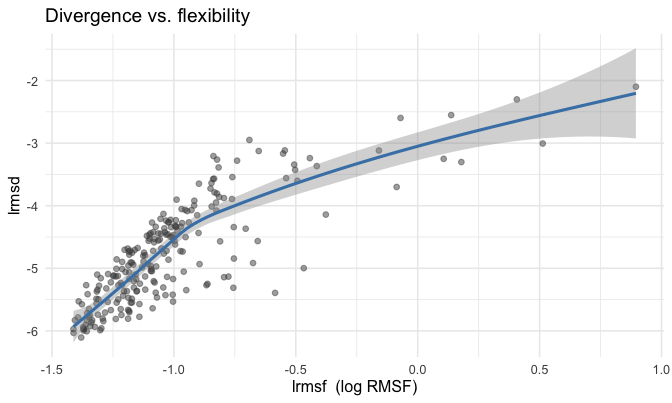


```r
ggplot(profile_demo, aes(dactive, lrmsd_msa)) +
  geom_point(alpha = 0.5, colour = "grey30") +
  geom_smooth(method = "loess", formula = y ~ x, se = TRUE, colour = "darkorange") +
  labs(title = "Divergence vs. distance to active site",
       x = "Distance to active site (Å)", y = "lrmsd")
```

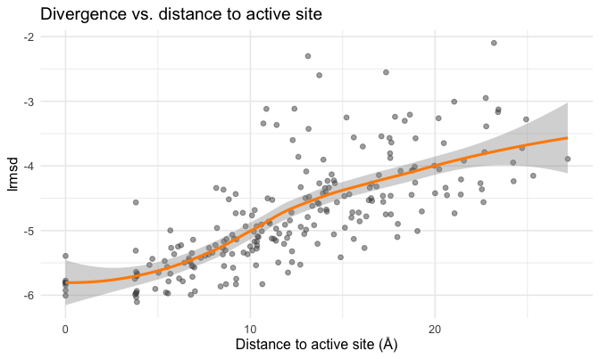

## 3. Decomposing the profile at given (a1, a2)

The profile at a chosen `(a1, a2)` can be split into additive contributions from
mutation, stability selection, and activity selection. The split uses four
**nested model variants**, each the model evaluated with one or both selection
pressures switched off:

| Variant | a1 (stability) | a2 (activity) | meaning |
|:--|:--|:--|:--|
| **MM** | 0 | 0 | mutation only — no selection |
| **MS** | a1 | 0 | mutation + stability selection |
| **MA** | 0 | a2 | mutation + activity selection |
| **MSA** | a1 | a2 | full model — both selections |

`calculate_decomposition()` returns, in one `$site` tibble, both the four nested lrmsd
profiles (`lrmsd_mm`, `lrmsd_ms`, `lrmsd_ma`, `lrmsd_msa`) and their split
(`phi_mut`, `phi_stab`, `phi_act`). `metric = "lrmsd"` keeps everything on the absolute
scale:


```r
decomposition <- calculate_decomposition(spm, a1, a2, metric = "lrmsd")$site   # a1 = 2, a2 = 500 from section 2
head(decomposition)
#> # A tibble: 6 × 9
#>    site pdb_site lrmsd_mm lrmsd_ms lrmsd_ma lrmsd_msa phi_mut phi_stab phi_act
#>   <int>    <int>    <dbl>    <dbl>    <dbl>     <dbl>   <dbl>    <dbl>   <dbl>
#> 1     1       20    -2.42    -2.43    -2.40     -2.40   -2.42 -0.00387  0.0228
#> 2     2       21    -3.35    -3.48    -3.29     -3.31   -3.35 -0.132    0.172 
#> 3     3       22    -3.27    -3.54    -3.20     -3.44   -3.27 -0.272    0.106 
#> 4     4       23    -3.62    -3.66    -3.44     -3.45   -3.62 -0.0364   0.213 
#> 5     5       24    -3.67    -3.83    -3.55     -3.64   -3.67 -0.164    0.197 
#> 6     6       25    -3.60    -3.82    -3.41     -3.65   -3.60 -0.221    0.176
```

The four profiles along the chain — each model adds one more selection pressure,
suppressing divergence further (active sites marked in red):


```r
model_colours <- c(MM = "#FF8C00", MS = "#0000CD", MA = "#1B9E77", MSA = "#C41E3A")
nested_profiles_long <- decomposition |>
  tidyr::pivot_longer(c(lrmsd_mm, lrmsd_ms, lrmsd_ma, lrmsd_msa),
                      names_to = "model", values_to = "lrmsd") |>
  mutate(model = factor(toupper(sub("lrmsd_", "", model)),
                        levels = c("MM", "MS", "MA", "MSA")))
ggplot(nested_profiles_long, aes(pdb_site, lrmsd, colour = model)) +
  geom_vline(xintercept = pdb_site_active, colour = "firebrick",
             alpha = 0.3, linewidth = 0.3) +
  geom_line(alpha = 0.85) +
  scale_colour_manual(values = model_colours) +
  labs(title = sprintf("Nested-model profiles (a1 = %g, a2 = %g)", a1, a2),
       subtitle = "Red lines mark active-site residues",
       x = "Residue (PDB numbering)", y = "lrmsd", colour = "model")
```

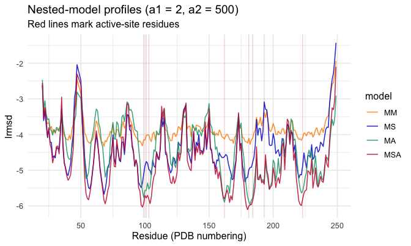

The **sequential** decomposition starts from the mutation-only model and adds one
selection pressure at a time along MM → MS → MSA. Each term is the incremental
divergence contributed by the next pressure. (MA — activity alone, stability off — is
the fourth variant: it is not a step on this MM → MS → MSA path, but it lets you see
activity selection's effect on its own, as the mirror of MS. The decomposition uses MM,
MS, and MSA.) Writing $\phi$ for the contributions,

$$
\phi_{\text{mut}}  = \text{lrmsd}_{\text{mm}}
$$
$$
\phi_{\text{stab}} = \text{lrmsd}_{\text{ms}} - \text{lrmsd}_{\text{mm}}
$$
$$
\phi_{\text{act}}  = \text{lrmsd}_{\text{msa}} - \text{lrmsd}_{\text{ms}}
$$

By construction these sum to the full prediction,
$\phi_{\text{mut}} + \phi_{\text{stab}} + \phi_{\text{act}} = \text{lrmsd}_{\text{msa}}$.
Those three `phi_*` columns are already in the `decomposition` tibble above — the four nested
profiles are there when you want to *see* them, and the `phi` split is there when you
want the contributions directly:


```r
# Paper component colours: mutation = orange, stability = blue, activity = red.
component_colours <- c(phi_mut = "#FF8C00", phi_stab = "#0000CD", phi_act = "#C41E3A")
decomposition_long <- decomposition |>
  tidyr::pivot_longer(c(phi_mut, phi_stab, phi_act),
                      names_to = "component", values_to = "phi") |>
  mutate(component = factor(component, levels = names(component_colours)))
ggplot(decomposition_long, aes(pdb_site, phi, colour = component)) +
  geom_vline(xintercept = pdb_site_active, colour = "firebrick",
             alpha = 0.3, linewidth = 0.3) +
  geom_hline(yintercept = 0, colour = "grey80") +
  geom_line() +
  scale_colour_manual(values = component_colours, guide = "none") +
  facet_wrap(~ component, ncol = 1) +
  labs(title = sprintf("Decomposition of the profile (a1 = %g, a2 = %g)", a1, a2),
       subtitle = "Red lines mark active-site residues",
       x = "Residue (PDB numbering)", y = "contribution to lrmsd")
```

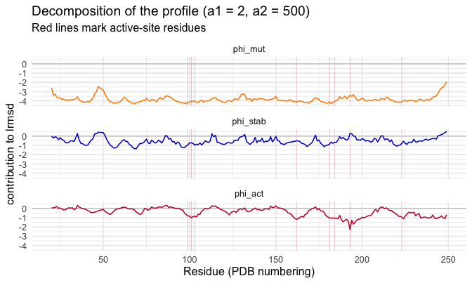

Reading the panels: each curve is one pressure's contribution to `lrmsd` at each
residue. Where a curve dips **below** zero, that pressure *reduces* divergence at that
residue (it conserves the site); above zero, it adds divergence. Activity selection, for
instance, should press down hardest near the active-site residues (red lines).

This decomposes the profile at the **chosen** `(a1, a2)`. Section 6 applies the
same decomposition to the **fitted** profile, after `a1, a2` are estimated from
data in section 5.

## 4. How the profile depends on a1 and a2

Stability selection (`a1`, with `a2 = 0`) and activity selection (`a2`, with
`a1 = 0`) shape the profile in different ways. Here we vary one parameter at a
time and overlay the resulting profiles:


```r
# Stability sweep: vary a1, hold a2 = 0
a1_values <- c(0, 1, 2, 4, 8)
sweep_a1 <- purrr::map_dfr(a1_values, function(a1)
  calculate_profiles(spm, a1, 0, metric = "lrmsd")$site |>
    rename(lrmsd = lrmsd_msa) |>
    mutate(a1 = a1) |>
    left_join(site_descriptors, by = "pdb_site"))

# Activity sweep: vary a2, hold a1 = 0
a2_values <- c(0, 31, 127, 511, 2047)
sweep_a2 <- purrr::map_dfr(a2_values, function(a2)
  calculate_profiles(spm, 0, a2, metric = "lrmsd")$site |>
    rename(lrmsd = lrmsd_msa) |>
    mutate(a2 = a2) |>
    left_join(site_descriptors, by = "pdb_site"))
```


```r
ggplot(sweep_a1, aes(pdb_site, lrmsd, colour = factor(a1), group = a1)) +
  geom_vline(xintercept = pdb_site_active, colour = "firebrick",
             alpha = 0.3, linewidth = 0.3) +
  geom_line(alpha = 0.85) +
  scale_colour_viridis_d(end = 0.9) +
  labs(title = "Stability sweep (a2 = 0)", subtitle = "Red lines mark active-site residues",
       x = "Residue (PDB numbering)", y = "lrmsd", colour = "a1")
```

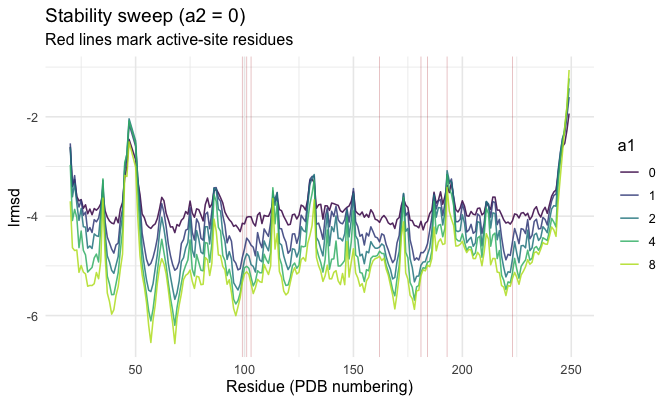


```r
ggplot(sweep_a2, aes(pdb_site, lrmsd, colour = factor(a2), group = a2)) +
  geom_vline(xintercept = pdb_site_active, colour = "firebrick",
             alpha = 0.3, linewidth = 0.3) +
  geom_line(alpha = 0.85) +
  scale_colour_viridis_d(option = "C", end = 0.9) +
  labs(title = "Activity sweep (a1 = 0)", subtitle = "Red lines mark active-site residues",
       x = "Residue (PDB numbering)", y = "lrmsd", colour = "a2")
```

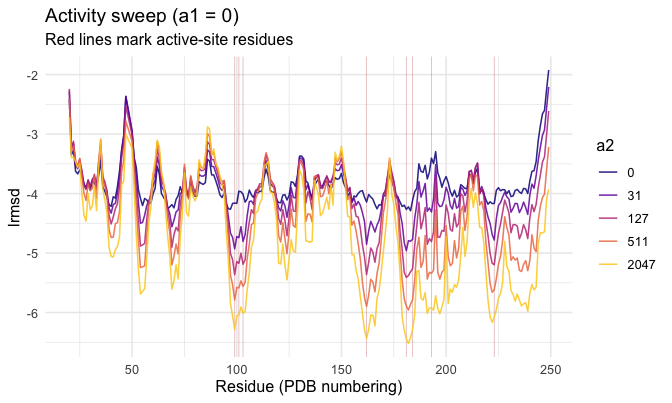

Increasing `a1` suppresses divergence broadly (stronger stability selection
conserves the whole structure); increasing `a2` suppresses divergence
selectively around the active site.

## 5. Fitting a1 and a2 to observed divergence

Sections 2–4 chose `(a1, a2)` by hand. In practice you estimate them: you find the
`(a1, a2)` whose predicted profile best matches a profile you measured.

To fit, you supply that **observed** divergence profile — **your** data, not something
`msamodel` computes. You obtain it by superimposing homologous structures onto your
protein over a sequence alignment and measuring how much each residue's position varies
across the family; the observed value is the log of that per-residue variation.
`msamodel` does not do this step — you bring the result as **two vectors**: which
residues you measured (PDB numbering), and the value at each. Nothing constrains where
they come from, so your own table keeps whatever column names it already has. The
package ships one for the worked example:


```r
observed_file <- system.file("extdata", "znb_lrmsd_obs_site.csv", package = "msamodel")
observed      <- read_csv(observed_file, show_col_types = FALSE)   # <- your observed data
head(observed)
#> # A tibble: 6 × 2
#>   pdb_site lrmsd_obs
#>      <dbl>     <dbl>
#> 1       20      1.65
#> 2       21      1.68
#> 3       22      1.23
#> 4       23      1.30
#> 5       24      1.95
#> 6       25      1.69
```

`fit_lrmsd_msa_site()` estimates `a1, a2` from it by maximum likelihood, returning a
point estimate plus an asymptotic covariance from the Hessian at the optimum. It is
fast and deterministic:


```r
# the two vectors: the residues, and the observed value at each
fit <- fit_lrmsd_msa_site(spm, observed$pdb_site, observed$lrmsd_obs)
c(a1 = fit$a1, a2 = fit$a2)
#>         a1         a2 
#>  0.4580022 42.3021911
```


Table: ML estimate of the selection parameters (se from the Hessian)

|parameter | estimate|     se|
|:---------|--------:|------:|
|a1        |    0.458|  0.122|
|a2        |   42.302| 10.187|


The [inference methods vignette](inference-methods.html) walks through this fit end
to end and puts delta-method confidence bands on the predicted profile and its
decomposition.

### Fitted vs. observed

An observed profile fixes the *shape* of divergence along the chain but not its overall
level, so the fit compares shapes: each profile with its own average subtracted off. We
write that centred form `nlrmsd = lrmsd - mean(lrmsd)` (the leading `n` = "centred"). We
take the MSA prediction at the ML estimate — the `lrmsd_msa` column of the fitted
decomposition — join it to the observed profile, and centre both over the compared
residues.

We score the fit with `D²`, the deviance explained relative to a flat (mean-only) null:
`D² = 1 - deviance/null_deviance`. The fitter has already computed it over exactly the
residues it scored, so we read it off the fit object rather than recomputing it —
`fit$gof$D2`, alongside `AIC`, `BIC` and the primitives it derives from. Note it is `D²`,
not `R²`: the model predicts divergence on a fixed scale, and `D²` measures agreement
with the prediction *as it stands*. `R²` would credit a prediction that is right only up
to an arbitrary rescaling. `D²` is at most 1 but has no lower bound — a negative value
means the fit is worse than a constant profile.


```r
predicted <- calculate_decomposition(spm, fit$a1, fit$a2, metric = "lrmsd")$site |>
  select(pdb_site, lrmsd_fit = lrmsd_msa)

observed_vs_predicted <- observed |>
  inner_join(predicted, by = "pdb_site") |>
  left_join(site_descriptors, by = "pdb_site") |>
  mutate(
    nlrmsd_obs = lrmsd_obs - mean(lrmsd_obs),
    nlrmsd_fit = lrmsd_fit - mean(lrmsd_fit)
  )

fit_d2 <- fit$gof$D2
```


Profile along the chain — observed vs fitted:


```r
ggplot(observed_vs_predicted_long, aes(pdb_site, nlrmsd, colour = source)) +
  geom_line(alpha = 0.8) +
  scale_colour_manual(values = c("observed" = "grey25", "fitted (MSA)" = "firebrick")) +
  annotate("text", x = -Inf, y = Inf, hjust = -0.15, vjust = 1.8,
           label = sprintf("D^2 == %.3f", fit_d2), parse = TRUE) +
  labs(title = "Observed vs. fitted divergence profile",
       x = "Residue (PDB numbering)", y = "nlrmsd (mean-centered)", colour = NULL) +
  theme(legend.position = "top")
```

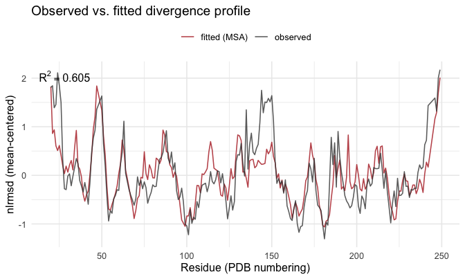

Fitted vs observed as a scatter (points on the dashed line are a perfect match):


```r
ggplot(observed_vs_predicted, aes(nlrmsd_obs, nlrmsd_fit)) +
  geom_abline(slope = 1, intercept = 0, colour = "grey70", linetype = 2) +
  geom_point(alpha = 0.5, colour = "steelblue") +
  annotate("text", x = -Inf, y = Inf, hjust = -0.15, vjust = 1.4,
           label = sprintf("D^2 == %.3f", fit_d2), parse = TRUE) +
  labs(title = "Fitted vs. observed (mean-centered)",
       x = "observed nlrmsd", y = "fitted nlrmsd")
```

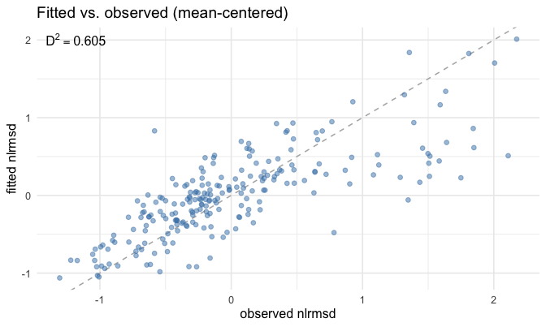

And the fitted/observed divergence against flexibility and distance to the
active site:


```r
ggplot(observed_vs_predicted_long, aes(lrmsf, nlrmsd, colour = source)) +
  geom_point(alpha = 0.4) +
  geom_smooth(method = "loess", formula = y ~ x, se = FALSE) +
  scale_colour_manual(values = c("observed" = "grey25", "fitted (MSA)" = "firebrick")) +
  labs(title = "Observed vs. fitted, by flexibility",
       x = "lrmsf (log RMSF)", y = "nlrmsd (mean-centered)", colour = NULL) +
  theme(legend.position = "top")
```

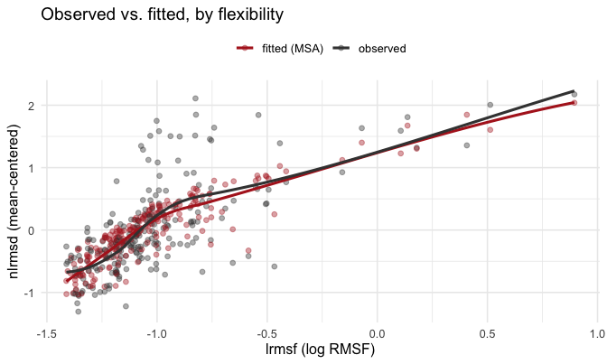


```r
ggplot(observed_vs_predicted_long, aes(dactive, nlrmsd, colour = source)) +
  geom_point(alpha = 0.4) +
  geom_smooth(method = "loess", formula = y ~ x, se = FALSE) +
  scale_colour_manual(values = c("observed" = "grey25", "fitted (MSA)" = "firebrick")) +
  labs(title = "Observed vs. fitted, by distance to active site",
       x = "Distance to active site (Å)", y = "nlrmsd (mean-centered)", colour = NULL) +
  theme(legend.position = "top")
```

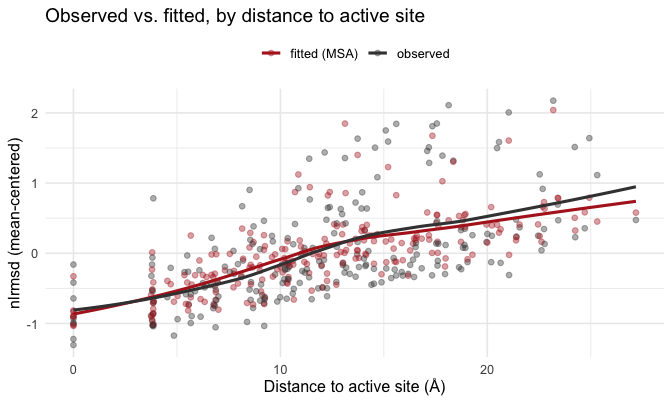

## 6. Decomposing the fitted profile

Section 3 decomposed the profile at a *chosen* `(a1, a2)`. The same
$\phi_{\text{mut}}/\phi_{\text{stab}}/\phi_{\text{act}}$ decomposition applies to
the **fitted** profile — call `calculate_decomposition()` at the ML estimate
`(fit$a1, fit$a2)` instead of the chosen strengths, and read the `phi_*` columns:


```r
decomposition_fit <- calculate_decomposition(spm, fit$a1, fit$a2, metric = "lrmsd")$site
```

The mutation term is the divergence under no selection (it still varies among
sites — mutations perturb sites unequally); a negative selection term means that
pressure *reduces* divergence at that site relative to the mutation-only model.


```r
decomposition_fit_long <- decomposition_fit |>
  tidyr::pivot_longer(c(phi_mut, phi_stab, phi_act),
                      names_to = "component", values_to = "phi") |>
  mutate(component = factor(component, levels = names(component_colours)))
ggplot(decomposition_fit_long, aes(pdb_site, phi, colour = component)) +
  geom_vline(xintercept = pdb_site_active, colour = "firebrick",
             alpha = 0.3, linewidth = 0.3) +
  geom_hline(yintercept = 0, colour = "grey80") +
  geom_line() +
  scale_colour_manual(values = component_colours, guide = "none") +
  facet_wrap(~ component, ncol = 1) +
  labs(title = "Decomposition of the fitted profile",
       subtitle = "Red lines mark active-site residues",
       x = "Residue (PDB numbering)", y = "contribution to lrmsd")
```

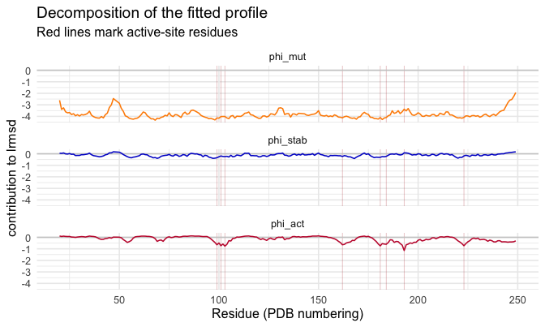

## Session info


```
#> R version 4.2.1 (2022-06-23)
#> Platform: x86_64-apple-darwin17.0 (64-bit)
#> Running under: macOS Big Sur ... 10.16
#> 
#> Matrix products: default
#> BLAS:   /Library/Frameworks/R.framework/Versions/4.2/Resources/lib/libRblas.0.dylib
#> LAPACK: /Library/Frameworks/R.framework/Versions/4.2/Resources/lib/libRlapack.dylib
#> 
#> locale:
#> [1] en_US.UTF-8/en_US.UTF-8/en_US.UTF-8/C/en_US.UTF-8/en_US.UTF-8
#> 
#> attached base packages:
#> [1] stats     graphics  grDevices utils     datasets  methods   base     
#> 
#> other attached packages:
#> [1] readr_2.1.4         purrr_1.2.0         ggplot2_4.0.1      
#> [4] tidyr_1.3.1         dplyr_1.1.4         msamodel_0.3.0.9000
#> 
#> loaded via a namespace (and not attached):
#>  [1] bio3d_2.4-5        Rcpp_1.1.0         lattice_0.22-5     ps_1.7.5          
#>  [5] digest_0.6.33      penm_0.2.0.9000    mime_0.12          R6_2.6.1          
#>  [9] evaluate_0.24.0    highr_0.11         pillar_1.11.1      rlang_1.1.6       
#> [13] miniUI_0.1.1.1     callr_3.7.6        urlchecker_1.0.1   jefuns_0.1.0      
#> [17] Matrix_1.5-4.1     splines_4.2.1      labeling_0.4.3     desc_1.4.3        
#> [21] devtools_2.4.5     stringr_1.6.0      htmlwidgets_1.6.4  S7_0.2.1          
#> [25] bit_4.0.5          shiny_1.8.1.1      compiler_4.2.1     httpuv_1.6.13     
#> [29] xfun_0.41          pkgconfig_2.0.3    pkgbuild_1.4.4     mgcv_1.9-1        
#> [33] htmltools_0.5.8.1  tidyselect_1.2.1   tibble_3.3.0       viridisLite_0.4.2 
#> [37] crayon_1.5.3       tzdb_0.4.0         withr_3.0.2        later_1.3.2       
#> [41] grid_4.2.1         nlme_3.1-164       xtable_1.8-4       gtable_0.3.6      
#> [45] lifecycle_1.0.4    magrittr_2.0.4     scales_1.4.0       cli_3.6.5         
#> [49] stringi_1.8.3      vroom_1.6.5        cachem_1.0.8       farver_2.1.2      
#> [53] fs_1.6.4           promises_1.2.1     remotes_2.5.0      ellipsis_0.3.2    
#> [57] generics_0.1.4     vctrs_0.6.5        RColorBrewer_1.1-3 tools_4.2.1       
#> [61] bit64_4.0.5        glue_1.8.0         hms_1.1.3          processx_3.8.3    
#> [65] pkgload_1.5.2      parallel_4.2.1     fastmap_1.1.1      sessioninfo_1.2.2 
#> [69] memoise_2.0.1      knitr_1.43         profvis_0.3.8      usethis_2.2.3
```
